# HERO — Flow Utama v2 (Mermaid)

**Versi:** 2.0 | **Tanggal:** 8 September 2026
**Dasar revisi:** [MoM Weekly Update #1](docs/14-mom-weekly-update-01.md)

Perubahan utama dari v1 ada di §Ringkasan Perubahan di bawah diagram.

```mermaid
flowchart TD
    START(["Mulai"]) --> TUJUAN{"Apa tujuan pengguna?"}

    %% ============ JALUR A - MEMBANGUN CORPUS ============
    subgraph JA["JALUR A - Membangun Corpus Peraturan Eksisting"]
        direction TB
        A1["Scraping situs publik<br/>JDIH / ojk.go.id-regulasi<br/>daftar URL diinput manual"]
        A3["Folder lokal / OneDrive DPEA<br/>peraturan INTERNAL - wajib NDA"]
        A1D{"Kedalaman crawling"}
        A1D1["Kedalaman 1 - prioritas awal"]
        A1D2["Kedalaman 2 dan seterusnya<br/>iterasi berikutnya"]
        A1B{"Situs ber-anti-bot?"}
        A1B1["requests + BeautifulSoup4"]
        A1B2["Playwright / Selenium"]
    end

    TUJUAN -- "Mengisi corpus<br/>peraturan eksisting" --> A1
    TUJUAN -- "Mengisi corpus<br/>dari arsip internal" --> A3
    A1 --> A1D
    A1D --> A1D1 --> A1B
    A1D --> A1D2 --> A1B
    A1B -- "Tidak" --> A1B1
    A1B -- "Ya" --> A1B2

    %% ============ JALUR B - OBJEK KAJIAN ============
    subgraph JB["JALUR B - Objek Kajian"]
        direction TB
        B0["Unggah manual<br/>DRAFT PERATURAN BARU<br/>yang akan dianalisa"]
    end

    TUJUAN -- "Menganalisa draft<br/>peraturan baru" --> B0

    %% ============ 2. INGEST & VALIDASI ============
    subgraph ING["2 - Ingest, Validasi & Ekstraksi"]
        direction TB
        C1{"Format PDF?"}
        C2["Tolak - catat ke log kegagalan"]
        C3{"Duplikat?<br/>bandingkan HASH + UKURAN BERKAS"}
        C4["Lewati - tandai duplikat"]
        C5["OCR halaman pertama"]
        C6["Ambil nomor peraturan,<br/>tanggal, dan judul<br/>dari halaman pertama"]
        C7["Terapkan naming convention"]
        C8{"PDF teks<br/>atau hasil scan?"}
        C9["Ekstraksi teks langsung"]
        C10["OCR seluruh halaman"]
        C11["Parsing struktur<br/>bab / pasal / ayat"]
    end

    A1B1 --> C1
    A1B2 --> C1
    A3 --> C1
    B0 --> C1
    C1 -- "Tidak" --> C2
    C2 --> ESK["Antrian penanganan manual"]
    C1 -- "Ya" --> C3
    C3 -- "Ya" --> C4
    C4 --> ESK
    C3 -- "Tidak" --> C5
    C5 --> C6 --> C7 --> C8
    C8 -- "Teks" --> C9
    C8 -- "Scan" --> C10
    C9 --> C11
    C10 --> C11

    %% ============ 3. PENYIMPANAN GANDA ============
    subgraph KB["3 - Penyimpanan Ganda"]
        direction TB
        D1["Klasifikasi kategori peraturan"]
        D2{"Folder kategori<br/>sudah ada?"}
        D3["Gunakan folder eksisting"]
        D4["Buat folder baru otomatis"]
        D5[("PDF ASLI<br/>bukti rujukan untuk<br/>validasi sampling DPEA")]
        D6[("BLOK TERSTRUKTUR di DB<br/>pasal + metadata + index")]
    end

    C11 --> D1 --> D2
    D2 -- "Ya" --> D3
    D2 -- "Tidak" --> D4
    D3 --> D5 & D6
    D4 --> D5 & D6

    %% ============ 4. LAYANAN ANALISA ============
    D6 --> E0
    C11 -.->|"khusus draft dari Jalur B"| E0

    subgraph APP["4 - Layanan Analisa"]
        direction TB
        E0{"Pilih layanan"}
        E1["Analisa, Summary<br/>& Key Takeaways"]
        E2["Harmonisasi<br/>draft vs corpus eksisting"]
        E3["Penyusunan Draft<br/>Surat Tanggapan - PoV Unit IT"]
    end

    E0 --> E1 & E2 & E3

    %% ============ 5. MESIN PEMROSESAN ============
    subgraph ENG["5 - Mesin Pemrosesan"]
        direction TB
        F1["MODE DETERMINISTIK - rule-based<br/>DEFAULT, selalu dijalankan<br/>harus jalan offline tanpa AI"]
        F2{"AI-Assisted<br/>diaktifkan?"}
        F3["Lapisan AI-Assisted<br/>menaturalkan narasi<br/>model lokal atau berbayar"]
        F4["Pakai hasil deterministik"]
    end

    E1 & E2 & E3 --> F1 --> F2
    F2 -- "Ya" --> F3
    F2 -- "Tidak" --> F4

    %% ============ 6. KLASIFIKASI TEMUAN ============
    subgraph HRM["6 - Klasifikasi Temuan Harmonisasi"]
        direction TB
        G0{"Objek pasal draft sudah<br/>diatur di corpus eksisting?"}
        G1{"Ketentuannya berubah?"}
        G2["MENGGANTIKAN<br/>menggugurkan pasal lama"]
        G3["MEMPERJELAS<br/>substansi sama, diperinci"]
        G4["PASAL BARU / TAMBAHAN<br/>tidak me-replace apa pun"]
        G5["DUPLIKASI<br/>identik, tidak menambah apa pun"]
        G6["KONFLIK<br/>bertentangan, keduanya berlaku"]
    end

    F3 --> G0
    F4 --> G0
    G0 -- "Ya" --> G1
    G0 -- "Tidak" --> G4
    G1 -- "Ya, ketentuan berbeda" --> G2
    G1 -- "Tidak, hanya diperinci" --> G3
    G1 -- "Identik" --> G5
    G1 -- "Bertentangan & sama-sama berlaku" --> G6

    %% ============ 7. OUTPUT & VALIDASI ============
    subgraph OUT["7 - Output & Validasi"]
        direction TB
        H1["Penyajian hasil di UI<br/>setiap butir MENGUTIP pasal sumber"]
        H2["VALIDASI SAMPLING oleh DPEA<br/>ambil 2-3 dari 10 dokumen<br/>buka peraturan yang dikutip,<br/>cek apakah pasalnya benar"]
        H3{"Kutipan akurat?"}
        H4["Perbaiki algoritma<br/>proses ulang"]
        H5["Ekspor SURAT TANGGAPAN TERTULIS<br/>format baku DPEA"]
    end

    G2 & G3 & G4 & G5 & G6 --> H1
    E1 --> H1
    H1 --> H2 --> H3
    H3 -- "Tidak" --> H4
    H4 --> E0
    H3 -- "Ya" --> H5
    H5 --> Z(["Keputusan final oleh Pengawas /<br/>unit terkait - DI LUAR SISTEM"])

    %% ============ STYLING ============
    classDef store fill:#e8f0fe,stroke:#3b6ea5,stroke-width:2px,color:#12314f
    classDef det fill:#e9f7ef,stroke:#2e8b57,stroke-width:2px,color:#14432a
    classDef ai fill:#fdf3e3,stroke:#c98a1d,stroke-width:2px,color:#5c3d05
    classDef human fill:#fdeaea,stroke:#c0392b,stroke-width:2px,color:#5c1a13
    classDef baru fill:#f3e8fd,stroke:#7d3cb5,stroke-width:2px,color:#3d1259

    class D5,D6 store
    class F1,F4 det
    class F3 ai
    class H2,Z,ESK human
    class G2,G3,G4,C3,C5,C6,C7 baru
```

---

## Ringkasan Perubahan dari v1

| No. | Perubahan | Alasan (sumber rapat) |
| --- | --- | --- |
| 1 | **Tiga sumber dipecah menjadi dua jalur berbeda tujuan.** Scraping & OneDrive mengisi *corpus*; unggah manual adalah *objek kajian* (draft peraturan baru) | "Upload manual itu diperlukan jika ada dokumen draft dari peraturan baru yang ingin dianalisa" |
| 2 | **Deduplikasi naik ke depan** dan memakai metode eksplisit: **hash + ukuran berkas** | "Bandingkan dari hash-nya… dilihat dari ukuran file-nya" |
| 3 | **OCR halaman pertama menjadi langkah tersendiri** untuk mengambil nomor peraturan, tanggal, dan judul sebagai *naming convention* | "Buka halaman pertama, pakai OCR, dibaca judulnya… itu diambil untuk format naming-nya sebelum masuk ke folder" |
| 4 | **Kedalaman crawling & penanganan anti-bot masuk diagram** | "Yang perlu di-adjust adalah gimana caranya ngecek kedalaman… mulai satu kedalaman dulu" |
| 5 | **Penyimpanan menjadi ganda**: PDF asli *dan* blok terstruktur di basis data | Opsi A/B ditawarkan mitra; PDF asli tetap wajib agar validator DPEA bisa membuka dokumen saat *sampling* |
| 6 | **Klasifikasi temuan diganti total** dari `konflik/duplikasi/gap` menjadi **menggantikan / memperjelas / pasal baru**, dengan duplikasi & konflik sebagai pelengkap | Contoh kasus pelaporan bank yang dijelaskan Faris |
| 7 | **Review manusia menjadi "Validasi Sampling oleh DPEA"** dengan metode eksplisit: 2–3 sampel dari 10 dokumen, cek kebenaran kutipan pasal | "Ambil saja sampel dua atau tiga. Benar nggak sih dia ngutip peraturan dari pasal ini" |
| 8 | **Output akhir dinamai spesifik**: Surat Tanggapan Tertulis format baku DPEA | "Gimana caranya aplikasi bisa mengeluarkan output yang sama seperti surat tanggapan tertulis yang sudah biasa kami pakai" |
| 9 | **Mode Deterministik diberi penegasan "harus jalan offline tanpa AI"** | "Seumpama posisinya offline, tidak ada internet, tidak ada budget untuk beli AI, ini aplikasi masih bisa jalan" |
| 10 | **Setiap butir output wajib mengutip pasal sumber** | Prasyarat agar validasi sampling DPEA dapat dijalankan sama sekali |

Dokumen lengkap: [docs/README.md](docs/README.md)
