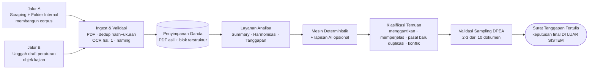

# HERO — Harmonisasi & Analisa Regulasi Otomatis

> Asisten analisa regulasi untuk **Departemen Pengembangan Aplikasi (DPEA), Otoritas Jasa Keuangan** — Capstone Project Departemen Teknik Informatika ITS, Semester Gasal 2026/2027.

| | |
| --- | --- |
| **Mitra** | OJK — DPEA |
| **Product Owner** | Faris Budi *(merangkap Agile Coach s.d. 11 Okt 2026)* |
| **Mentor Industri** | Andika Wahyu Prihandoko |
| **Periode** | 31 Agustus – 24 Desember 2026 (± 17 minggu / 8 sprint) |
| **Metode** | Agile, pendekatan MVP, sprint 2 mingguan |

---

## Masalah yang diselesaikan

DPEA wajib menyusun **tanggapan tertulis** atas setiap draft peraturan yang masuk, dari sudut
pandang IT. Volumenya **54 tanggapan (2025)** dan **40 per Agustus 2026**, masing-masing memakan
**2–3 hari kerja** secara manual.

Penyebab lamanya bukan semata volume bacaan, melainkan terputusnya konsentrasi:

> *"Kalau orangnya bisa fokus, bisa. Tapi kalau baru kerja setengah jam terus dipanggil rapat,
> itu sudah nggak kepegang. Nanti memulai lagi, nyari lagi dokumennya."*

**Target HERO: 2–3 jam per tanggapan.**

## Empat fitur utama

| Fase | Fitur | Periode |
| --- | --- | --- |
| 1 | Scraping & Ingest Dokumen + Knowledge Base | 14 Sep – 11 Okt 2026 |
| 2 | Analisa, Summary & Key Takeaways | 12 Okt – 8 Nov 2026 |
| 3 | Harmonisasi Draft vs Peraturan Eksisting | 9 – 29 Nov 2026 |
| 4 | Draft Surat Tanggapan berbasis PoV Unit | 30 Nov – 13 Des 2026 |
| 5 | Stabilisasi & UAT | 14 – 24 Des 2026 |

## Dua prinsip yang tidak boleh dilanggar

1. **Mode Deterministik adalah default dan wajib jalan tanpa AI.** Aplikasi harus tetap berfungsi
   saat offline, tanpa internet, dan tanpa anggaran AI. Lapisan AI hanya menaturalkan narasi di
   atas hasil deterministik — tidak pernah menggantikannya.
2. **Sistem tidak mengambil keputusan.** Seluruh keluaran berlabel *Draft / Rekomendasi*.
   Keputusan final tetap kewenangan Pengawas / unit terkait DPEA.

---

## Alur sistem

Diagram lengkap beserta ringkasan perubahan: **[HERO_FLOW.md](HERO_FLOW.md)**

---

## Dokumentasi

Seluruh dokumen proyek ada di **[`docs/`](docs/README.md)**.

| Peran | Dokumen |
| --- | --- |
| **Mulai dari sini** | [Indeks dokumen](docs/README.md) |
| Manajemen proyek | [Charter](docs/00-project-charter-hero.md) · [Stakeholder & RACI](docs/01-stakeholder-register-raci.md) · [WBS & Sprint Plan](docs/07-wbs-sprint-plan.md) · [Risk Register](docs/10-risk-register.md) |
| Analisis | [BRD](docs/02-brd-business-requirements.md) · [SRS](docs/03-srs-functional-spec.md) · [Process Flow](docs/04-process-flow-asis-tobe.md) · [Use Case](docs/05-use-case-spec.md) · [DFD](docs/13-dfd-data-flow-diagram.md) · [Data Model](docs/08-data-model-dictionary.md) · [RTM](docs/09-rtm-traceability-matrix.md) |
| Arsitektur | [Dokumen Arsitektur Sistem](docs/16-arsitektur-sistem.md) |
| Eksekusi | [Product Backlog](docs/06-product-backlog-user-stories.md) · [UI Spec Fase 1](docs/15-ui-spec-fase-1.md) · [Test Plan & UAT](docs/11-test-plan-uat.md) |
| Rapat | [MoM Weekly Update #1](docs/14-mom-weekly-update-01.md) |
| Referensi | [Glossary](docs/12-glossary.md) · [Template operasional](docs/templates/) |

---

## Tim & pembagian peran

| Peran | Nama | Label issue |
| --- | --- | --- |
| Project Manager / Business Analyst | Ahmad Zaky Ash Shidqi | `role: pm-ba` |
| Backend | Moh. Rafli Gusti Saputra | `role: backend` |
| Frontend / UI-UX | Muhammad Ikhwan | `role: frontend` |
| Data / ML | Mirza Syahrizal Fathir | `role: data-ml` |
| Platform / Infra & QA | Ahmad Izzul Hamdan | `role: infra-qa` |

## Cara kerja

- **Rapat mitra mingguan**, maksimal 1 jam. Format laporan: dari fase sebelumnya ada N item —
  berapa terealisasi, mana yang disetujui user, yang belum kenapa belum, sisanya masuk antrian
  fase berikutnya.
- **Item yang belum selesai tidak memblokir fase berikutnya** — masuk backlog, dilaporkan mingguan.
- **Sejak 12 Oktober 2026 tim berperan sebagai konsultan**, bukan pelaksana. Mitra menyampaikan
  kebutuhan; tim memberi rekomendasi teknis beserta alasannya.
- Diskusi harian lewat grup WhatsApp; keputusan yang mengubah scope dicatat sebagai
  [Change Request](docs/templates/change-request-form.md).

## Kepatuhan

Dokumen peraturan internal DPEA tunduk pada **NDA**. Berkas dokumen, dataset, dan hasil scraping
**tidak boleh masuk repositori ini** — lihat `.gitignore`. Sebelum mengirim isi dokumen ke layanan
AI pihak ketiga, periksa `klasifikasi_akses` dokumen tersebut; hanya dokumen berklasifikasi
publik yang boleh dikirim keluar. Model lokal adalah opsi yang direkomendasikan karena
menghilangkan risiko ini sepenuhnya.
