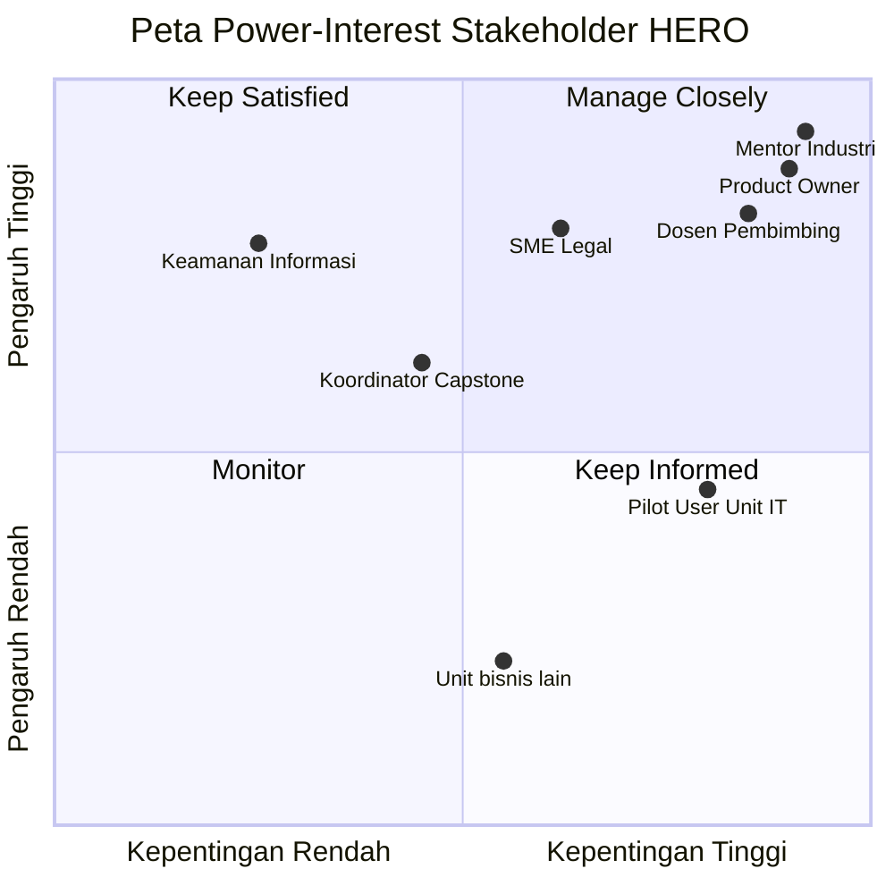
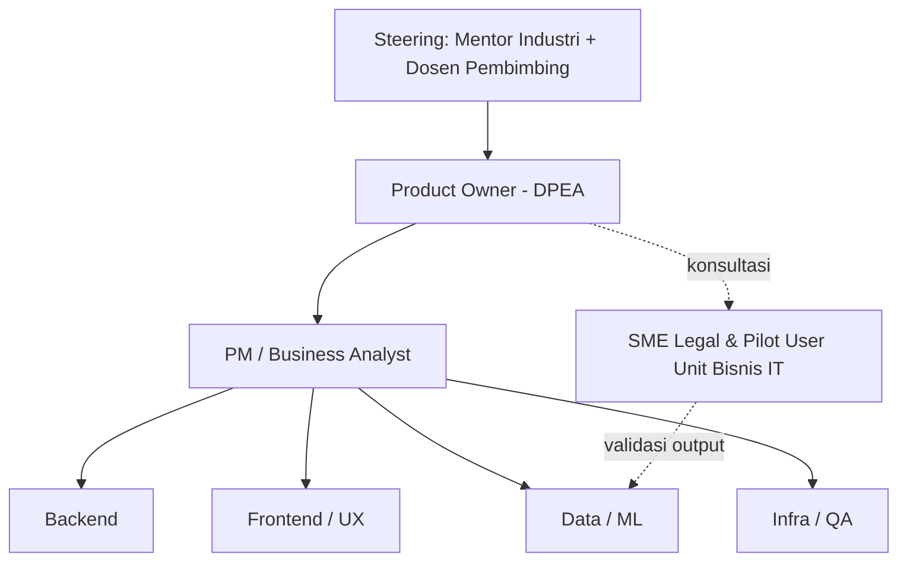

# STAKEHOLDER REGISTER, RACI & COMMUNICATION PLAN
**Proyek:** HERO | **Versi:** 1.1 | **Tanggal:** 8 September 2026

---

## 1. Stakeholder Register

| ID | Stakeholder | Organisasi/Unit | Peran dalam Proyek | Kepentingan | Pengaruh | Strategi Pengelolaan |
| --- | --- | --- | --- | --- | --- | --- |
| SH-01 | **Andika Wahyu Prihandoko** | OJK – DPEA | Mentor Industri; **ko-Product Owner & validator** | Tinggi | Tinggi | **Manage Closely** — libatkan di rapat mingguan, keputusan scope, dan validasi sampling |
| SH-02 | **Faris Budi** | OJK – DPEA | **Product Owner + Agile Coach** (s.d. 11 Okt), lalu **murni Product Owner**; narasumber teknis utama | Tinggi | Tinggi | **Manage Closely** — pemilik prioritas backlog, penerima *sign-off* fase, dan sumber seluruh klarifikasi teknis |
| SH-03 | Perwakilan Unit Bisnis IT | OJK | Pilot User PoV (MVP) | Tinggi | Sedang | **Keep Informed** — validasi template & gaya bahasa tanggapan |
| SH-04 | Validator DPEA (Faris & Andika) | OJK | Pelaksana **validasi sampling manual** atas kebenaran kutipan pasal | Tinggi | Tinggi | **Manage Closely** — bukan SME eksternal; mereka menguji sendiri (KEP-08) |
| SH-05 | Tim Pengawasan & unit bisnis lain | OJK | *End user* sekunder | Sedang | Rendah | **Keep Informed** — demo hasil tiap fase |
| SH-06 | Dosen Pembimbing Capstone | ITS – Teknik Informatika | Pembimbing akademik | Tinggi | Tinggi | **Manage Closely** — laporan mingguan & review dokumen |
| SH-07 | Koordinator MK Capstone | ITS – Teknik Informatika | Pengelola mata kuliah | Sedang | Sedang | **Keep Satisfied** — pemenuhan milestone akademik |
| SH-08 | **Ahmad Zaky Ash Shidqi** | Tim Proyek | PM + Business Analyst; pemimpin sesi rapat mitra | Tinggi | Tinggi | Anggota inti |
| SH-09 | **Moh. Rafli Gusti Saputra** | Tim Proyek | Backend — API, basis data, integrasi | Tinggi | Sedang | Anggota inti |
| SH-10 | **Muhammad Ikhwan** | Tim Proyek | Frontend / UI-UX — mockup Figma per fase | Tinggi | Sedang | Anggota inti |
| SH-11 | **Mirza Syahrizal Fathir** | Tim Proyek | Data / ML — scraper, parsing, analisis substansi | Tinggi | Tinggi | Anggota inti |
| SH-12 | **Ahmad Izzul Hamdan** | Tim Proyek | Platform / Infra & QA — deployment, hosting, pengujian | Tinggi | Sedang | Anggota inti |
| SH-13 | Tim Keamanan Informasi OJK | OJK | Penjaga kepatuhan NDA & data | Rendah | Tinggi | **Keep Satisfied** — konsultasi bila menyentuh data non-publik |

### 1.1 Peta Power–Interest

---

## 2. Struktur Tata Kelola

### 2.1 Pergeseran Peran Mitra pada 12 Oktober 2026

Ini perubahan tata kelola yang dinyatakan mitra sendiri (KEP-12) dan berdampak pada cara tim
bekerja, bukan sekadar catatan administratif.

| Periode | Peran Faris & Andika | Peran Tim | Konsekuensi |
| --- | --- | --- | --- |
| **Sekarang – 11 Okt 2026** | Product Owner **+ Agile Coach** | Pelaksana yang sedang dibimbing | Tim boleh bertanya cara menyusun prioritas, menghitung backlog, dan menjalankan Agile. Mitra siap mengajari |
| **12 Okt 2026 – selesai** | **Murni Product Owner** | **Konsultan** | Mitra akan menyampaikan kebutuhan ("peraturan 10 halaman bisa nggak jadi 1 halaman?") dan **tim yang memberi rekomendasi teknisnya** ("summary sebaiknya per-pasal atau per-sub-pasal, dengan alasan ini") |

> **Catatan PM.** Setelah 12 Oktober, menjawab "terserah Bapak" bukan lagi jawaban yang dapat
> diterima — mitra secara eksplisit memposisikan tim sebagai konsultan mereka. Tiap usulan
> teknis perlu disertai alasan dan konsekuensinya. Kebiasaan ini sebaiknya dilatih sejak
> sekarang, selagi mitra masih berperan sebagai Agile Coach.

---

## 3. RACI Matrix

**R** = Responsible (mengerjakan) · **A** = Accountable (bertanggung jawab akhir) ·
**C** = Consulted (dimintai masukan) · **I** = Informed (diberi tahu)

| Aktivitas / Deliverable | PM/BA | PO | Mentor | BE | FE | ML | QA | SME | Dosen |
| --- | --- | --- | --- | --- | --- | --- | --- | --- | --- |
| Project Charter | R | A | C | I | I | I | I | I | C |
| Penggalian kebutuhan & BRD | **R/A** | C | C | I | I | I | I | C | I |
| SRS / Spesifikasi Fungsional | **R/A** | C | C | C | C | C | C | I | I |
| Pemetaan proses AS-IS / TO-BE | **R/A** | C | C | I | I | I | I | C | I |
| Product Backlog & prioritisasi | R | **A** | C | C | C | C | C | I | I |
| Desain arsitektur sistem | C | I | C | **R/A** | C | C | C | I | C |
| Desain UI/UX & purwarupa | C | C | I | I | **R/A** | I | C | C | I |
| Modul Scraping & Ingest (D-01) | C | A | I | **R** | I | C | C | I | I |
| Knowledge Base terstruktur (D-02) | C | A | I | **R** | I | C | C | I | I |
| Modul Analisa & Summary (D-03) | C | A | C | C | I | **R** | C | C | I |
| Modul Harmonisasi (D-04) | C | A | C | C | I | **R** | C | **C** | I |
| Modul Tanggapan PoV (D-05) | C | A | C | I | C | **R** | C | **C** | I |
| Definisi profil PoV & template tanggapan | **R** | A | C | I | I | C | I | **C** | I |
| Infrastruktur & CI/CD | I | I | C | C | I | I | **R/A** | I | I |
| Test Plan & pelaksanaan pengujian | C | I | I | C | C | C | **R/A** | I | I |
| UAT & berita acara | R | **A** | C | I | I | I | C | **R** | I |
| Dokumentasi teknis & panduan (D-06) | **R/A** | C | I | C | C | C | C | I | C |
| Laporan progress mingguan | **R/A** | I | I | I | I | I | I | I | C |
| Manajemen risiko & change request | **R** | **A** | C | C | C | C | C | I | I |
| Kepatuhan NDA & keamanan data | R | A | **A** | C | C | C | C | I | I |

> **Catatan PM:** setiap baris hanya boleh punya **satu A**. Baris "UAT & berita acara" dan
> "Kepatuhan NDA" perlu ditegaskan ke mentor siapa pemegang A tunggalnya sebelum charter
> ditandatangani.

---

## 4. Communication Plan

| Komunikasi | Peserta | Frekuensi | Media | Output | PIC |
| --- | --- | --- | --- | --- | --- |
| Daily stand-up (async) | Tim inti | Harian | Grup chat | Update 3 pertanyaan | Semua |
| Sprint Planning | Tim inti + PO | Awal sprint (2 mgg) | Online meeting | Sprint backlog | PM |
| Sprint Review / Demo | Tim + PO + Mentor | Akhir sprint | Online meeting | Feedback + sign-off | PM |
| Sprint Retrospective | Tim inti | Akhir sprint | Online meeting | Action item | PM |
| **Rapat Mingguan Mitra** | PM + Tim + Faris + Andika | **Mingguan, maks. 1 jam** | Online meeting | Weekly Status Report | PM |
| **Grup WhatsApp** | Tim + mitra | Harian, ad-hoc | WhatsApp | Tanya-jawab cepat, tautan Figma | PM |
| Bimbingan Akademik | PM + Dosen | Mingguan | Sesuai kesepakatan | Catatan bimbingan | PM |
| Sesi Validasi Sampling | BA + ML + Validator DPEA | Akhir tiap fase | Online meeting | Hasil validasi sampling | BA |
| UAT Session | QA + Pilot User + PO | Fase 4–5 | Online meeting | Berita acara UAT | QA |
| Eskalasi Isu Kritis | PM → PO → Mentor | Ad-hoc, < 1×24 jam | Chat + email | Issue log | PM |

### 4.1 Jalur Eskalasi

| Level | Kondisi | Ditangani Oleh | SLA Respons |
| --- | --- | --- | --- |
| L1 | Hambatan teknis dalam tim | PM | 1 hari kerja |
| L2 | Perubahan scope, dependensi eksternal, akses data | PM → Product Owner | 2 hari kerja |
| L3 | Risiko gagal *deliverable* fase, isu NDA/keamanan | PO → Mentor Industri + Dosen | 1 hari kerja |

### 4.2 Aturan Dokumentasi

- Semua keputusan yang mengubah scope, jadwal, atau kriteria penerimaan **wajib** dicatat
  dalam Minutes of Meeting dan, bila berdampak pada baseline, diajukan lewat Change Request.
- Notulen rapat mitra disebar maksimal **1×24 jam** setelah rapat.
- Dokumen requirement bersifat *living document*; setiap perubahan menaikkan nomor versi dan
  dicatat pada tabel Riwayat Revisi.

---

## 5. Kebutuhan Konfirmasi (Open Items)

| No. | Item | Ditujukan Kepada | Target Tanggal | Status |
| --- | --- | --- | --- | --- |
| ~~OI-01~~ | ~~Penunjukan Product Owner~~ | — | — | ✅ **Selesai** — Faris Budi (KEP-12) |
| OI-02 | Penunjukan pilot user Unit Bisnis IT | Mentor | 8 Nov 2026 | 🟡 Terbuka |
| ~~OI-03~~ | ~~Penunjukan SME Legal/Regulasi~~ | — | — | ✅ **Tidak diperlukan** — validasi dilakukan Faris & Andika secara sampling (KEP-08) |
| OI-04 | Penandatanganan NDA seluruh anggota tim | Mentor + Tim | 13 Sep 2026 | 🔴 Terbuka — **memblokir akses folder OneDrive** |
| OI-05 | Konfirmasi tool project management & repository | Mentor + Dosen | 13 Sep 2026 | 🟡 Terbuka |
| **OI-06** | **Alamat situs sumber ketiga** (dua sudah ditunjukkan) | Faris | 14 Sep 2026 | 🔴 Terbuka |
| **OI-07** | **Contoh surat tanggapan + dokumen dasarnya** (AI-M3..AI-M6) | Faris | 11 Okt 2026 | 🔴 Terbuka — memblokir Fase 4 |
| **OI-08** | Skema hosting untuk uji coba mitra 8 Okt | Tim (Infra) | 28 Sep 2026 | 🔴 Terbuka |
