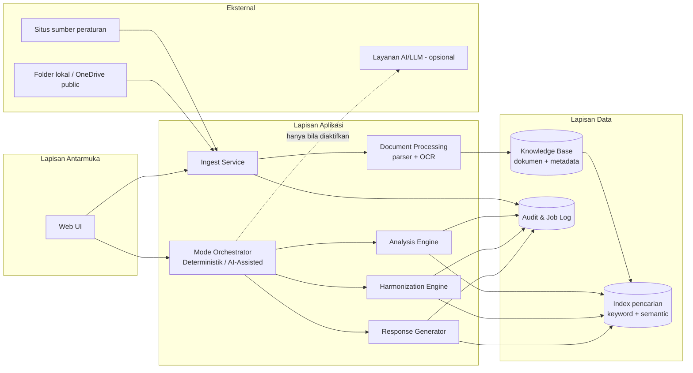

# SOFTWARE REQUIREMENTS SPECIFICATION (SRS / FRD)
**Proyek:** HERO — Harmonisasi & Analisa Regulasi Otomatis
**Versi:** 1.1 (Draft) | **Tanggal:** 8 September 2026 | **Penyusun:** Business Analyst

---

## 1. Pendahuluan

### 1.1 Tujuan Dokumen
Menjabarkan kebutuhan fungsional dan non-fungsional aplikasi HERO sebagai acuan pengembangan,
pengujian, dan penerimaan (UAT). Dokumen ini turunan dari [BRD](02-brd-business-requirements.md).

### 1.2 Lingkup Produk
HERO adalah asisten analisa regulasi untuk DPEA OJK yang mencakup empat kapabilitas:
pengumpulan dokumen, analisa & peringkasan, harmonisasi, dan penyusunan draft tanggapan
berbasis PoV. Setiap kapabilitas dijalankan pada mode **Deterministik** (default) dengan
opsi lapisan **AI-Assisted**.

### 1.3 Konvensi Penomoran

| Prefiks | Modul |
| --- | --- |
| `FR-SCR` | Scraping & Ingest Dokumen |
| `FR-KB` | Knowledge Base |
| `FR-ANL` | Analisa, Summary & Key Takeaways |
| `FR-HRM` | Harmonisasi |
| `FR-POV` | Draft Tanggapan Berbasis PoV |
| `FR-SYS` | Platform, Mode Pemrosesan, UI & Audit |
| `NFR` | Non-Functional Requirement |

Prioritas menggunakan **MoSCoW**: Must / Should / Could / Won't (MVP).

---

## 2. Deskripsi Umum

### 2.1 Aktor Sistem

| Aktor | Deskripsi | Hak Akses Utama |
| --- | --- | --- |
| **Analis Regulasi** | Pengguna utama dari DPEA/unit bisnis; menjalankan analisa, harmonisasi, dan penyusunan tanggapan | Ingest, jalankan analisa, lihat & ekspor hasil |
| **Admin Knowledge Base** | Mengelola sumber, kategori/folder, dan kualitas data KB | Kelola sumber, kategori, dokumen, konfigurasi folder |
| **Admin Sistem** | Mengelola pengguna, konfigurasi mode AI, dan pemantauan sistem | Konfigurasi sistem, kelola user, lihat audit log |
| **Pilot User PoV** | Perwakilan Unit Bisnis IT; memvalidasi draft tanggapan | Lihat & beri umpan balik atas draft tanggapan |
| **Sistem Terjadwal** | Proses latar (ingest batch, indexing) | — |

### 2.2 Arsitektur Logis

### 2.3 Mode Pemrosesan

| Mode | Sifat | Peran |
| --- | --- | --- |
| **Deterministik (Non-AI)** | Default, wajib tersedia | Menjalankan seluruh cakupan proses berbasis aturan (*rule-based*), pola, dan basis data. Menjadi *fallback* utama agar sistem tetap beroperasi meski AI tidak tersedia. |
| **AI-Assisted** | Opsional, dapat diaktifkan/nonaktifkan | *Enhancement* di atas hasil Deterministik untuk menghaluskan dan menaturalkan output, tanpa menggantikan proses dasar. |

---

## 3. Kebutuhan Fungsional

### 3.1 Modul Scraping & Ingest Dokumen (FR-SCR)

| ID | Kebutuhan | Prioritas | Kriteria Penerimaan |
| --- | --- | --- | --- |
| FR-SCR-01 | Pengguna dapat menginput dan mengelola daftar URL situs sumber peraturan secara manual (tambah, ubah, nonaktifkan, hapus) | Must | Daftar tersimpan & dapat dipanggil ulang; minimal 3 situs dapat dikelola |
| FR-SCR-02 | Sistem menarik (*fetch*) dokumen berformat PDF dari daftar situs yang telah diinput | Must | Dokumen PDF pada halaman target berhasil diunduh & tercatat sumbernya |
| **FR-SCR-02a** | Sistem mendukung penelusuran berjenjang dengan **kedalaman yang dapat diatur per sumber**, dimulai dari kedalaman 1 | Must | Kedalaman dapat diatur; kedalaman 1 hanya menelusuri halaman yang ditunjuk; kedalaman > 1 ikut menelusuri tautan di dalamnya |
| **FR-SCR-02b** | Sistem menangani situs ber-*anti-bot* melalui jalur otomasi peramban, bukan permintaan HTTP polos | Should | Minimal 1 situs ber-anti-bot berhasil ditarik dokumennya |
| FR-SCR-03 | Sistem menampilkan status dan hasil setiap proses *scraping* (berhasil/gagal, jumlah dokumen, alasan gagal) | Must | Ringkasan job tampil di UI dan tersimpan di log |
| FR-SCR-04 | Pengguna dapat mengunggah dokumen PDF secara manual, satu atau banyak berkas sekaligus | Must | Berkas terunggah masuk antrian pemrosesan dengan notifikasi hasil |
| **FR-SCR-04a** | Saat mengunggah, pengguna wajib menyatakan apakah berkas adalah **draft peraturan baru** (objek kajian) atau **peraturan eksisting** (anggota corpus) | Must | Pilihan tampil sebelum unggah; draft **tidak** masuk daftar kandidat pembanding harmonisasi |
| FR-SCR-05 | Sistem dapat membaca dan menarik dokumen dari folder lokal yang dikonfigurasi | Must | Minimal 1 folder lokal terbaca; dokumen baru terdeteksi saat proses dijalankan |
| FR-SCR-06 | Sistem dapat membaca dan menarik dokumen dari folder OneDrive *public* yang dikonfigurasi | Must | Minimal 1 folder OneDrive public terbaca |
| FR-SCR-07 | Sistem memvalidasi format berkas dan menolak berkas non-PDF disertai alasan | Must | Berkas non-PDF ditolak, tidak masuk KB, tercatat di log kegagalan |
| FR-SCR-08 | Sistem mendeteksi duplikat dokumen dengan membandingkan **hash isi berkas DAN ukuran berkas** | **Must** | Dokumen identik tidak tersimpan ganda; UI menampilkan alasan duplikat beserta dokumen pembandingnya |
| FR-SCR-09 | Sistem mengekstraksi metadata dasar: judul, nomor peraturan, tanggal terbit | Must | Ketiga metadata terisi otomatis untuk dokumen berstruktur baku |
| **FR-SCR-09a** | Sistem meng-**OCR halaman pertama** dokumen untuk mengambil nomor peraturan, tanggal, dan judul | Must | Ketiga unsur terbaca dari halaman 1; kegagalan baca mengarahkan dokumen ke antrian koreksi manual |
| **FR-SCR-09b** | Sistem menerapkan **penamaan berkas baku** dari hasil FR-SCR-09a sebelum berkas masuk folder knowledge base | Must | Nama berkas mengikuti konvensi yang disepakati; tidak ada berkas masuk KB dengan nama asli dari sumber |
| FR-SCR-10 | Pengguna dapat mengoreksi metadata hasil ekstraksi secara manual | Must | Perubahan tersimpan dan tercatat di audit log |
| FR-SCR-11 | Sistem mendeteksi PDF hasil pindai dan memprosesnya melalui OCR | Should | Teks dokumen hasil pindai dapat diekstraksi dan diindeks |
| FR-SCR-12 | Dokumen yang gagal diproses masuk antrian penanganan manual, tidak dibuang diam-diam | Must | Daftar dokumen gagal dapat dilihat dan diproses ulang |

### 3.2 Modul Knowledge Base (FR-KB)

| ID | Kebutuhan | Prioritas | Kriteria Penerimaan |
| --- | --- | --- | --- |
| FR-KB-01 | Sistem mengklasifikasikan dokumen ke kategori peraturan berdasarkan aturan yang dapat dikonfigurasi | Must | Dokumen uji terklasifikasi sesuai kategori yang ditetapkan |
| FR-KB-02 | Sistem menempatkan dokumen ke folder eksisting bila kategori sudah ada | Must | Tidak terjadi duplikasi folder untuk kategori yang sama |
| FR-KB-03 | Sistem membuat folder baru otomatis bila kategori belum ada | Must | Folder baru terbentuk dengan penamaan sesuai konvensi |
| FR-KB-04 | Sistem menyimpan dokumen beserta metadata, teks hasil ekstraksi, dan struktur pasal | Must | Seluruh atribut wajib pada Data Dictionary terisi |
| **FR-KB-04a** | Sistem menyimpan **berkas PDF asli** dan **blok terstruktur di basis data** sekaligus | Must | PDF asli dapat dibuka dari layar detail dokumen; blok pasal tersimpan dan terindeks |
| FR-KB-05 | Pengguna dapat mencari dokumen berdasarkan kata kunci, nomor peraturan, kategori, tanggal, dan status keberlakuan | Must | Hasil pencarian relevan & dapat difilter |
| FR-KB-06 | Pengguna dapat melihat detail dokumen beserta struktur bab/pasal/ayat | Must | Struktur tampil hierarkis dan dapat dinavigasi |
| FR-KB-07 | Sistem menyimpan riwayat versi dokumen bila dokumen dengan identitas sama diunggah ulang | Should | Versi lama tetap dapat diakses |
| FR-KB-08 | Admin KB dapat memindahkan, mengganti kategori, dan menonaktifkan dokumen | Should | Perubahan tercatat di audit log |
| FR-KB-09 | Peraturan berstatus dicabut tetap tersimpan dan ditandai, tidak dihapus | Must | Status "dicabut" terlihat jelas di UI dan hasil pencarian |

### 3.3 Modul Analisa, Summary & Key Takeaways (FR-ANL)

| ID | Kebutuhan | Prioritas | Kriteria Penerimaan |
| --- | --- | --- | --- |
| FR-ANL-01 | Sistem mengekstraksi struktur dokumen (bab, pasal, ayat) berdasarkan pola penomoran baku | Must | Struktur terbentuk benar pada ≥ 80% dokumen uji berstruktur baku |
| FR-ANL-02 | Sistem mengidentifikasi dasar hukum yang dirujuk dokumen | Must | Daftar dasar hukum tampil dan tertaut ke dokumen di KB bila tersedia |
| FR-ANL-03 | Sistem mengidentifikasi status keberlakuan dokumen (berlaku / dicabut / diubah) | Must | Status terisi; sumber penetapan status dapat ditelusuri |
| FR-ANL-04 | Sistem menghasilkan ringkasan (*summary*) isi peraturan | Must | Summary dihasilkan untuk ≥ 10 dokumen uji |
| FR-ANL-05 | Sistem menyusun *Key Takeaways* berupa poin-poin penting dokumen | Must | Minimal 3 poin per dokumen, tertaut ke pasal sumbernya |
| FR-ANL-06 | Setiap butir summary/Key Takeaway mencantumkan rujukan pasal asal | Must | Pengguna dapat melompat dari poin ke teks pasal asli |
| FR-ANL-07 | Sistem mengidentifikasi topik/klausul utama yang relevan dengan kebutuhan pengguna | Should | Daftar topik dapat difilter sesuai minat unit |
| FR-ANL-08 | Waktu proses summary per dokumen pada mode Deterministik di bawah 5 menit | Must | Terukur dari *timestamp* mulai–selesai job |
| FR-ANL-09 | Pengguna dapat mengekspor hasil analisa | Should | Ekspor berisi summary, Key Takeaways, dan rujukan pasal |

### 3.4 Modul Harmonisasi (FR-HRM)

| ID | Kebutuhan | Prioritas | Kriteria Penerimaan |
| --- | --- | --- | --- |
| FR-HRM-01 | Pengguna dapat memilih draft peraturan baru dan menjalankan proses harmonisasi terhadap KB | Must | Proses berjalan & menghasilkan laporan |
| FR-HRM-02 | Sistem memilih kandidat peraturan eksisting yang relevan untuk dibandingkan | Must | Kandidat relevan; dasar pemilihan dapat dijelaskan ke pengguna |
| FR-HRM-03 | Sistem mencocokkan rujukan/referensi pasal secara eksplisit antar dokumen | Must | Rujukan eksplisit terdeteksi dan terpetakan |
| FR-HRM-04 | Sistem mengecek status peraturan yang dirujuk (masih berlaku / telah dicabut) | Must | Rujukan ke peraturan dicabut ditandai sebagai temuan |
| FR-HRM-05 | Sistem menganalisis kesesuaian makna/substansi antar pasal, bukan sekadar kecocokan kata | Must | Pasal dengan redaksi berbeda namun bermakna sama terdeteksi |
| FR-HRM-06 | Sistem mengklasifikasikan temuan sebagai **MENGGANTIKAN** ketika objek pasal sudah diatur di corpus namun ketentuannya berbeda | Must | Temuan berlabel `menggantikan` beserta pasal yang digugurkan |
| FR-HRM-07 | Sistem mengklasifikasikan temuan sebagai **MEMPERJELAS** ketika objek sudah diatur dan substansi sama, hanya diperinci | Must | Temuan berlabel `memperjelas` |
| FR-HRM-08 | Sistem mengklasifikasikan temuan sebagai **PASAL BARU / TAMBAHAN** ketika objek belum pernah diatur di corpus | Must | Temuan berlabel `pasal_baru`; sistem tidak menandainya sebagai penggantian |
| **FR-HRM-08a** | Sistem mengklasifikasikan temuan sebagai **DUPLIKASI** ketika pasal identik dan tidak menambah apa pun | Must | Temuan berlabel `duplikasi` |
| **FR-HRM-08b** | Sistem mengklasifikasikan temuan sebagai **KONFLIK** ketika dua pasal bertentangan dan keduanya sama-sama berlaku | Must | Temuan berlabel `konflik` |
| FR-HRM-09 | Setiap temuan mencantumkan pasal draft, pasal pembanding, jenis temuan, tingkat keyakinan, dan **kutipan teks pasal beserta tautan ke PDF asli** | Must | Kelima atribut terisi; PDF asli dapat dibuka langsung dari temuan |
| FR-HRM-10 | Sistem menyusun ringkasan hasil harmonisasi beserta rekomendasi awal | Must | Laporan memuat ringkasan + daftar temuan + rekomendasi |
| FR-HRM-11 | Pengguna dapat menandai setiap temuan sebagai valid / tidak relevan disertai catatan | Should | Penandaan tersimpan sebagai umpan balik & bahan evaluasi recall |
| FR-HRM-12 | Recall deteksi pada dokumen uji mencapai ≥ 70% | Must | Diverifikasi melalui **validasi sampling manual DPEA**: dari 10 dokumen yang di-*run*, diambil 2–3 sampel, lalu diperiksa apakah kutipan pasalnya benar |
| FR-HRM-13 | Pengguna dapat mengekspor laporan harmonisasi | Should | Laporan dapat diunduh dalam format yang disepakati |

### 3.5 Modul Draft Tanggapan Berbasis PoV (FR-POV)

| ID | Kebutuhan | Prioritas | Kriteria Penerimaan |
| --- | --- | --- | --- |
| FR-POV-01 | Sistem menyimpan profil PoV unit fungsi (tugas, fungsi, keilmuan, kata kunci relevan) | Must | Minimal 1 profil (Unit Bisnis IT) tersimpan & dapat dipilih |
| FR-POV-02 | Sistem menerapkan template/format tanggapan baku sesuai standar unit | Must | Output mengikuti struktur template yang divalidasi pilot user |
| FR-POV-03 | Sistem memeriksa kelengkapan pasal yang wajib ditanggapi berdasarkan *checklist* | Must | Pasal wajib yang belum ditanggapi ditandai jelas |
| FR-POV-04 | Sistem menyusun narasi draft tanggapan sesuai PoV yang dipilih | Must | Draft tersusun untuk ≥ 3 draft peraturan uji |
| FR-POV-05 | Sistem menyoroti pasal yang relevan/berdampak terhadap tugas, fungsi, dan keilmuan unit | Should | Daftar pasal berdampak tampil terpisah dengan alasan relevansi |
| FR-POV-06 | Pengguna dapat menyunting draft tanggapan sebelum diekspor | Must | Perubahan tersimpan sebagai versi baru |
| FR-POV-07 | Struktur data PoV dirancang mendukung banyak profil meskipun MVP hanya mengaktifkan satu | Must | Penambahan profil kedua tidak memerlukan perubahan skema |
| FR-POV-08 | Pengguna dapat mengekspor draft tanggapan sesuai format template unit | Must | Hasil ekspor sesuai format yang divalidasi pilot user |

### 3.6 Platform, Mode, UI & Audit (FR-SYS)

| ID | Kebutuhan | Prioritas | Kriteria Penerimaan |
| --- | --- | --- | --- |
| FR-SYS-01 | Setiap proses analisa dijalankan pada mode Deterministik sebagai default | Must | Tanpa aksi pengguna, proses berjalan deterministik |
| FR-SYS-02 | Pengguna dapat mengaktifkan/menonaktifkan AI-Assisted per proses melalui *toggle* | Must | Toggle berfungsi; status mode tercatat pada hasil |
| FR-SYS-03 | Hasil deterministik disimpan terpisah dari hasil AI-Assisted dan dapat dibandingkan | Must | Kedua versi dapat ditampilkan berdampingan |
| FR-SYS-04 | Bila layanan AI tidak tersedia, sistem tetap menyelesaikan proses pada mode Deterministik | Must | *Fallback test* lulus tanpa kegagalan proses |
| FR-SYS-05 | Setiap output analisa diberi label "Draft / Rekomendasi — memerlukan review" | Must | Label tampil di UI dan pada hasil ekspor |
| FR-SYS-06 | Sistem menyediakan UI unggah dokumen, pencarian, dan penyajian hasil | Must | Ketiga alur dapat diselesaikan pengguna tanpa bantuan teknis |
| FR-SYS-07 | Sistem mencatat audit log: siapa, kapan, aksi apa, atas dokumen mana, mode apa | Must | Log dapat ditelusuri per dokumen dan per pengguna |
| FR-SYS-08 | Sistem menerapkan autentikasi pengguna dan pembedaan peran | Must | Akses fitur sesuai peran pada §2.1 |
| FR-SYS-09 | Sistem menampilkan status pekerjaan berjalan (antrian, proses, selesai, gagal) | Should | Pengguna mengetahui progres tanpa menebak |
| FR-SYS-10 | Sistem menyimpan riwayat setiap eksekusi analisa agar hasil dapat diulang (*repeatable*) | Must | Eksekusi dapat ditelusuri: input, mode, versi aturan, output |

---

## 4. Kebutuhan Non-Fungsional (NFR)

| ID | Kategori | Kebutuhan | Target Terukur |
| --- | --- | --- | --- |
| NFR-01 | Kinerja | Waktu proses summary per dokumen pada mode Deterministik | < 5 menit |
| NFR-02 | Kinerja | Waktu respons pencarian di knowledge base | < 3 detik untuk KB skala MVP |
| NFR-03 | Kinerja | Kapasitas dokumen knowledge base pada MVP | ≥ 100 dokumen tanpa degradasi berarti |
| NFR-04 | Keandalan | Sistem tetap berfungsi penuh saat layanan AI tidak tersedia | Seluruh fitur lulus *fallback test* |
| NFR-05 | Keandalan | Kegagalan pemrosesan satu dokumen tidak menghentikan *batch* | Job lain tetap selesai; dokumen gagal masuk antrian manual |
| NFR-06 | Keamanan | Autentikasi wajib untuk seluruh fitur | Tidak ada endpoint fungsional tanpa autentikasi |
| NFR-07 | Keamanan | Otorisasi berbasis peran | Uji akses lintas peran ditolak |
| NFR-08 | Keamanan | Kepatuhan NDA — tidak ada distribusi data DPEA ke luar lingkungan yang disepakati | Tidak ada pengiriman data ke layanan pihak ketiga tanpa persetujuan tertulis |
| NFR-09 | Keamanan | Data dokumen tersimpan pada penyimpanan yang aksesnya terkendali | Konfigurasi akses terdokumentasi |
| NFR-10 | Auditabilitas | Seluruh aksi pengguna dan proses sistem tercatat | Audit log lengkap sesuai FR-SYS-07 |
| NFR-11 | Ketertelusuran | Setiap hasil analisa dapat ditelusuri ke dokumen & pasal sumbernya | 100% butir output memiliki rujukan |
| NFR-12 | Usability | Pengguna baru dapat menyelesaikan alur unggah → analisa → lihat hasil dengan panduan singkat | Tervalidasi saat UAT |
| NFR-13 | Usability | Antarmuka berbahasa Indonesia | Seluruh label & pesan sistem |
| NFR-14 | Kompatibilitas | Berjalan pada peramban modern versi terkini | Diuji minimal 2 peramban |
| NFR-15 | Maintainability | Aturan klasifikasi, PoV, dan checklist dapat diubah tanpa mengubah kode | Konfigurasi terpisah dari kode |
| NFR-16 | Portabilitas | Sistem dapat dijalankan di lingkungan di luar sistem DPEA (akses publik) | Sesuai batasan Charter §A.6 |
| NFR-17 | Observability | Tersedia log operasional untuk penelusuran kegagalan | Log job & error dapat diakses tim |
| NFR-18 | Dokumentasi | Tersedia dokumentasi teknis & panduan pengguna | Selesai 100% di Fase 5 |

---

## 5. Aturan Validasi Data

| Entitas | Field | Aturan |
| --- | --- | --- |
| Dokumen | format | Hanya PDF diterima pada jalur ingest |
| Dokumen | judul | Wajib; bila ekstraksi gagal, wajib diisi manual sebelum masuk KB |
| Dokumen | nomor peraturan | Wajib untuk dokumen peraturan resmi; format divalidasi terhadap pola baku |
| Dokumen | tanggal terbit | Wajib; format tanggal valid; tidak boleh melebihi tanggal hari ini |
| Dokumen | status keberlakuan | Salah satu dari: berlaku, diubah, dicabut, tidak diketahui |
| Dokumen | klasifikasi | Wajib ditandai publik/non-publik saat ingest (BRule-05) |
| Sumber Situs | URL | Wajib; format URL valid; unik |
| Profil PoV | nama unit | Wajib; unik |
| Temuan Harmonisasi | jenis | Salah satu dari: `menggantikan`, `memperjelas`, `pasal_baru`, `duplikasi`, `konflik`, `rujukan_dicabut` |
| Temuan Harmonisasi | tingkat keyakinan | Nilai terdefinisi (mis. tinggi/sedang/rendah) |
| Hasil Analisa | mode | Salah satu dari: deterministik, ai_assisted |

---

## 6. Keputusan Teknis yang Masih Terbuka

| ID | Keputusan | Dampak Bila Tertunda | Target |
| --- | --- | --- | --- |
| ~~TD-01~~ | ~~Tech stack~~ — **TERJAWAB (KEP-04):** bahasa & framework bebas. Tim mengusulkan Python + requests + BeautifulSoup4 untuk scraping, beralih ke Playwright/Selenium bila perlu. Mitra ber-stack .NET namun menerima Python dan dapat mengonversi sendiri bila masuk produksi | — | ✅ Selesai |
| TD-02 | Mesin pencarian semantik / pendekatan retrieval | Memblokir FR-HRM-05 | 30 Sep 2026 |
| TD-03 | Penyedia layanan AI/LLM & batasan pengiriman data (kaitan NFR-08) | Memblokir FR-SYS-02 & kepatuhan NDA | 30 Sep 2026 — **sebagian terjawab (KEP-03):** mitra mempersilakan model lokal (Ollama dsb.) maupun berbayar. Model lokal menghilangkan risiko NDA sepenuhnya dan menjadi opsi yang direkomendasikan |
| TD-04 | Mesin OCR untuk PDF hasil pindai | Memblokir FR-SCR-11 **dan FR-SCR-09a** — kini menjadi kebutuhan Fase 1, bukan Fase 2, karena penamaan berkas bergantung pada OCR halaman pertama | **27 Sep 2026** |
| **TD-07** | **Ambang kemiripan** yang memisahkan `menggantikan` / `memperjelas` / `duplikasi` | Memblokir FR-HRM-06..08a. Ditanyakan tim di rapat, dijawab mitra secara kualitatif (kesamaan objek & kausal), belum berupa angka | 25 Okt 2026 |
| **TD-08** | Bentuk baku **surat tanggapan tertulis** DPEA | Memblokir FR-POV-02 & FR-POV-08. Bergantung pada contoh dokumen yang akan disediakan mitra (AI-M3..AI-M6) | 8 Nov 2026 |
| TD-05 | Format ekspor laporan yang diterima unit | Memblokir FR-POV-08 | 8 Nov 2026 |
| TD-06 | Mekanisme akses OneDrive *public* (API vs sinkronisasi folder) | Memblokir FR-SCR-06 | 27 Sep 2026 |

> **Catatan BA — TD-03 adalah titik temu antara fitur dan kepatuhan.** Mengirim isi dokumen ke
> layanan AI eksternal berpotensi bersinggungan dengan NDA dan BRule-06. Keputusan ini perlu
> diambil bersama mentor dan, bila perlu, Tim Keamanan Informasi OJK — bukan diputuskan tim
> pengembang sendiri.

---

## Riwayat Revisi

| Versi | Tanggal | Perubahan | Penyusun |
| --- | --- | --- | --- |
| 1.0 | 7 Sep 2026 | Draft awal, turunan BRD v1.0 & URD v1.1 | BA |
| 1.1 | 8 Sep 2026 | Hasil Weekly Update #1: tambah FR-SCR-02a/02b/04a/09a/09b & FR-KB-04a; klasifikasi harmonisasi diganti menjadi menggantikan/memperjelas/pasal baru/duplikasi/konflik; dedup memakai hash+ukuran; TD-01 ditutup, TD-07 & TD-08 dibuka | BA |
