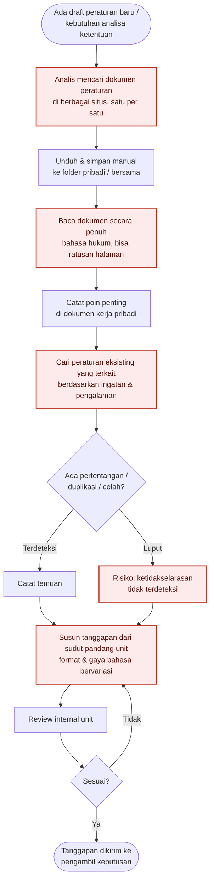
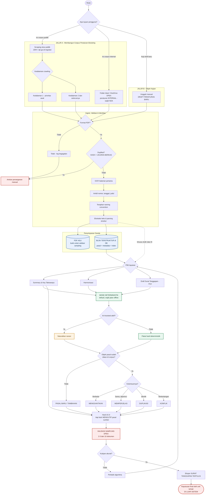
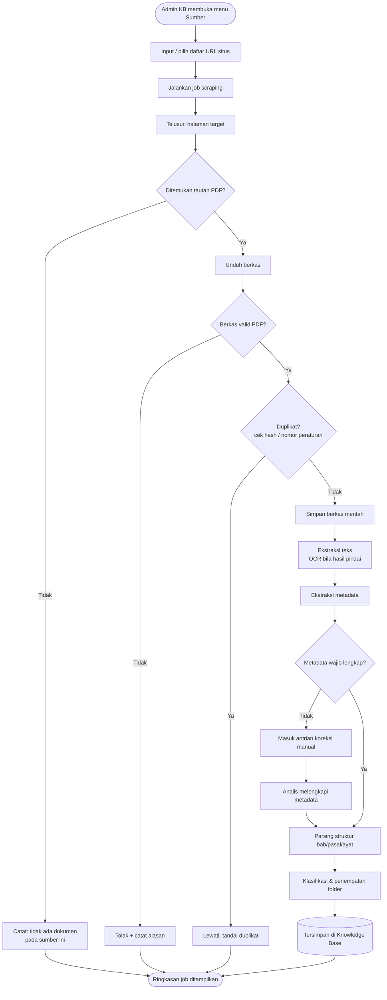
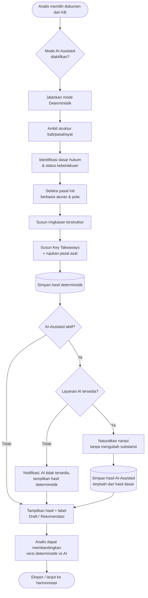
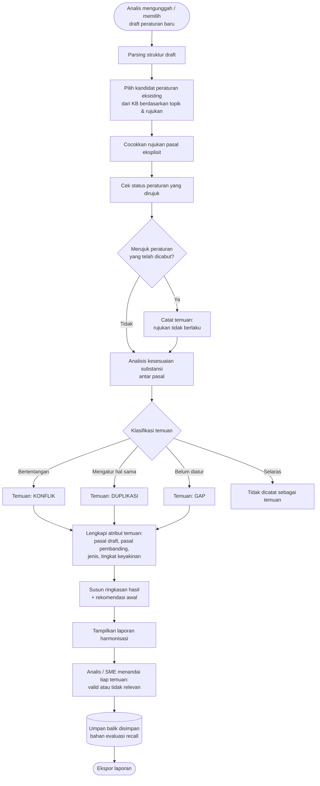
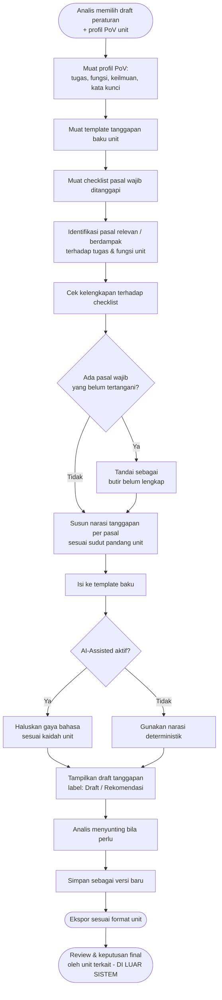
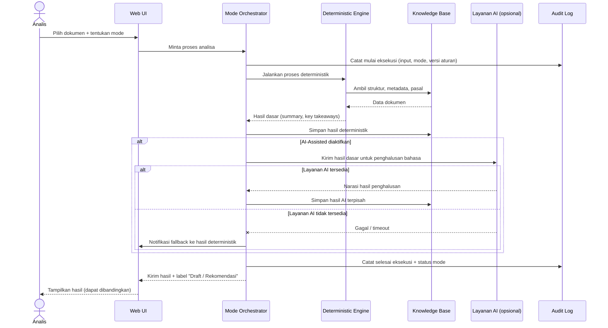
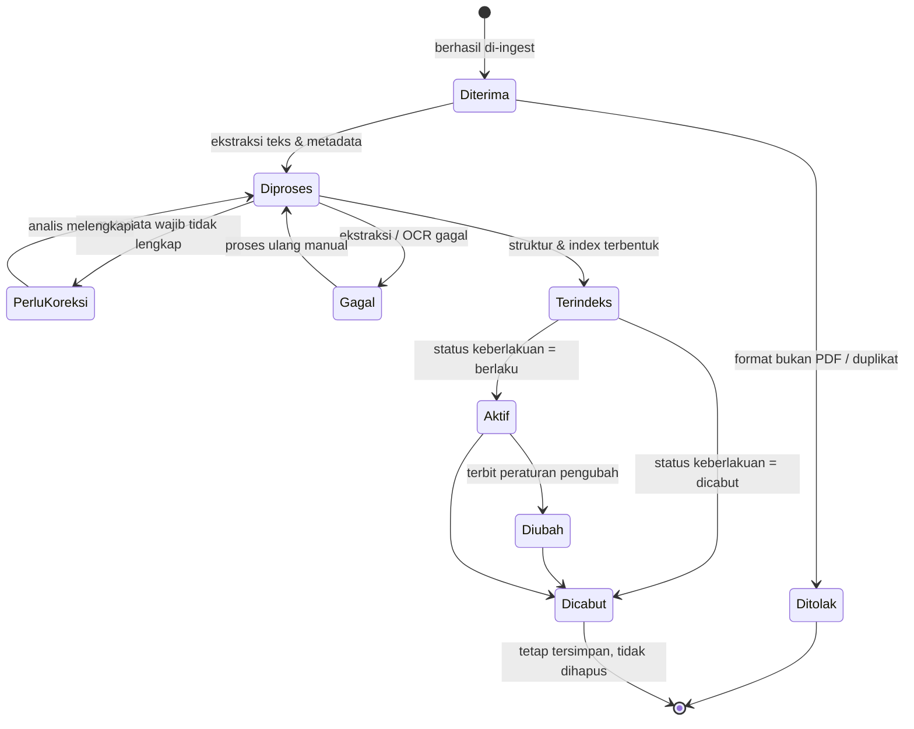

# PROCESS FLOW — AS-IS & TO-BE
**Proyek:** HERO | **Versi:** 2.0 | **Tanggal:** 8 September 2026 | **Penyusun:** Business Analyst

---

## 1. Proses AS-IS (Kondisi Saat Ini)

Seluruh rangkaian dikerjakan manual oleh analis. Perhatikan tiga titik yang menjadi sumber
masalah: pengumpulan satu per satu, pembacaan penuh dokumen, dan harmonisasi yang bergantung
pada ingatan individu.

### 1.1 Titik Nyeri (Pain Point) pada AS-IS

| Langkah | Pain Point | Kode BRD |
| --- | --- | --- |
| Mencari & mengunduh dokumen | Manual satu per satu, tersebar, tidak terkonsolidasi | PB-01 |
| Membaca dokumen penuh | Lama; bahasa hukum; dokumen panjang | PB-02 |
| Mencari peraturan terkait | Bergantung ingatan; cakupan tidak terjamin | PB-03 |
| Deteksi konflik | Rawan luput; tidak ada jejak audit | PB-03 |
| Menyusun tanggapan | Format & kualitas bervariasi antar penyusun | PB-04 |
| Seluruh proses | Tidak tersimpan terpusat; tidak dapat diulang | PB-05 |

---

## 2. Proses TO-BE v2 (Setelah HERO)

> **Versi 2** — direvisi 8 September 2026 berdasarkan [MoM Weekly Update #1](14-mom-weekly-update-01.md).
> Diagram lengkap beserta ringkasan 10 perubahan dari v1 ada di [HERO_FLOW.md](../HERO_FLOW.md).

Perbedaan paling mendasar dari v1: **tiga sumber dokumen tidak lagi disatukan ke satu pipeline
dengan tujuan yang sama.** Scraping dan folder internal mengisi *corpus* peraturan eksisting,
sedangkan unggah manual memasukkan **draft peraturan baru yang menjadi objek kajian**. Keduanya
melewati validasi yang sama, tetapi berakhir dengan peran yang berbeda.

### 2.1 Perbandingan AS-IS vs TO-BE

| Aspek | AS-IS | TO-BE | Requirement Terkait |
| --- | --- | --- | --- |
| Pengumpulan dokumen | Manual, satu per satu | 3 jalur ingest terpusat | FR-SCR-01..07 |
| Penyimpanan | Folder pribadi/bersama, tidak baku | Knowledge base terstruktur & terindeks | FR-KB-01..09 |
| Pemahaman dokumen | Baca penuh | Summary + Key Takeaways dengan rujukan pasal | FR-ANL-04..06 |
| Pencarian peraturan terkait | Ingatan individu | Pemilihan kandidat sistematis + pencarian semantik | FR-HRM-02, FR-HRM-05 |
| Deteksi ketidakselarasan | Rawan luput | Temuan berlabel menggantikan/memperjelas/pasal baru/duplikasi/konflik, tertelusur ke pasal | FR-HRM-06..09 |
| Penyusunan tanggapan | Format bervariasi, 2–3 hari per tanggapan | Surat tanggapan format baku DPEA, target 2–3 jam | FR-POV-02..05 |
| Jejak audit | Tidak ada | Audit log & riwayat eksekusi — pekerjaan dapat ditinggalkan lalu dilanjutkan | FR-SYS-07, FR-SYS-10 |
| Keputusan final | Manusia | **Tetap manusia** (tidak berubah) | BRule-01 |

---

## 3. Flow Detail per Modul

### 3.1 Scraping & Ingest (Fitur 3.2)

### 3.2 Analisa, Summary & Key Takeaways (Fitur 3.3)

### 3.3 Harmonisasi Draft vs Eksisting (Fitur 3.4)

### 3.4 Draft Tanggapan Berbasis PoV (Fitur 3.5)

---

## 4. Sequence Diagram — Alur Utama Analisa

---

## 5. State Dokumen dalam Sistem

---

## Riwayat Revisi

| Versi | Tanggal | Perubahan | Penyusun |
| --- | --- | --- | --- |
| 1.0 | 7 Sep 2026 | Draft awal: AS-IS, TO-BE, 4 flow modul, sequence & state diagram | BA |
| 2.0 | 8 Sep 2026 | TO-BE v2 hasil Weekly Update #1: pemisahan Jalur A/B, dedup hash+ukuran, OCR halaman 1, penyimpanan ganda, klasifikasi temuan baru, validasi sampling | BA |
