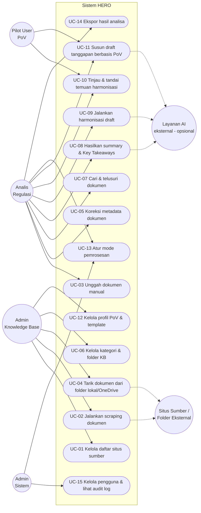

# USE CASE SPECIFICATION
**Proyek:** HERO | **Versi:** 1.0 | **Tanggal:** 7 September 2026 | **Penyusun:** Business Analyst

---

## 1. Diagram Use Case

### 1.1 Ringkasan Use Case

| ID | Nama Use Case | Aktor Utama | FR Terkait | Prioritas |
| --- | --- | --- | --- | --- |
| UC-01 | Kelola daftar situs sumber | Admin KB | FR-SCR-01 | Must |
| UC-02 | Jalankan scraping dokumen | Admin KB | FR-SCR-02, 03, 07, 08 | Must |
| UC-03 | Unggah dokumen manual | Analis | FR-SCR-04, 07 | Must |
| UC-04 | Tarik dokumen dari folder lokal/OneDrive | Admin KB | FR-SCR-05, 06 | Must |
| UC-05 | Koreksi metadata dokumen | Analis | FR-SCR-09, 10, 12 | Must |
| UC-06 | Kelola kategori & folder KB | Admin KB | FR-KB-01..03, 08 | Must |
| UC-07 | Cari & telusuri dokumen | Analis | FR-KB-05, 06, 09 | Must |
| UC-08 | Hasilkan summary & Key Takeaways | Analis | FR-ANL-01..09 | Must |
| UC-09 | Jalankan harmonisasi draft | Analis | FR-HRM-01..10 | Must |
| UC-10 | Tinjau & tandai temuan harmonisasi | Analis, Pilot User | FR-HRM-11, 12 | Should |
| UC-11 | Susun draft tanggapan berbasis PoV | Analis, Pilot User | FR-POV-02..06 | Must |
| UC-12 | Kelola profil PoV & template | Admin KB | FR-POV-01, 07 | Must |
| UC-13 | Atur mode pemrosesan | Analis, Admin Sistem | FR-SYS-01..04 | Must |
| UC-14 | Ekspor hasil analisa | Analis | FR-ANL-09, FR-HRM-13, FR-POV-08 | Should |
| UC-15 | Kelola pengguna & lihat audit log | Admin Sistem | FR-SYS-07, 08 | Must |

---

## 2. Spesifikasi Use Case Rinci

### UC-02 — Jalankan Scraping Dokumen

| Atribut | Keterangan |
| --- | --- |
| **ID** | UC-02 |
| **Aktor Utama** | Admin Knowledge Base |
| **Aktor Sekunder** | Situs sumber peraturan |
| **Deskripsi** | Menarik dokumen PDF dari daftar situs yang telah diinput manual, lalu memasukkannya ke knowledge base |
| **Prakondisi** | Pengguna terautentikasi sebagai Admin KB; minimal 1 situs sumber aktif terdaftar |
| **Pemicu** | Admin KB menekan "Jalankan Scraping" |
| **Pascakondisi Sukses** | Dokumen PDF valid tersimpan di KB dengan metadata dasar; ringkasan job tercatat |
| **Pascakondisi Gagal** | Tidak ada dokumen tersimpan; alasan kegagalan tercatat di log dan tampil di UI |

**Alur Utama**

| No. | Aktor | Sistem |
| --- | --- | --- |
| 1 | Memilih satu atau beberapa situs sumber | Menampilkan konfirmasi cakupan job |
| 2 | Menjalankan job | Membuat job dan menampilkan status "berjalan" |
| 3 | — | Menelusuri halaman target dan mengidentifikasi tautan PDF |
| 4 | — | Mengunduh berkas dan memvalidasi format |
| 5 | — | Memeriksa duplikasi terhadap KB |
| 6 | — | Mengekstraksi teks (OCR bila hasil pindai) dan metadata dasar |
| 7 | — | Mem-*parsing* struktur bab/pasal/ayat |
| 8 | — | Mengklasifikasi & menempatkan ke folder KB |
| 9 | — | Menampilkan ringkasan: jumlah berhasil, duplikat, gagal |

**Alur Alternatif & Eksepsi**

| Kode | Kondisi | Penanganan Sistem |
| --- | --- | --- |
| A1 | Situs tidak dapat diakses | Tandai sumber gagal, lanjutkan ke sumber berikutnya, catat alasan |
| A2 | Tidak ditemukan tautan PDF | Catat "tidak ada dokumen", job tetap berstatus selesai |
| E1 | Berkas bukan PDF | Tolak berkas, catat alasan, tidak masuk KB (FR-SCR-07) |
| E2 | Dokumen duplikat | Lewati penyimpanan, tandai sebagai duplikat, beri notifikasi (FR-SCR-08) |
| E3 | Ekstraksi metadata gagal / tidak lengkap | Dokumen masuk antrian koreksi manual (UC-05), tidak dibuang (FR-SCR-12) |
| E4 | OCR gagal pada PDF hasil pindai | Dokumen ditandai "gagal proses", masuk antrian penanganan manual |

**Aturan Bisnis Terkait:** BRule-04, BRule-05
**Kebutuhan Data:** Sumber Situs, Dokumen, Job Ingest, Log Kegagalan

---

### UC-08 — Hasilkan Summary & Key Takeaways

| Atribut | Keterangan |
| --- | --- |
| **ID** | UC-08 |
| **Aktor Utama** | Analis Regulasi |
| **Aktor Sekunder** | Layanan AI (opsional) |
| **Deskripsi** | Menghasilkan ringkasan dan poin-poin penting sebuah dokumen peraturan |
| **Prakondisi** | Dokumen sudah tersimpan & terindeks di KB; struktur pasal berhasil di-*parsing* |
| **Pemicu** | Analis menekan "Analisa Dokumen" |
| **Pascakondisi Sukses** | Summary dan minimal 3 Key Takeaways tersimpan, tiap butir memiliki rujukan pasal |
| **Pascakondisi Gagal** | Hasil tidak tersimpan; pengguna diberi tahu penyebabnya |

**Alur Utama**

| No. | Aktor | Sistem |
| --- | --- | --- |
| 1 | Memilih dokumen dari KB | Menampilkan detail dokumen & opsi mode |
| 2 | Menentukan mode (default: Deterministik) | Menyimpan pilihan mode untuk eksekusi ini |
| 3 | Menjalankan analisa | Mencatat awal eksekusi ke audit log |
| 4 | — | Mengambil struktur bab/pasal/ayat |
| 5 | — | Mengidentifikasi dasar hukum & status keberlakuan |
| 6 | — | Menyeleksi pasal inti berbasis aturan |
| 7 | — | Menyusun summary & Key Takeaways beserta rujukan pasal |
| 8 | — | Menyimpan hasil deterministik |
| 9 | — | Menampilkan hasil dengan label "Draft / Rekomendasi" |

**Alur Alternatif & Eksepsi**

| Kode | Kondisi | Penanganan Sistem |
| --- | --- | --- |
| A1 | AI-Assisted diaktifkan & layanan tersedia | Naturalkan narasi; simpan hasil AI terpisah dari hasil dasar (FR-SYS-03) |
| A2 | AI-Assisted diaktifkan namun layanan tidak tersedia | Tampilkan hasil deterministik + notifikasi *fallback*; proses tidak gagal (FR-SYS-04) |
| E1 | Struktur pasal tidak dapat di-*parsing* | Tampilkan peringatan; sarankan koreksi manual struktur |
| E2 | Waktu proses melampaui 5 menit | Catat sebagai pelanggaran NFR-01; job tetap diselesaikan, dicatat untuk evaluasi kinerja |

**Aturan Bisnis Terkait:** BRule-01, BRule-02, BRule-03
**Kebutuhan Data:** Dokumen, Struktur Pasal, Hasil Analisa, Key Takeaway, Audit Log

---

### UC-09 — Jalankan Harmonisasi Draft

| Atribut | Keterangan |
| --- | --- |
| **ID** | UC-09 |
| **Aktor Utama** | Analis Regulasi |
| **Deskripsi** | Membandingkan draft peraturan baru terhadap peraturan eksisting di KB dan menghasilkan laporan temuan |
| **Prakondisi** | Draft peraturan sudah diunggah & ter-*parsing*; KB berisi peraturan eksisting yang relevan |
| **Pemicu** | Analis menekan "Jalankan Harmonisasi" |
| **Pascakondisi Sukses** | Laporan harmonisasi tersimpan berisi ringkasan, daftar temuan berlabel, dan rekomendasi awal |
| **Pascakondisi Gagal** | Tidak ada laporan; penyebab tercatat |

**Alur Utama**

| No. | Aktor | Sistem |
| --- | --- | --- |
| 1 | Memilih draft peraturan | Menampilkan struktur draft |
| 2 | Menjalankan harmonisasi | Memilih kandidat peraturan eksisting yang relevan |
| 3 | — | Mencocokkan rujukan pasal eksplisit antar dokumen |
| 4 | — | Mengecek status keberlakuan peraturan yang dirujuk |
| 5 | — | Menganalisis kesesuaian makna/substansi antar pasal |
| 6 | — | Mengklasifikasi temuan: konflik / duplikasi / gap |
| 7 | — | Melengkapi atribut tiap temuan (pasal draft, pasal pembanding, jenis, tingkat keyakinan) |
| 8 | — | Menyusun ringkasan hasil + rekomendasi awal |
| 9 | Meninjau laporan | Menampilkan laporan dengan label "Draft / Rekomendasi" |

**Alur Alternatif & Eksepsi**

| Kode | Kondisi | Penanganan Sistem |
| --- | --- | --- |
| A1 | Draft merujuk peraturan yang telah dicabut | Catat sebagai temuan tersendiri (FR-HRM-04) |
| A2 | Tidak ditemukan peraturan eksisting yang relevan | Laporkan "tidak ada pembanding relevan" beserta dasar pencariannya — bukan laporan kosong tanpa penjelasan |
| E1 | Peraturan pembanding belum ter-*parsing* strukturnya | Kecualikan dari perbandingan & tampilkan daftar dokumen yang dilewati beserta alasannya |

**Aturan Bisnis Terkait:** BRule-01, BRule-08
**Kebutuhan Data:** Dokumen, Struktur Pasal, Eksekusi Harmonisasi, Temuan Harmonisasi

---

### UC-11 — Susun Draft Tanggapan Berbasis PoV

| Atribut | Keterangan |
| --- | --- |
| **ID** | UC-11 |
| **Aktor Utama** | Analis Regulasi |
| **Aktor Sekunder** | Pilot User PoV (validasi) |
| **Deskripsi** | Menyusun draft tanggapan atas draft peraturan baru dari sudut pandang unit fungsi terpilih |
| **Prakondisi** | Draft peraturan ter-*parsing*; profil PoV & template tanggapan tersedia; checklist pasal wajib terdefinisi |
| **Pemicu** | Analis menekan "Susun Tanggapan" |
| **Pascakondisi Sukses** | Draft tanggapan tersusun sesuai template, dengan penandaan butir yang belum lengkap bila ada |
| **Pascakondisi Gagal** | Tidak ada draft; penyebab tercatat |

**Alur Utama**

| No. | Aktor | Sistem |
| --- | --- | --- |
| 1 | Memilih draft peraturan & profil PoV | Memuat profil PoV, template, dan checklist |
| 2 | Menjalankan penyusunan | Mengidentifikasi pasal relevan/berdampak pada tugas & fungsi unit |
| 3 | — | Memeriksa kelengkapan terhadap checklist pasal wajib |
| 4 | — | Menyusun narasi tanggapan per pasal sesuai sudut pandang unit |
| 5 | — | Mengisi narasi ke dalam template baku |
| 6 | Meninjau & menyunting | Menyimpan hasil suntingan sebagai versi baru |
| 7 | Mengekspor | Menghasilkan berkas sesuai format unit |

**Alur Alternatif & Eksepsi**

| Kode | Kondisi | Penanganan Sistem |
| --- | --- | --- |
| A1 | Ada pasal wajib belum tertangani | Tandai sebagai "belum lengkap" dan tetap tampilkan di draft (FR-POV-03) |
| A2 | AI-Assisted aktif | Haluskan gaya bahasa sesuai kaidah unit tanpa mengubah substansi |
| E1 | Profil PoV belum dikonfigurasi | Blokir proses & arahkan ke UC-12 |
| E2 | Template unit belum tersedia | Blokir proses & tampilkan pesan kebutuhan konfigurasi |

**Aturan Bisnis Terkait:** BRule-01, BRule-07
**Kebutuhan Data:** Profil PoV, Template Tanggapan, Checklist Pasal, Draft Tanggapan, Butir Tanggapan

---

### UC-13 — Atur Mode Pemrosesan

| Atribut | Keterangan |
| --- | --- |
| **ID** | UC-13 |
| **Aktor Utama** | Analis Regulasi / Admin Sistem |
| **Deskripsi** | Mengaktifkan atau menonaktifkan lapisan AI-Assisted untuk suatu proses |
| **Prakondisi** | Pengguna terautentikasi |
| **Pemicu** | Pengguna mengubah *toggle* mode |
| **Pascakondisi Sukses** | Mode tersimpan dan diterapkan pada eksekusi berikutnya; status mode tercatat pada hasil |

**Alur Utama**

| No. | Aktor | Sistem |
| --- | --- | --- |
| 1 | Membuka pengaturan mode | Menampilkan status mode saat ini (default: Deterministik) |
| 2 | Mengubah *toggle* AI-Assisted | Menyimpan preferensi & mencatat ke audit log |
| 3 | Menjalankan proses analisa | Menjalankan proses deterministik terlebih dahulu, lalu lapisan AI bila aktif |

**Alur Alternatif & Eksepsi**

| Kode | Kondisi | Penanganan Sistem |
| --- | --- | --- |
| E1 | Layanan AI tidak tersedia saat toggle aktif | Beri peringatan dini di UI; proses tetap berjalan deterministik (FR-SYS-04) |

**Aturan Bisnis Terkait:** BRule-02, BRule-03

---

## Riwayat Revisi

| Versi | Tanggal | Perubahan | Penyusun |
| --- | --- | --- | --- |
| 1.0 | 7 Sep 2026 | Draft awal: 15 use case, 5 spesifikasi rinci | BA |
