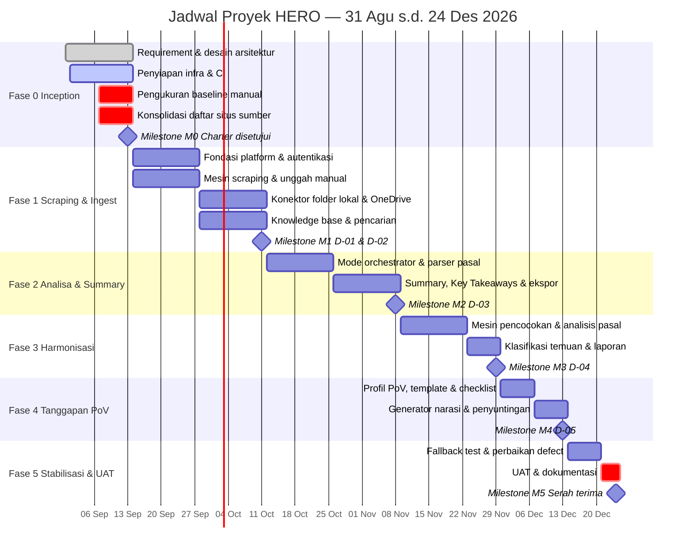
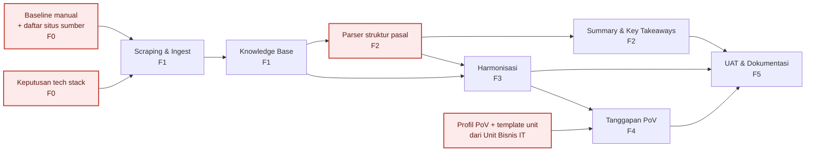

# WORK BREAKDOWN STRUCTURE, SPRINT PLAN & MILESTONE
**Proyek:** HERO | **Versi:** 1.2 | **Tanggal:** 9 September 2026 | **Penyusun:** Project Manager

---

## 1. Work Breakdown Structure (WBS)

```
1. HERO — Harmonisasi & Analisa Regulasi Otomatis
│
├── 1.1 Manajemen Proyek
│   ├── 1.1.1 Penyusunan & persetujuan Project Charter
│   ├── 1.1.2 Perencanaan sprint & pengelolaan backlog
│   ├── 1.1.3 Pelaporan progress (mingguan / dua mingguan)
│   ├── 1.1.4 Manajemen risiko & change request
│   ├── 1.1.5 Koordinasi stakeholder & sesi validasi SME
│   └── 1.1.6 Penutupan proyek & serah terima
│
├── 1.2 Analisis & Perancangan
│   ├── 1.2.1 Penggalian kebutuhan & BRD
│   ├── 1.2.2 Pemetaan proses AS-IS & TO-BE
│   ├── 1.2.3 Spesifikasi fungsional (SRS) & use case
│   ├── 1.2.4 Pengukuran baseline proses manual
│   ├── 1.2.5 Perancangan arsitektur sistem
│   ├── 1.2.6 Perancangan model data & knowledge base
│   └── 1.2.7 Perancangan UI/UX & purwarupa
│
├── 1.3 Fondasi Platform  ............................. [EP-06]
│   ├── 1.3.1 Autentikasi & manajemen peran
│   ├── 1.3.2 Kerangka Mode Orchestrator (Deterministik / AI)
│   ├── 1.3.3 Audit log & riwayat eksekusi
│   ├── 1.3.4 Kerangka UI & navigasi
│   └── 1.3.5 Lingkungan staging & CI
│
├── 1.4 Modul Scraping & Ingest  ..................... [EP-01 / D-01]
│   │
│   ├── 1.4.A Algoritma penelusuran ................. [Data/ML]
│   │   ├── 1.4.A.1 Penelusuran situs & kontrol kedalaman
│   │   ├── 1.4.A.2 Penanganan situs ber-anti-bot
│   │   ├── 1.4.A.3 Pengunduhan berkas PDF
│   │   ├── 1.4.A.4 Ekstraksi teks & OCR
│   │   └── 1.4.A.5 Ekstraksi metadata & penamaan baku
│   │
│   └── 1.4.B Pipeline ingest ....................... [Backend]
│       ├── 1.4.B.1 Manajemen daftar sumber
│       ├── 1.4.B.2 Job runner & pemantauan status
│       ├── 1.4.B.3 Unggah manual dokumen
│       ├── 1.4.B.4 Konektor folder lokal & OneDrive
│       ├── 1.4.B.5 Validasi format & deteksi duplikat
│       ├── 1.4.B.6 Penyimpanan berkas & metadata
│       └── 1.4.B.7 Antrian penanganan dokumen gagal
│
├── 1.5 Knowledge Base  .............................. [EP-02 / D-02]
│   ├── 1.5.1 Skema penyimpanan dokumen & metadata
│   ├── 1.5.2 Mesin klasifikasi & penempatan folder
│   ├── 1.5.3 Index pencarian (kata kunci & semantik)
│   ├── 1.5.4 UI pencarian & detail dokumen
│   ├── 1.5.5 Versioning dokumen
│   └── 1.5.6 Pengelolaan status keberlakuan
│
├── 1.6 Modul Analisa & Summary  ..................... [EP-03 / D-03]
│   ├── 1.6.1 Parser struktur bab/pasal/ayat
│   ├── 1.6.2 Ekstraksi dasar hukum & status
│   ├── 1.6.3 Mesin peringkasan deterministik
│   ├── 1.6.4 Generator Key Takeaways + rujukan pasal
│   ├── 1.6.5 Identifikasi topik/klausul utama
│   ├── 1.6.6 Lapisan AI-Assisted untuk narasi
│   └── 1.6.7 Ekspor hasil analisa
│
├── 1.7 Modul Harmonisasi  ........................... [EP-04 / D-04]
│   ├── 1.7.1 Pemilihan kandidat peraturan pembanding
│   ├── 1.7.2 Pencocokan rujukan pasal eksplisit
│   ├── 1.7.3 Pengecekan status peraturan yang dirujuk
│   ├── 1.7.4 Analisis kesesuaian substansi antar pasal
│   ├── 1.7.5 Klasifikasi temuan (konflik/duplikasi/gap)
│   ├── 1.7.6 Laporan harmonisasi & rekomendasi awal
│   ├── 1.7.7 Umpan balik penandaan temuan
│   └── 1.7.8 Evaluasi recall terhadap ground truth SME
│
├── 1.8 Modul Tanggapan PoV  ......................... [EP-05 / D-05]
│   ├── 1.8.1 Manajemen profil PoV unit fungsi
│   ├── 1.8.2 Manajemen template tanggapan & checklist
│   ├── 1.8.3 Identifikasi pasal berdampak
│   ├── 1.8.4 Pemeriksaan kelengkapan checklist
│   ├── 1.8.5 Generator narasi tanggapan berbasis PoV
│   ├── 1.8.6 Penyuntingan & versioning draft
│   └── 1.8.7 Ekspor sesuai format unit
│
└── 1.9 Pengujian, Dokumentasi & UAT  ................ [EP-07 / D-06]
    ├── 1.9.1 Test plan & penyusunan test case
    ├── 1.9.2 Pengujian fungsional per fase
    ├── 1.9.3 Fallback test tanpa layanan AI
    ├── 1.9.4 Pelaksanaan UAT & berita acara
    ├── 1.9.5 Dokumentasi teknis
    └── 1.9.6 Panduan pengguna
```

### 1.1 WBS Dictionary (Ringkas)

| Kode WBS | Deliverable | Penanggung Jawab | Kriteria Selesai |
| --- | --- | --- | --- |
| 1.1 | Dokumen manajemen proyek | PM | Charter disetujui; laporan rutin terkirim; proyek ditutup resmi |
| 1.2 | Dokumen analisis & desain | BA + Arsitek | BRD, SRS, use case, model data, purwarupa di-*review* PO |
| 1.3 | Fondasi platform | Backend + Infra | Login, mode orchestrator, audit log, CI berfungsi |
| 1.4.A | Algoritma penelusuran | **Data/ML** | Dokumen tertarik dari ≥ 3 situs; kedalaman crawling dapat diatur |
| 1.4.B | Pipeline ingest | **Backend** | Unggah manual, folder lokal, deduplikasi, dan antrian gagal berfungsi |
| 1.5 | Knowledge Base (D-02) | **Backend**, aturan klasifikasi oleh Data/ML | ≥ 20 dokumen tersimpan terstruktur & dapat dicari |
| 1.6 | Modul Analisa & Summary (D-03) | Data/ML | Summary & Key Takeaways untuk ≥ 10 dokumen, < 5 menit/dokumen |
| 1.7 | Modul Harmonisasi (D-04) | Data/ML | ≥ 5 pasang dokumen dibandingkan; recall ≥ 70% |
| 1.8 | Modul Tanggapan PoV (D-05) | Data/ML + Frontend | ≥ 3 draft tanggapan; template tervalidasi pilot user |
| 1.9 | Pengujian & dokumentasi (D-06) | QA + PM/BA | 4 fitur lulus UAT; dokumentasi 100%; fallback test lulus |

> **Catatan pembagian 1.4.** Modul ini dipecah menjadi dua kepemilikan karena sifat pekerjaannya
> berbeda. **1.4.A** adalah algoritma: menelusuri kedalaman URL, menangani situs ber-anti-bot,
> dan mengekstraksi isi dokumen — pekerjaan yang tingkat ketidakpastiannya tinggi dan menuntut
> percobaan berulang terhadap situs nyata. **1.4.B** adalah pipeline: siklus hidup pekerjaan,
> penyimpanan, dan penanganan kegagalan — pekerjaan yang polanya sudah baku.
>
> Kontrak antarkeduanya ditetapkan pada [Dokumen Arsitektur §4.3](16-arsitektur-sistem.md).
> Pemisahan ini memungkinkan 1.4.A dikerjakan tanpa menunggu skema basis data selesai, dan
> 1.4.B dikerjakan dengan penelusur tiruan — sehingga kedua peran berjalan sejak hari pertama
> Sprint 1.

---

## 2. Peta Fase → Sprint → Deliverable

| Fase | Periode | Sprint | Fokus | Deliverable |
| --- | --- | --- | --- | --- |
| **Fase 0** — Inception & Setup | 31 Agu – 13 Sep | S0 | Requirement, arsitektur, infrastruktur, KB skeleton | Dokumen requirement & arsitektur disetujui |
| **Fase 1** — MVP Scraping & Ingest | 14 Sep – 11 Okt | S1, S2 | Fitur 3.2 + knowledge base | D-01, D-02 |
| **Fase 2** — MVP Analisa & Summary | 12 Okt – 8 Nov | S3, S4 | Fitur 3.3 + mode pemrosesan | D-03 |
| **Fase 3** — MVP Harmonisasi | 9 – 29 Nov | S5, (S6) | Fitur 3.4 | D-04 |
| **Fase 4** — MVP Tanggapan PoV | 30 Nov – 13 Des | (S6), S7 | Fitur 3.5, pilot Unit Bisnis IT | D-05 |
| **Fase 5** — Stabilisasi & UAT | 14 – 24 Des | S7, S8 | UAT, perbaikan, dokumentasi | D-06 |

> **Catatan PM — batas sprint tidak sejajar dengan batas fase.** Sprint 6 (23 Nov – 6 Des)
> memotong akhir Fase 3 dan awal Fase 4; Sprint 7 (7 – 20 Des) memotong Fase 4 dan Fase 5.
> Konsekuensinya, *demo* akhir Fase 3 (29 Nov) jatuh di tengah Sprint 6, bukan di *sprint review*.
> **Rekomendasi:** jadwalkan **milestone review terpisah** pada 29 Nov dan 13 Des di luar
> ritme sprint review, atau ajukan penyesuaian batas fase ke mentor. Perlu diputuskan sebelum
> Sprint 5 dimulai (9 Nov).

---

## 3. Jadwal Proyek (Gantt)



---

## 4. Rencana Sprint

| Sprint | Periode | Tujuan Sprint (Sprint Goal) | Story | SP |
| --- | --- | --- | --- | --- |
| **S0** | 31 Agu – 13 Sep | Kebutuhan, arsitektur, dan infrastruktur siap; baseline manual terukur | US-11 + aktivitas 1.2.x | 4 |
| **S1** | 14 Sep – 27 Sep | Pengguna dapat login dan menarik dokumen PDF dari situs sumber & unggahan manual | US-01, 02, 12, 13, 14, 15, 18, 20, 26 | 45 |
| **S2** | 28 Sep – 11 Okt | Dokumen dari folder eksternal masuk KB terstruktur dan dapat dicari | US-03, 08, 09, 16, 17, 19, 21, 22, 23, 24, 25, 27, 28, 31 | 72 |
| **S3** | 12 Okt – 25 Okt | Struktur pasal terbaca dan mode Deterministik/AI dapat dipilih | US-04, 05, 07, 29, 30, 32, 33, 34 | 43 |
| **S4** | 26 Okt – 8 Nov | Analis memperoleh summary & Key Takeaways bertautan pasal dalam < 5 menit | US-06, 10, 35, 36, 37, 38, 39, 40 | 42 |
| **S5** | 9 Nov – 22 Nov | Sistem dapat membandingkan draft terhadap peraturan eksisting secara substansi | US-41, 42, 43, 44, 45 | 39 |
| **S6** | 23 Nov – 6 Des | Temuan harmonisasi terklasifikasi & dilaporkan; fondasi PoV siap | US-46, 47, 48, 49, 50, 51, 52, 57 | 40 |
| **S7** | 7 Des – 20 Des | Draft tanggapan berbasis PoV tersusun & sistem lulus fallback test | US-53, 54, 55, 56, 58, 59, 63 | 39 |
| **S8** | 21 Des – 24 Des | UAT lulus, dokumentasi lengkap, proyek diserahterimakan | US-60, 61, 62 | 18 |

### 4.1 Ritual Sprint

| Ritual | Waktu | Durasi | Peserta |
| --- | --- | --- | --- |
| Sprint Planning | Hari-1 sprint | 2 jam | Tim + PO |
| Daily Stand-up (async) | Setiap hari | 15 menit | Tim (grup WhatsApp) |
| **Rapat Mingguan Mitra** | **Mingguan** | **Maks. 1 jam** | Tim + Faris + Andika |
| Backlog Refinement | Pertengahan sprint | 1 jam | Tim + BA |
| Sprint Review / Demo | Hari terakhir sprint | 1,5 jam | Tim + PO + Mentor |
| Sprint Retrospective | Setelah review | 1 jam | Tim |

### 4.2 Format Rapat Mingguan yang Diminta Mitra

Ditetapkan Faris pada Weekly Update #1. Dibawakan oleh PM:

1. Dari fase sebelumnya ada **N item** — berapa yang **terealisasi**
2. Mana saja yang **sudah disetujui user** (Faris & Andika)
3. Yang belum — **mengapa belum**
4. Item yang belum selesai **masuk antrian fase berikutnya**, tidak menahan dimulainya fase baru

> Prinsip yang ditegaskan mitra: *"Enaknya Agile itu, kita nggak harus nunggu semuanya."*
> Fase 1 boleh dimulai meski ada sisa Fase 0 — asalkan sisanya tercatat di backlog dan
> dilaporkan mingguan.

---

## 5. Milestone & Indikator Keberhasilan

| ID | Milestone | Tanggal | Indikator Keberhasilan | Penerima Sign-off |
| --- | --- | --- | --- | --- |
| **M0** | Inception selesai | 13 Sep 2026 | Dokumen requirement & arsitektur disetujui; infrastruktur dasar siap; struktur folder KB awal tersedia; NDA lengkap | Mentor + PO |
| **M1** | MVP Scraping & Ingest | **Uji coba mitra 8 Okt**, penerimaan 11 Okt 2026 | ≥ 3 situs sumber tertarik; unggah manual berfungsi; ≥ 1 folder lokal terbaca; ≥ 20 dokumen di KB (mode Deterministik). **OneDrive digeser ke Fase 2** — folder belum disediakan mitra | PO |
| **M2** | MVP Analisa & Summary | 8 Nov 2026 | Summary & Key Takeaways untuk ≥ 10 dokumen uji; waktu proses < 5 menit/dokumen; toggle AI-Assisted berfungsi | PO + SME |
| **M3** | MVP Harmonisasi | 29 Nov 2026 | ≥ 5 pasang dokumen dibandingkan; ≥ 70% potensi konflik/duplikasi terdeteksi (divalidasi manual) | PO + SME |
| **M4** | MVP Tanggapan PoV | 13 Des 2026 | ≥ 3 draft tanggapan tersusun; template sesuai standar unit tervalidasi pilot user | PO + Pilot User |
| **M5** | Stabilisasi & Serah Terima | 24 Des 2026 | 4 fitur lulus UAT (≥ 1 pilot user/fitur); dokumentasi 100%; sistem lulus fallback test tanpa AI | Mentor + PO + Dosen |

### 5.1 Kesiapan Uji Coba Mitra — 8 Oktober 2026

Mitra menyatakan akan **mencoba sendiri** aplikasinya, bukan hanya menonton demo:
*"Tanggal delapan pun diberikan, kami akan siap untuk melakukan uji coba."*

| Prasyarat | Penanggung Jawab | Tenggat |
| --- | --- | --- |
| Aplikasi dapat diakses mitra (hosting / tautan) | Infra/QA | **28 Sep 2026** |
| Delapan alur pada [UI Spec §6](15-ui-spec-fase-1.md) dapat diselesaikan tanpa pendampingan | Frontend + Backend | 7 Okt 2026 |
| ≥ 20 dokumen sudah terisi di knowledge base | Data/ML | 7 Okt 2026 |
| Panduan singkat cara memakai | BA | 7 Okt 2026 |

> **Ini prasyarat yang mudah terlewat.** Tim menyatakan akan mulai dari lokal lalu publish
> bertahap. Aplikasi yang hanya berjalan di laptop anggota tim **tidak dapat diuji mitra** —
> dan M1 gagal diverifikasi meskipun seluruh fiturnya jalan. Pendanaan tersedia dengan skema
> yang sama seperti semester lalu; ajukan sebelum akhir September bila hosting berbayar
> diperlukan.

---

## 6. Dependensi & Jalur Kritis



**Jalur kritis:** Baseline & tech stack (F0) → Scraping & Ingest (F1) → Knowledge Base (F1) →
**Parser struktur pasal** (F2) → Harmonisasi (F3) → Tanggapan PoV (F4) → UAT (F5).

| Dependensi Kritis | Mengapa Kritis | Dampak Bila Terlambat |
| --- | --- | --- |
| **Parser struktur bab/pasal/ayat** (US-32) | Menjadi masukan bagi summary, harmonisasi, *dan* tanggapan PoV | Ketiga fitur berikutnya tertunda serentak — risiko terbesar terhadap jadwal |
| **Keputusan tech stack** (TD-01) | Memblokir arsitektur, estimasi, dan penyiapan infrastruktur | Sprint 1 mundur; efek berantai ke seluruh fase |
| **Daftar situs sumber** | Masukan wajib Fitur 3.2 | M1 tidak dapat diverifikasi |
| **Profil PoV & template unit** | Masukan wajib Fitur 3.5 | M4 tidak dapat diverifikasi |
| **Ketersediaan SME** | Menentukan *ground truth* recall & validasi tanggapan | M3 dan M4 tidak dapat dinyatakan lulus |

> **Rekomendasi PM:** karena US-32 (parser struktur pasal, 13 SP) menopang tiga fitur sekaligus,
> kerjakan **purwarupa parser lebih awal** — mulai eksplorasi teknis di S2 secara paralel dengan
> ingest, meski penyelesaiannya tetap dijadwalkan di S3. Menemukan bahwa penomoran dokumen OJK
> tidak sebaku asumsi pada bulan November akan jauh lebih mahal daripada menemukannya pada
> bulan Oktober.

---

## 7. Kapasitas & Sumber Daya

| Peran | Jumlah | Estimasi Kapasitas | Beban Utama |
| --- | --- | --- | --- |
| PM / Business Analyst | 1 | Konstan sepanjang proyek | F0 (berat), pelaporan & validasi (rutin) |
| Backend | 1 | Konstan | F1 (berat), F2–F4 (dukungan) |
| Frontend / UX | 1 | Konstan | F1–F2 (sedang), F4 (berat) |
| Data / ML | 1 | Konstan | F2–F4 (berat) |
| Infra / QA | 1 | Konstan | F0 & F5 (berat), CI (rutin) |

> **Catatan PM:** beban Data/ML memuncak dari Fase 2 sampai Fase 4 tanpa jeda — tiga modul
> tersulit (D-03 nilai 4, D-04 nilai 4, D-05 nilai 5) berurutan di jalurnya. Perlu disepakati
> sejak awal bahwa Backend dan BA ikut menopang pekerjaan berbasis aturan (parsing, checklist,
> template), sehingga Data/ML dapat fokus pada bagian retrieval dan analisis substansi.

---

## Riwayat Revisi

| Versi | Tanggal | Perubahan | Penyusun |
| --- | --- | --- | --- |
| 1.0 | 7 Sep 2026 | Draft awal: WBS, peta fase-sprint, Gantt, 9 sprint, 6 milestone, jalur kritis | PM |
| 1.2 | 9 Sep 2026 | WBS 1.4 dipecah menjadi 1.4.A (algoritma, Data/ML) dan 1.4.B (pipeline, Backend); kepemilikan 1.5 diperjelas | PM |
| 1.1 | 8 Sep 2026 | Kadens rapat menjadi mingguan + format laporan mitra; M1 menyertakan uji coba mitra 8 Okt; OneDrive digeser ke Fase 2; tambah §5.1 prasyarat uji coba | PM |
