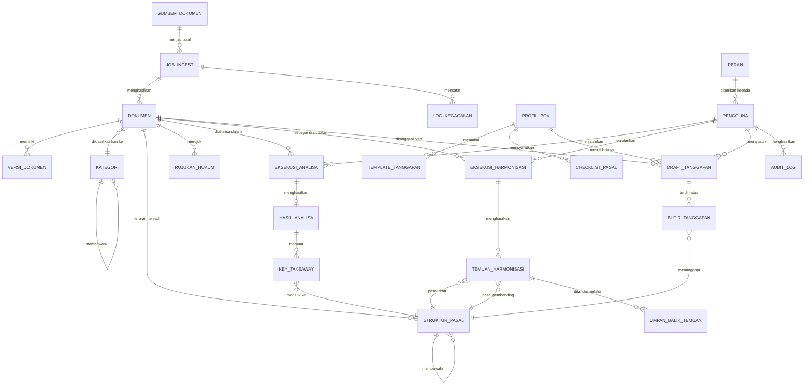

# DATA MODEL & DATA DICTIONARY
**Proyek:** HERO | **Versi:** 1.1 | **Tanggal:** 8 September 2026 | **Penyusun:** Business Analyst

> Dokumen ini menjelaskan **model data konseptual/logis** dari sudut pandang bisnis.
> Rancangan fisik (tipe kolom, indeks, partisi) ditetapkan tim Backend setelah tech stack
> diputuskan (TD-01).

---

## 1. Entity Relationship Diagram

---

## 2. Data Dictionary

### 2.1 SUMBER_DOKUMEN
Daftar situs dan folder yang menjadi asal dokumen.

| Atribut | Tipe Logis | Wajib | Deskripsi | Aturan |
| --- | --- | --- | --- | --- |
| id_sumber | ID | Ya | Pengenal unik sumber | — |
| jenis_sumber | Enum | Ya | `situs_web`, `folder_lokal`, `onedrive_public` | — |
| nama | Teks | Ya | Nama sumber yang dikenali pengguna | — |
| alamat | Teks | Ya | URL situs atau jalur folder | Unik; format valid sesuai jenis |
| status_aktif | Boolean | Ya | Sumber ikut diproses atau tidak | Default: aktif |
| tanggal_ditambahkan | Tanggal-Waktu | Ya | Waktu pendaftaran sumber | — |
| terakhir_dijalankan | Tanggal-Waktu | Tidak | Waktu job terakhir atas sumber ini | — |

### 2.2 JOB_INGEST
Satu eksekusi pengumpulan dokumen.

| Atribut | Tipe Logis | Wajib | Deskripsi | Aturan |
| --- | --- | --- | --- | --- |
| id_job | ID | Ya | Pengenal job | — |
| id_sumber | ID | Tidak | Sumber yang diproses; kosong untuk unggah manual | FK → SUMBER_DOKUMEN |
| jenis_job | Enum | Ya | `scraping`, `unggah_manual`, `sinkron_folder` | — |
| dijalankan_oleh | ID | Ya | Pengguna pemicu job | FK → PENGGUNA |
| waktu_mulai | Tanggal-Waktu | Ya | — | — |
| waktu_selesai | Tanggal-Waktu | Tidak | Kosong selama job berjalan | — |
| status | Enum | Ya | `antrian`, `berjalan`, `selesai`, `gagal` | — |
| jumlah_berhasil | Angka | Ya | Dokumen masuk KB | Default 0 |
| jumlah_duplikat | Angka | Ya | Dokumen dilewati karena duplikat | Default 0 |
| jumlah_gagal | Angka | Ya | Dokumen gagal diproses | Default 0 |

### 2.3 DOKUMEN
Entitas inti knowledge base.

| Atribut | Tipe Logis | Wajib | Deskripsi | Aturan |
| --- | --- | --- | --- | --- |
| id_dokumen | ID | Ya | Pengenal dokumen | — |
| judul | Teks | Ya | Judul peraturan | Wajib sebelum masuk KB (FR-SCR-09/10) |
| nomor_peraturan | Teks | Tidak | Nomor resmi peraturan | Wajib untuk peraturan resmi; divalidasi pola |
| jenis_peraturan | Teks | Tidak | Contoh: POJK, SEOJK, UU, PP | — |
| tanggal_terbit | Tanggal | Ya | Tanggal penetapan/pengundangan | Tidak melebihi tanggal hari ini |
| status_keberlakuan | Enum | Ya | `berlaku`, `diubah`, `dicabut`, `tidak_diketahui` | Dokumen dicabut **tidak dihapus** (BRule-08) |
| klasifikasi_akses | Enum | Ya | `publik`, `non_publik` | Ditandai saat ingest (BRule-05) |
| id_kategori | ID | Ya | Kategori/folder KB | FK → KATEGORI |
| id_job | ID | Ya | Job yang memasukkan dokumen | FK → JOB_INGEST |
| hash_isi | Teks | Ya | Sidik jari isi berkas untuk deteksi duplikat | Dibandingkan **bersama** `ukuran_berkas` (FR-SCR-08) |
| ukuran_berkas | Angka | Ya | Ukuran berkas dalam byte | Pasangan pembanding `hash_isi` |
| peran_dokumen | Enum | Ya | `corpus_eksisting` atau `draft_kajian` | Draft kajian **tidak** ikut menjadi kandidat pembanding harmonisasi (FR-SCR-04a) |
| nama_berkas_baku | Teks | Ya | Nama hasil *naming convention* dari OCR halaman 1 | Nomor + tanggal + judul (FR-SCR-09b) |
| jalur_berkas | Teks | Ya | Lokasi penyimpanan berkas asli | — |
| sumber_perolehan | Teks | Tidak | URL/jalur asal dokumen | — |
| metode_ekstraksi | Enum | Ya | `teks_langsung`, `ocr` | — |
| teks_lengkap | Teks Panjang | Tidak | Hasil ekstraksi teks | Kosong bila ekstraksi gagal |
| status_pemrosesan | Enum | Ya | `diterima`, `diproses`, `perlu_koreksi`, `terindeks`, `gagal`, `ditolak` | Lihat state diagram §5 dok. 04 |
| tanggal_masuk | Tanggal-Waktu | Ya | Waktu masuk sistem | — |

### 2.4 VERSI_DOKUMEN
Riwayat versi bila dokumen dengan identitas sama diunggah ulang (FR-KB-07).

| Atribut | Tipe Logis | Wajib | Deskripsi |
| --- | --- | --- | --- |
| id_versi | ID | Ya | Pengenal versi |
| id_dokumen | ID | Ya | Dokumen induk |
| nomor_versi | Angka | Ya | Urutan versi, mulai 1 |
| jalur_berkas | Teks | Ya | Berkas pada versi ini |
| diunggah_oleh | ID | Ya | FK → PENGGUNA |
| waktu_versi | Tanggal-Waktu | Ya | Waktu pembuatan versi |
| catatan_perubahan | Teks | Tidak | Alasan penggantian |

### 2.5 KATEGORI
Struktur folder knowledge base, mendukung hierarki.

| Atribut | Tipe Logis | Wajib | Deskripsi | Aturan |
| --- | --- | --- | --- | --- |
| id_kategori | ID | Ya | Pengenal kategori | — |
| nama_kategori | Teks | Ya | Nama folder | Unik dalam satu induk |
| id_induk | ID | Tidak | Kategori induk; kosong bila akar | FK → KATEGORI |
| dibuat_otomatis | Boolean | Ya | Dibuat sistem atau manual | FR-KB-03 |
| aturan_klasifikasi | Teks | Tidak | Pola/kata kunci penentu kategori | Dapat diubah tanpa ubah kode (NFR-15) |

### 2.6 STRUKTUR_PASAL
Hasil penguraian dokumen menjadi bab/pasal/ayat; menjadi tulang punggung ketertelusuran.

| Atribut | Tipe Logis | Wajib | Deskripsi | Aturan |
| --- | --- | --- | --- | --- |
| id_struktur | ID | Ya | Pengenal unit struktur | — |
| id_dokumen | ID | Ya | Dokumen induk | FK → DOKUMEN |
| id_induk | ID | Tidak | Unit struktur induk (bab → pasal → ayat) | FK → STRUKTUR_PASAL |
| tingkat | Enum | Ya | `bab`, `bagian`, `paragraf`, `pasal`, `ayat`, `huruf` | — |
| penomoran | Teks | Ya | Nomor sebagaimana tertulis di dokumen | — |
| judul | Teks | Tidak | Judul bab/bagian bila ada | — |
| isi_teks | Teks Panjang | Ya | Teks asli unit struktur | — |
| urutan | Angka | Ya | Urutan tampil dalam dokumen | — |

### 2.7 RUJUKAN_HUKUM
Dasar hukum yang dirujuk dokumen (FR-ANL-02).

| Atribut | Tipe Logis | Wajib | Deskripsi |
| --- | --- | --- | --- |
| id_rujukan | ID | Ya | Pengenal rujukan |
| id_dokumen | ID | Ya | Dokumen yang merujuk |
| teks_rujukan | Teks | Ya | Kutipan rujukan sebagaimana tertulis |
| id_dokumen_dirujuk | ID | Tidak | Dokumen tujuan bila ditemukan di KB |
| status_dokumen_dirujuk | Enum | Tidak | Salinan status keberlakuan saat pemeriksaan |
| jenis_rujukan | Enum | Ya | `dasar_hukum`, `rujukan_pasal`, `pencabutan`, `perubahan` |

### 2.8 EKSEKUSI_ANALISA
Satu kali proses analisa; menyimpan jejak agar hasil dapat diulang (FR-SYS-10).

| Atribut | Tipe Logis | Wajib | Deskripsi | Aturan |
| --- | --- | --- | --- | --- |
| id_eksekusi | ID | Ya | Pengenal eksekusi | — |
| id_dokumen | ID | Ya | Dokumen yang dianalisa | FK → DOKUMEN |
| dijalankan_oleh | ID | Ya | Pengguna pemicu | FK → PENGGUNA |
| mode | Enum | Ya | `deterministik`, `ai_assisted` | Default `deterministik` (BRule-02) |
| versi_aturan | Teks | Ya | Versi aturan/konfigurasi yang dipakai | Untuk pengulangan hasil |
| status_layanan_ai | Enum | Tidak | `tersedia`, `tidak_tersedia`, `tidak_dipakai` | Merekam kejadian *fallback* |
| waktu_mulai | Tanggal-Waktu | Ya | — | — |
| waktu_selesai | Tanggal-Waktu | Tidak | — | Selisih dipakai mengukur NFR-01 |
| status | Enum | Ya | `antrian`, `berjalan`, `selesai`, `gagal` | — |

### 2.9 HASIL_ANALISA

| Atribut | Tipe Logis | Wajib | Deskripsi | Aturan |
| --- | --- | --- | --- | --- |
| id_hasil | ID | Ya | Pengenal hasil | — |
| id_eksekusi | ID | Ya | Eksekusi asal | FK → EKSEKUSI_ANALISA |
| ringkasan_deterministik | Teks Panjang | Ya | Summary hasil mode dasar | Selalu terisi (BRule-02) |
| ringkasan_ai | Teks Panjang | Tidak | Summary hasil penghalusan AI | Disimpan terpisah (FR-SYS-03) |
| daftar_topik | Teks | Tidak | Topik/klausul utama | FR-ANL-07 |
| label_status | Teks | Ya | Selalu "Draft / Rekomendasi" | BRule-01, FR-SYS-05 |

### 2.10 KEY_TAKEAWAY

| Atribut | Tipe Logis | Wajib | Deskripsi | Aturan |
| --- | --- | --- | --- | --- |
| id_takeaway | ID | Ya | Pengenal poin | — |
| id_hasil | ID | Ya | Hasil analisa induk | FK → HASIL_ANALISA |
| urutan | Angka | Ya | Urutan tampil | — |
| isi_poin | Teks | Ya | Isi poin penting | — |
| id_struktur | ID | Ya | Pasal sumber poin | FK → STRUKTUR_PASAL; wajib (NFR-11) |

### 2.11 EKSEKUSI_HARMONISASI

| Atribut | Tipe Logis | Wajib | Deskripsi |
| --- | --- | --- | --- |
| id_harmonisasi | ID | Ya | Pengenal eksekusi |
| id_dokumen_draft | ID | Ya | Draft peraturan yang dikaji |
| dijalankan_oleh | ID | Ya | Pengguna pemicu |
| mode | Enum | Ya | `deterministik`, `ai_assisted` |
| daftar_kandidat | Teks | Ya | Dokumen pembanding terpilih + dasar pemilihannya (FR-HRM-02) |
| ringkasan_hasil | Teks Panjang | Tidak | Ringkasan harmonisasi |
| rekomendasi_awal | Teks Panjang | Tidak | Rekomendasi tindak lanjut |
| waktu_mulai | Tanggal-Waktu | Ya | — |
| waktu_selesai | Tanggal-Waktu | Tidak | — |
| status | Enum | Ya | `antrian`, `berjalan`, `selesai`, `gagal` |

### 2.12 TEMUAN_HARMONISASI

| Atribut | Tipe Logis | Wajib | Deskripsi | Aturan |
| --- | --- | --- | --- | --- |
| id_temuan | ID | Ya | Pengenal temuan | — |
| id_harmonisasi | ID | Ya | Eksekusi asal | FK → EKSEKUSI_HARMONISASI |
| id_pasal_draft | ID | Ya | Pasal pada draft | FK → STRUKTUR_PASAL |
| id_pasal_pembanding | ID | Tidak | Pasal pada peraturan eksisting; kosong untuk temuan jenis `pasal_baru` | FK → STRUKTUR_PASAL |
| jenis_temuan | Enum | Ya | `menggantikan`, `memperjelas`, `pasal_baru`, `duplikasi`, `konflik`, `rujukan_dicabut` | FR-HRM-06..08b |
| id_pasal_digugurkan | ID | Tidak | Pasal lama yang gugur; wajib bila jenis = `menggantikan` | FK → STRUKTUR_PASAL |
| kutipan_pasal_draft | Teks | Ya | Bunyi pasal draft **apa adanya**, bukan parafrase | Prasyarat validasi sampling DPEA |
| kutipan_pasal_pembanding | Teks | Tidak | Bunyi pasal pembanding apa adanya | Prasyarat validasi sampling DPEA |
| tingkat_keyakinan | Enum | Ya | `tinggi`, `sedang`, `rendah` | — |
| penjelasan | Teks | Ya | Alasan sistem menandai temuan | — |
| dasar_deteksi | Enum | Ya | `rujukan_eksplisit`, `kemiripan_substansi`, `status_peraturan` | Menjelaskan asal temuan |

### 2.13 UMPAN_BALIK_TEMUAN
Penandaan valid/tidak relevan oleh analis atau SME (FR-HRM-11); menjadi bahan perhitungan
recall M-07.

| Atribut | Tipe Logis | Wajib | Deskripsi |
| --- | --- | --- | --- |
| id_umpan_balik | ID | Ya | Pengenal umpan balik |
| id_temuan | ID | Ya | Temuan yang ditandai |
| ditandai_oleh | ID | Ya | Pengguna penilai |
| penilaian | Enum | Ya | `valid`, `tidak_relevan`, `perlu_ditinjau` |
| catatan | Teks | Tidak | Alasan penilaian |
| waktu_penandaan | Tanggal-Waktu | Ya | — |

### 2.14 PROFIL_POV

| Atribut | Tipe Logis | Wajib | Deskripsi | Aturan |
| --- | --- | --- | --- | --- |
| id_pov | ID | Ya | Pengenal profil | — |
| nama_unit | Teks | Ya | Nama unit fungsi | Unik |
| deskripsi_tugas | Teks | Ya | Tugas unit | — |
| deskripsi_fungsi | Teks | Ya | Fungsi unit | — |
| bidang_keilmuan | Teks | Ya | Keilmuan yang menjadi sudut pandang | — |
| kata_kunci_relevansi | Teks | Ya | Kata kunci penentu pasal berdampak | Dapat dikonfigurasi (NFR-15) |
| status_aktif | Boolean | Ya | Profil dipakai atau tidak | MVP: 1 profil aktif (BRule-07) |

### 2.15 TEMPLATE_TANGGAPAN & CHECKLIST_PASAL

**TEMPLATE_TANGGAPAN**

| Atribut | Tipe Logis | Wajib | Deskripsi |
| --- | --- | --- | --- |
| id_template | ID | Ya | Pengenal template |
| id_pov | ID | Ya | Profil PoV pemilik template |
| nama_template | Teks | Ya | Nama template |
| struktur_bagian | Teks | Ya | Definisi bagian/urutan tanggapan baku |
| versi | Teks | Ya | Versi template |
| divalidasi_oleh | Teks | Tidak | Pihak unit yang memvalidasi |

**CHECKLIST_PASAL**

| Atribut | Tipe Logis | Wajib | Deskripsi |
| --- | --- | --- | --- |
| id_checklist | ID | Ya | Pengenal butir checklist |
| id_pov | ID | Ya | Profil PoV pemilik checklist |
| kriteria_pasal | Teks | Ya | Kriteria pasal yang wajib ditanggapi |
| wajib | Boolean | Ya | Wajib atau opsional |
| keterangan | Teks | Tidak | Penjelasan tambahan |

### 2.16 DRAFT_TANGGAPAN & BUTIR_TANGGAPAN

**DRAFT_TANGGAPAN**

| Atribut | Tipe Logis | Wajib | Deskripsi | Aturan |
| --- | --- | --- | --- | --- |
| id_tanggapan | ID | Ya | Pengenal draft tanggapan | — |
| id_dokumen | ID | Ya | Draft peraturan yang ditanggapi | FK → DOKUMEN |
| id_pov | ID | Ya | Profil PoV yang dipakai | FK → PROFIL_POV |
| id_template | ID | Ya | Template yang dipakai | FK → TEMPLATE_TANGGAPAN |
| disusun_oleh | ID | Ya | Pengguna penyusun | FK → PENGGUNA |
| mode | Enum | Ya | `deterministik`, `ai_assisted` | — |
| nomor_versi | Angka | Ya | Versi draft; naik setiap penyuntingan | FR-POV-06 |
| status_kelengkapan | Enum | Ya | `lengkap`, `ada_pasal_wajib_belum_ditanggapi` | FR-POV-03 |
| label_status | Teks | Ya | Selalu "Draft / Rekomendasi" | BRule-01 |
| waktu_dibuat | Tanggal-Waktu | Ya | — | — |

**BUTIR_TANGGAPAN**

| Atribut | Tipe Logis | Wajib | Deskripsi |
| --- | --- | --- | --- |
| id_butir | ID | Ya | Pengenal butir |
| id_tanggapan | ID | Ya | Draft tanggapan induk |
| id_struktur | ID | Ya | Pasal yang ditanggapi |
| narasi_deterministik | Teks Panjang | Ya | Narasi hasil mode dasar |
| narasi_ai | Teks Panjang | Tidak | Narasi hasil penghalusan AI |
| alasan_relevansi | Teks | Tidak | Mengapa pasal ini berdampak bagi unit |
| disunting_manual | Boolean | Ya | Ditandai bila diubah pengguna |

### 2.17 PENGGUNA, PERAN & AUDIT_LOG

**PENGGUNA**

| Atribut | Tipe Logis | Wajib | Deskripsi |
| --- | --- | --- | --- |
| id_pengguna | ID | Ya | Pengenal pengguna |
| nama | Teks | Ya | Nama lengkap |
| identitas_login | Teks | Ya | Pengenal masuk sistem; unik |
| unit_kerja | Teks | Tidak | Unit asal pengguna |
| id_peran | ID | Ya | FK → PERAN |
| status_aktif | Boolean | Ya | Akun aktif atau tidak |

**PERAN**

| Atribut | Tipe Logis | Wajib | Deskripsi |
| --- | --- | --- | --- |
| id_peran | ID | Ya | Pengenal peran |
| nama_peran | Enum | Ya | `analis`, `admin_kb`, `admin_sistem`, `pilot_user` |
| daftar_hak_akses | Teks | Ya | Hak akses fitur yang melekat |

**AUDIT_LOG**

| Atribut | Tipe Logis | Wajib | Deskripsi | Aturan |
| --- | --- | --- | --- | --- |
| id_log | ID | Ya | Pengenal catatan | — |
| id_pengguna | ID | Ya | Pelaku aksi | FK → PENGGUNA |
| waktu | Tanggal-Waktu | Ya | Waktu aksi | — |
| jenis_aksi | Teks | Ya | Contoh: `ingest`, `analisa`, `harmonisasi`, `ubah_metadata`, `ekspor` | — |
| entitas_terkait | Teks | Ya | Jenis + id entitas yang dikenai aksi | — |
| mode | Enum | Tidak | Mode pemrosesan bila relevan | FR-SYS-07 |
| keterangan | Teks | Tidak | Detail tambahan | — |

### 2.18 LOG_KEGAGALAN
Dokumen yang ditolak atau gagal diproses; menjamin tidak ada dokumen hilang diam-diam
(FR-SCR-12).

| Atribut | Tipe Logis | Wajib | Deskripsi |
| --- | --- | --- | --- |
| id_kegagalan | ID | Ya | Pengenal catatan |
| id_job | ID | Ya | Job asal |
| nama_berkas | Teks | Ya | Nama berkas yang gagal |
| sumber_perolehan | Teks | Tidak | URL/jalur asal |
| jenis_kegagalan | Enum | Ya | `format_tidak_didukung`, `duplikat`, `ekstraksi_gagal`, `ocr_gagal`, `metadata_tidak_lengkap`, `sumber_tidak_dapat_diakses` |
| pesan | Teks | Ya | Penjelasan kegagalan |
| status_tindak_lanjut | Enum | Ya | `belum_ditangani`, `diproses_ulang`, `diabaikan` |

---

## 3. Catatan Perancangan

| No. | Catatan | Alasan |
| --- | --- | --- |
| 1 | `STRUKTUR_PASAL` bersifat rekursif (bab → pasal → ayat → huruf) | Kedalaman struktur peraturan bervariasi; hierarki rekursif menghindari perubahan skema saat menemui pola baru |
| 2 | Hasil deterministik dan hasil AI disimpan pada **kolom terpisah**, bukan saling menimpa | Menegakkan BRule-03 dan memungkinkan perbandingan (FR-SYS-03) |
| 3 | `PROFIL_POV` dirancang jamak sejak awal meski MVP hanya mengaktifkan satu | Memenuhi FR-POV-07; menghindari perubahan skema pada fase berikutnya |
| 4 | Dokumen dicabut disimpan dengan atribut status, tidak dihapus | BRule-08; riwayat regulasi tetap utuh dan dapat dirujuk |
| 5 | Setiap `KEY_TAKEAWAY`, `TEMUAN_HARMONISASI`, dan `BUTIR_TANGGAPAN` wajib menunjuk `STRUKTUR_PASAL` | Menegakkan ketertelusuran NFR-11 di tingkat basis data, bukan hanya di UI |
| 6 | `EKSEKUSI_ANALISA` menyimpan `versi_aturan` | Tanpa ini, hasil tidak dapat diulang (*repeatable*) ketika aturan berubah — kebutuhan eksplisit pada PB-05 |
| 7 | `UMPAN_BALIK_TEMUAN` terpisah dari `TEMUAN_HARMONISASI` | Satu temuan dapat dinilai lebih dari satu penilai; diperlukan untuk menghitung recall M-07 secara jujur |
| 8 | `klasifikasi_akses` melekat pada dokumen | Mendukung penegakan NDA (BRule-06) sebelum dokumen dikirim ke layanan mana pun |
| 9 | `peran_dokumen` memisahkan corpus dari draft kajian | Draft peraturan yang sedang dikaji tidak boleh ikut menjadi pembanding dirinya sendiri — kesalahan ini sulit terdeteksi setelah data telanjur bercampur |
| 10 | Kutipan pasal disimpan **apa adanya**, bukan parafrase | Validator DPEA memeriksa dengan membuka peraturan aslinya lalu membandingkan bunyi pasal. Parafrase membuat metode validasi mereka mustahil dijalankan (KEP-08) |
| 11 | `id_pasal_digugurkan` terpisah dari `id_pasal_pembanding` | Klasifikasi `menggantikan` menyatakan pasal lama **gugur** — konsekuensi hukumnya berbeda dari sekadar "mirip", sehingga perlu direkam eksplisit |
| 12 | Berkas PDF asli disimpan berdampingan dengan blok terstruktur | Blok untuk pengindeksan, PDF untuk pembuktian. Menyimpan salah satunya saja mematikan salah satu kebutuhan |

---

## Riwayat Revisi

| Versi | Tanggal | Perubahan | Penyusun |
| --- | --- | --- | --- |
| 1.0 | 7 Sep 2026 | Draft awal: ERD 20 entitas + data dictionary + catatan perancangan | BA |
| 1.1 | 8 Sep 2026 | Klasifikasi temuan diperbarui (menggantikan/memperjelas/pasal_baru); tambah atribut ukuran_berkas, peran_dokumen, nama_berkas_baku, kutipan pasal, id_pasal_digugurkan; catatan perancangan 9–12 | BA |
