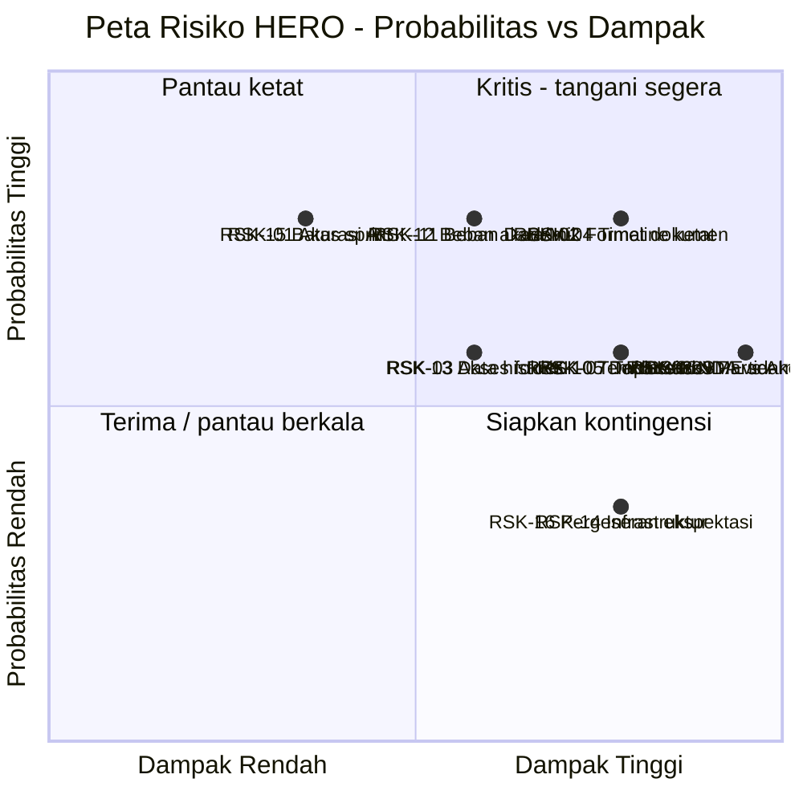

# RISK REGISTER, ISSUE LOG & ASSUMPTION LOG
**Proyek:** HERO | **Versi:** 1.1 | **Tanggal:** 8 September 2026 | **Penyusun:** Project Manager
**Frekuensi Peninjauan:** setiap Sprint Planning & Sprint Review

---

## 1. Skala Penilaian

| Probabilitas | Nilai | Definisi |
| --- | --- | --- |
| Sangat Rendah | 1 | Hampir pasti tidak terjadi |
| Rendah | 2 | Kemungkinan kecil |
| Sedang | 3 | Bisa terjadi, tidak mengejutkan |
| Tinggi | 4 | Kemungkinan besar terjadi |
| Sangat Tinggi | 5 | Hampir pasti terjadi |

| Dampak | Nilai | Definisi |
| --- | --- | --- |
| Sangat Rendah | 1 | Tidak memengaruhi jadwal/deliverable |
| Rendah | 2 | Penyesuaian minor dalam sprint |
| Sedang | 3 | Satu story tertunda / kualitas menurun |
| Tinggi | 4 | Satu milestone terancam |
| Sangat Tinggi | 5 | Deliverable utama gagal / proyek terancam |

**Skor = Probabilitas × Dampak.** Kategori: 1–4 Rendah · 5–9 Sedang · 10–14 Tinggi · 15–25 Kritis.

---

## 2. Risk Register

| ID | Risiko | Kategori | P | D | Skor | Level | Strategi | Mitigasi | Rencana Kontingensi | Pemicu (Trigger) | Owner |
| --- | --- | --- | --- | --- | --- | --- | --- | --- | --- | --- | --- |
| **RSK-01** | Akurasi mode AI-Assisted dalam menaturalkan output belum sesuai ekspektasi | Teknis | 4 | 2 | 8 | Sedang | Mitigasi | AI-Assisted bersifat opsional & hanya *enhancement*; hasil deterministik selalu tersimpan terpisah | Nonaktifkan AI-Assisted; serahkan output deterministik apa adanya | Pilot user menilai narasi AI menyimpang dari hasil dasar | Data/ML |
| **RSK-02** | Format dokumen sumber bervariasi (PDF hasil scan, tidak terstruktur) sehingga ekstraksi gagal/tidak akurat | Teknis | 4 | 4 | 16 | **Kritis** | Mitigasi | Sediakan OCR & penanganan khusus; antrian eskalasi manual; uji dini dengan sampel dokumen nyata | Batasi dataset uji pada dokumen berstruktur baku; koreksi metadata manual | > 20% dokumen sampel gagal di-*parsing* saat S1–S2 | Data/ML |
| **RSK-03** | Akses folder lokal/OneDrive public terkendala hak akses atau perubahan struktur folder | Eksternal | 3 | 3 | 9 | Sedang | Mitigasi | Kunci konfigurasi akses di awal proyek; notifikasi bila folder tidak dapat diakses | Andalkan jalur scraping & unggah manual untuk memenuhi M-02 | Job sinkron folder gagal 2 kali berturut-turut | Backend |
| **RSK-04** | Timeline ketat (± 17 minggu untuk 4 fitur utama) menggeser scope atau kualitas | Jadwal | 4 | 4 | 16 | **Kritis** | Mitigasi | Prioritisasi MoSCoW ketat; target per fase dibuat *do-able*; scope sprint dikunci saat planning | Turunkan story *Should*/*Could* ke backlog pasca-MVP lewat Change Request | *Velocity* dua sprint berturut-turut di bawah rencana | PM |
| **RSK-05** | Daftar situs sumber peraturan belum dikonsolidasikan saat Sprint 1 dimulai | Eksternal | 3 | 4 | 12 | Tinggi | Mitigasi | Workshop konsolidasi di Fase 0; mulai dari 3 situs prioritas | Gunakan 3 situs publik yang dipilih tim sendiri, konfirmasi menyusul | Daftar belum diterima per 13 Sep 2026 | PM |
| **RSK-06** | SME/narasumber tidak tersedia untuk validasi di akhir fase | Sumber Daya | 2 | 4 | 8 | Sedang ⬇ | Mitigasi | **Turun dari Kritis:** mitra menyatakan validasi dilakukan sendiri oleh Faris & Andika secara *sampling* (KEP-08), bukan *ground truth* menyeluruh oleh SME eksternal | Perkecil ukuran sampel; nyatakan keterbatasannya di laporan UAT | Sesi validasi tertunda > 1 minggu dari jadwal | PM |
| ~~RSK-07~~ | ~~Tech stack belum ditentukan~~ — **DITUTUP 8 Sep 2026.** Mitra membebaskan pilihan bahasa & framework (KEP-04) | Teknis | — | — | — | ✅ Ditutup | — | — | — | — | — |
| **RSK-08** | Pengiriman isi dokumen ke layanan AI eksternal berbenturan dengan NDA/kerahasiaan data | Kepatuhan | 3 | 5 | 15 | **Kritis** | Hindari | Keputusan penyedia AI diambil bersama mentor; batasi ke dokumen berklasifikasi publik; dokumentasikan aliran data | Jalankan MVP sepenuhnya pada mode Deterministik; AI-Assisted ditunda | Rencana desain menyertakan pengiriman dokumen non-publik ke pihak ketiga | PM + Mentor |
| **RSK-09** | Parser struktur pasal (US-32) meleset dari asumsi penomoran baku | Teknis | 3 | 5 | 15 | **Kritis** | Mitigasi | Purwarupa parser dimulai lebih awal di S2 secara paralel dengan ingest | Sediakan mode penandaan struktur semi-manual sebagai jalan keluar | Akurasi parser < 60% pada sampel awal | Data/ML |
| **RSK-10** | Profil PoV & template tanggapan Unit Bisnis IT tidak tersedia tepat waktu | Eksternal | 3 | 4 | 12 | Tinggi | Mitigasi | Minta template & checklist sejak Fase 0, jangan menunggu Fase 4 | Susun template sementara berbasis contoh tanggapan terdahulu, minta koreksi | Belum diterima per 8 Nov 2026 | BA |
| **RSK-11** | Beban Data/ML memuncak tanpa jeda sepanjang Fase 2–4 | Sumber Daya | 4 | 3 | 12 | Tinggi | Mitigasi | Backend & BA menopang pekerjaan berbasis aturan (parsing, checklist, template) | Turunkan cakupan analisis substansi ke pendekatan yang lebih sederhana | Story Data/ML tidak selesai dua sprint berturut-turut | PM |
| **RSK-12** | Anggota tim terbentur beban akademik lain (UTS/UAS, mata kuliah lain) | Sumber Daya | 4 | 3 | 12 | Tinggi | Mitigasi | Petakan kalender akademik ke rencana sprint; kurangi target SP pada sprint yang beririsan | Redistribusi story antar anggota; geser story *Should* | Kapasitas mingguan turun > 30% dari rencana | PM |
| **RSK-13** | Ketersediaan data historis peraturan digital tidak cukup untuk pengujian | Eksternal | 3 | 3 | 9 | Sedang | Mitigasi | Kumpulkan dataset uji publik sejak Fase 0; targetkan lebih banyak dari kebutuhan minimum | Kurangi ukuran dataset uji & nyatakan keterbatasannya di laporan UAT | Jumlah dokumen uji < 20 per 11 Okt 2026 | BA |
| **RSK-14** | Infrastruktur (server/storage/komputasi AI) tidak memadai atau berbiaya di luar perkiraan | Eksternal | 2 | 4 | 8 | Sedang | Mitigasi | Konfirmasi kapasitas & pembiayaan di Fase 0; rancang agar mode Deterministik ringan | Jalankan pada lingkungan minimal; batasi ukuran dataset | Permintaan sumber daya ditolak/tertunda | Infra |
| **RSK-15** | Batas sprint tidak sejajar dengan batas fase sehingga demo milestone tidak jatuh di sprint review | Manajemen | 4 | 2 | 8 | Sedang | Mitigasi | Jadwalkan milestone review terpisah pada 29 Nov & 13 Des | Geser tanggal demo ke sprint review terdekat dengan persetujuan PO | Terkonfirmasi saat perencanaan Sprint 5 | PM |
| **RSK-16** | Ekspektasi mitra bergeser ke arah keputusan otomatis, di luar lingkup | Scope | 2 | 4 | 8 | Sedang | Mitigasi | Tegaskan BRule-01 di setiap demo; label "Draft / Rekomendasi" melekat pada seluruh output | Ajukan Change Request formal & tinjau ulang lingkup bersama mentor | Muncul permintaan "sistem yang memutuskan" di forum mana pun | PM |
| **RSK-17** | **Ambang kemiripan untuk memisahkan `menggantikan` / `memperjelas` / `duplikasi` belum terdefinisi** | Teknis | 4 | 4 | 16 | **Kritis** | Mitigasi | Rumuskan aturan bersama mitra (US-64) memakai contoh kasus pelaporan bank; uji pada dokumen nyata sebelum dibangun | Mulai dengan aturan berbasis kesamaan objek & kausal tanpa ambang angka, lalu kalibrasi dari umpan balik | Belum ada aturan tertulis per 25 Okt 2026 | BA + Data/ML |
| **RSK-18** | **Kapasitas tim (± 88 SP) di bawah kebutuhan minimum Fase 1 (± 117 SP)** | Jadwal | 5 | 4 | 20 | **Kritis** | Mitigasi | Komitmen Fase 1 dipangkas ke ± 90 SP sesuai 4 indikator mitra; sisanya masuk backlog Fase 2 (KEP-11) | Turunkan US-16 (folder lokal) ke Fase 2; sisakan hanya scraping + unggah manual untuk demo 8 Okt | *Velocity* Sprint 1 di bawah 40 SP | PM |
| **RSK-19** | **Contoh surat tanggapan & dokumen dasarnya dari mitra terlambat** | Eksternal | 3 | 5 | 15 | **Kritis** | Mitigasi | Tagih AI-M3..AI-M6 di setiap rapat mingguan sejak sekarang, bukan menunggu Fase 4 | Susun template sementara dari struktur surat dinas umum, minta koreksi mitra lebih awal | Belum diterima per 11 Okt 2026 | PM + BA |
| **RSK-20** | Situs sumber ber-*anti-bot* menghambat scraping | Teknis | 4 | 3 | 12 | Tinggi | Mitigasi | Siapkan dua jalur sejak awal: permintaan HTTP polos dan otomasi peramban (Playwright/Selenium) | Fokuskan pada situs yang dapat "ditembak polosan" untuk memenuhi target 3 situs | Satu dari tiga situs target menolak permintaan otomatis | Data/ML |
| **RSK-21** | Folder OneDrive peraturan internal belum tersedia saat Fase 1 berjalan | Eksternal | 4 | 2 | 8 | Sedang | Terima | Mitra menyatakan akan mengabari saat folder siap; tidak dalam kendali tim | US-17 sudah digeser ke backlog Fase 2; indikator Fase 1 hanya mensyaratkan 1 folder lokal | Belum ada kabar per 28 Sep 2026 | PM |

### 2.1 Peta Risiko

### 2.2 Lima Risiko Prioritas Tertinggi

| Peringkat | ID | Risiko | Skor | Tindakan Terdekat | Tenggat |
| --- | --- | --- | --- | --- | --- |
| 1 | **RSK-18** | Kapasitas tim di bawah kebutuhan Fase 1 | **20** | Kunci komitmen Fase 1 pada ± 90 SP; sisanya ke backlog | 14 Sep 2026 |
| 2 | RSK-02 | Variasi format dokumen sumber | 16 | *Spike* US-32a: uji 20 dokumen nyata & ukur keberhasilan parsing | 27 Sep 2026 |
| 3 | RSK-04 | Timeline ketat | 16 | Terapkan usulan pemangkasan lingkup Fase 1 | 28 Sep 2026 |
| 4 | **RSK-17** | Ambang kemiripan belum terdefinisi | **16** | Jadwalkan sesi perumusan aturan harmonisasi bersama mitra | 25 Okt 2026 |
| 5 | **RSK-19** | Contoh surat tanggapan terlambat | 15 | Tagih AI-M3..AI-M6 di setiap rapat mingguan | 11 Okt 2026 |

*Turun peringkat:* RSK-06 (SME) dari 15 → 8 berkat metode validasi sampling.
*Ditutup:* RSK-07 (tech stack).

---

## 3. Issue Log

Risiko yang telah terjadi dicatat di sini dan dikelola sampai tertutup.

| ID | Isu | Tanggal Muncul | Dampak | Level | Tindakan | Owner | Target Selesai | Status |
| --- | --- | --- | --- | --- | --- | --- | --- | --- |
| ISU-01 | Product Owner dari DPEA belum ditunjuk resmi | 7 Sep 2026 | Prioritisasi backlog & sign-off sprint tidak punya pemilik | Tinggi | — | PM | 13 Sep 2026 | ✅ **Selesai** — Faris Budi menyatakan diri sebagai Product Owner + Agile Coach s.d. 11 Okt, lalu murni Product Owner (KEP-12) |
| ISU-02 | Tech stack belum ditentukan | 7 Sep 2026 | Desain arsitektur & estimasi tertahan | Tinggi | — | PM | 13 Sep 2026 | ✅ **Selesai** — dibebaskan mitra (KEP-04) |
| ISU-03 | Baseline waktu proses manual belum diukur | 7 Sep 2026 | M-04 & M-07 tidak dapat dibuktikan saat UAT | Tinggi | — | BA | 13 Sep 2026 | ✅ **Selesai** — mitra menyampaikan 54/40 tanggapan, 2–3 hari → target 2–3 jam |
| ISU-04 | Daftar situs sumber belum dikonsolidasikan | 7 Sep 2026 | Sprint 1 berisiko mundur | Sedang | Menunggu alamat ketiga dari mitra (AI-M1) | PM | 14 Sep 2026 | 🟡 **Menunggu Pihak Eksternal** — 2 dari 3 situs sudah ditunjukkan (ojk.go.id/regulasi & JDIH) |
| ISU-05 | Ketidakselarasan nama & tanggal mulai antar dokumen charter | 7 Sep 2026 | Ambiguitas acuan dokumen proyek | Rendah | Konfirmasi ke mentor | PM | 13 Sep 2026 | 🟡 Terbuka |
| **ISU-06** | **Ambang kemiripan pasal belum dijawab mitra** | 8 Sep 2026 | Aturan klasifikasi harmonisasi tidak dapat dibangun | Tinggi | Jadwalkan sesi perumusan bersama (US-64) | BA | 25 Okt 2026 | 🔴 Terbuka |
| **ISU-07** | **Contoh surat tanggapan & dokumen dasarnya belum diterima** | 8 Sep 2026 | Fase 4 tidak punya target bentuk keluaran | Tinggi | Tagih AI-M3..AI-M6 setiap rapat mingguan | PM | 11 Okt 2026 | 🔴 Terbuka |
| **ISU-08** | **NDA belum ditandatangani seluruh anggota tim** | 8 Sep 2026 | Folder OneDrive peraturan internal tidak dapat diakses | Sedang | Koordinasi format NDA dengan mitra | PM | 13 Sep 2026 | 🔴 Terbuka |
| **ISU-09** | **Kesiapan hosting untuk uji coba mitra 8 Okt belum dipastikan** | 8 Sep 2026 | Mitra tidak dapat mencoba sendiri; indikator Fase 1 gagal diverifikasi | Tinggi | Tentukan skema hosting & ajukan pendanaan bila perlu | Infra/QA | 28 Sep 2026 | 🔴 Terbuka |

**Definisi status:** `Terbuka` · `Sedang Ditangani` · `Menunggu Pihak Eksternal` · `Selesai` · `Dieskalasi`

---

## 4. Assumption Log

| ID | Asumsi | Sumber | Cara Validasi | Tenggat Validasi | Status | Konsekuensi Bila Gugur |
| --- | --- | --- | --- | --- | --- | --- |
| AS-01 | Dokumen sumber berformat PDF & bersifat publik/legal untuk diproses | Charter G | Telaah sampel dokumen bersama mentor | 27 Sep 2026 | Belum divalidasi | Lingkup ingest berubah; perlu Change Request |
| AS-02 | Infrastruktur (server, storage, komputasi AI) memadai | Charter G | Konfirmasi kapasitas & pembiayaan | 13 Sep 2026 | Belum divalidasi | Fitur AI-Assisted ditunda |
| AS-03 | SME tersedia untuk validasi tiap akhir fase | Charter G | Penjadwalan bersama mentor | 30 Sep 2026 | Belum divalidasi | M-07 & M-09 tidak terverifikasi |
| AS-04 | PoV MVP dibatasi 1 profil unit fungsi | Charter G | Konfirmasi tertulis PO | 13 Sep 2026 | Belum divalidasi | Beban Fase 4 melonjak |
| AS-05 | Mode Deterministik dapat memenuhi seluruh cakupan proses secara mandiri | Charter G | Purwarupa deterministik pada 1 fitur | 25 Okt 2026 | Belum divalidasi | BRule-02 gugur; ketergantungan AI naik |
| AS-06 | Dokumen peraturan mengikuti pola penomoran baku yang dapat di-*parsing* | Analisis BA | Uji parser pada 20 dokumen sampel | 27 Sep 2026 | Belum divalidasi | RSK-09 terwujud; tiga fitur terdampak |
| AS-07 | Tim beranggotakan 5 peran dengan kapasitas konstan sepanjang proyek | Charter D | Konfirmasi kalender akademik tiap anggota | 13 Sep 2026 | Belum divalidasi | RSK-12 terwujud; kapasitas sprint turun |

---

## 5. Tata Cara Pengelolaan

1. **Peninjauan rutin:** register ditinjau di setiap Sprint Planning dan Sprint Review.
2. **Risiko baru:** siapa pun anggota tim dapat mengusulkan; PM yang mencatat dan menilai.
3. **Eskalasi:** risiko berlevel **Kritis** dilaporkan ke Product Owner dan Mentor pada
   kesempatan komunikasi terdekat, tidak menunggu jadwal rutin.
4. **Penutupan:** risiko ditutup bila pemicunya sudah tidak mungkin terjadi (misal fasenya
   terlewat) — dicatat beserta alasannya, bukan dihapus.
5. **Perubahan baseline:** setiap mitigasi yang mengubah scope, jadwal, atau kriteria
   penerimaan harus melalui [Change Request](templates/change-request-form.md).

---

## Riwayat Revisi

| Versi | Tanggal | Perubahan | Penyusun |
| --- | --- | --- | --- |
| 1.0 | 7 Sep 2026 | Draft awal: 16 risiko, 5 isu terbuka, 7 asumsi | PM |
| 1.1 | 8 Sep 2026 | Hasil Weekly Update #1: RSK-07 ditutup, RSK-06 turun ke Sedang, RSK-17..21 ditambahkan; ISU-01/02/03 selesai, ISU-06..09 dibuka | PM |
