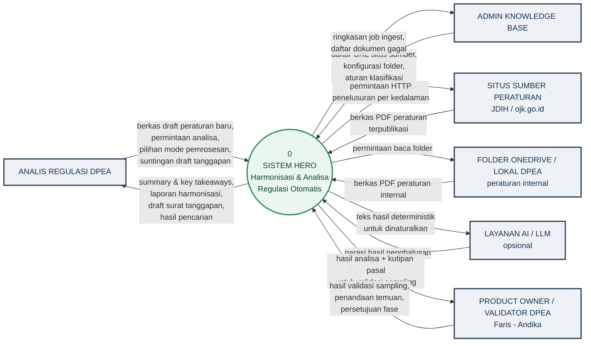
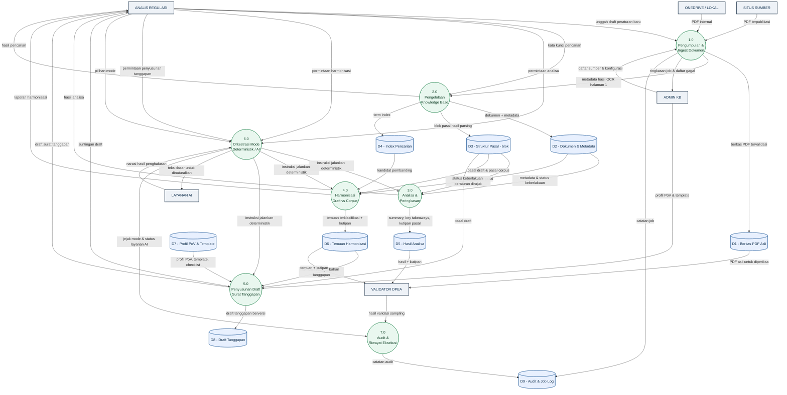
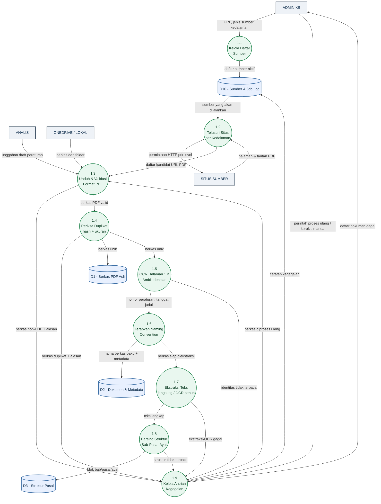
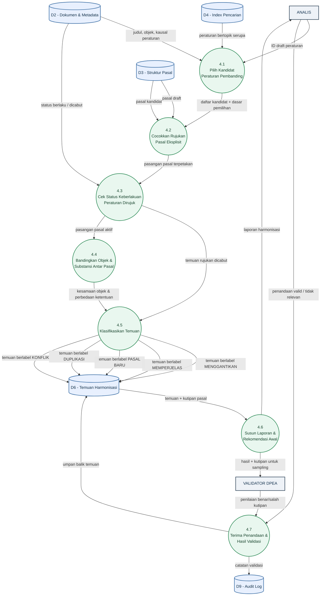
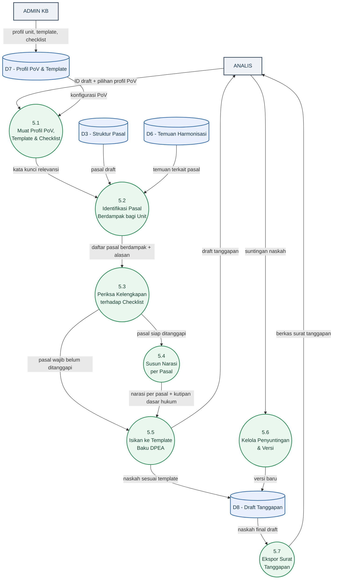

# DATA FLOW DIAGRAM (DFD)
**Proyek:** HERO | **Versi:** 1.0 | **Tanggal:** 8 September 2026 | **Penyusun:** Business Analyst
**Dasar:** [SRS](03-srs-functional-spec.md), [MoM Weekly Update #1](14-mom-weekly-update-01.md)

---

## 0. Notasi

| Bentuk | Arti |
| --- | --- |
| Persegi bergaris tebal | **Entitas eksternal** — pihak/sistem di luar batas HERO |
| Persegi membulat | **Proses** — transformasi data |
| Silinder | **Data store** — tempat data mengendap |
| Panah berlabel | **Aliran data** — nama data, bukan nama aksi |

Penomoran: proses induk `1.0`, dekomposisinya `1.1`, `1.2`, dan seterusnya.

---

## 1. Context Diagram (DFD Level 0)

Menunjukkan batas sistem: siapa memberi data apa ke HERO, dan HERO mengembalikan apa.

### 1.1 Kamus Aliran Data — Level 0

| Aliran | Dari → Ke | Isi Data |
| --- | --- | --- |
| Daftar URL situs sumber | Admin KB → HERO | Nama sumber, URL, jenis sumber, kedalaman crawling, status aktif |
| Berkas PDF peraturan terpublikasi | Situs Sumber → HERO | Berkas PDF mentah + URL asal |
| Berkas PDF peraturan internal | OneDrive/Lokal → HERO | Berkas PDF mentah + jalur folder |
| Berkas draft peraturan baru | Analis → HERO | Berkas PDF draft yang akan dikaji |
| Permintaan analisa | Analis → HERO | ID dokumen, jenis layanan, profil PoV, mode pemrosesan |
| Teks hasil deterministik | HERO → Layanan AI | Narasi dasar yang akan dinaturalkan (**hanya dokumen berklasifikasi publik**) |
| Laporan harmonisasi | HERO → Analis | Ringkasan, daftar temuan berklasifikasi, kutipan pasal, rekomendasi awal |
| Draft surat tanggapan | HERO → Analis | Naskah sesuai template baku DPEA + daftar pasal berdampak |
| Hasil validasi sampling | Validator DPEA → HERO | Penilaian benar/salah atas kutipan pasal pada dokumen sampel |

---

## 2. DFD Level 1 — Dekomposisi Sistem HERO

### 2.1 Daftar Proses Level 1

| No. | Proses | Masukan Utama | Keluaran Utama | FR Terkait |
| --- | --- | --- | --- | --- |
| 1.0 | Pengumpulan & Ingest Dokumen | Daftar sumber, PDF dari situs/folder/unggahan | Berkas tervalidasi, metadata dasar, log job | FR-SCR-01…12 |
| 2.0 | Pengelolaan Knowledge Base | Metadata, teks, struktur | Dokumen terklasifikasi, index pencarian | FR-KB-01…09 |
| 3.0 | Analisa & Peringkasan | Blok pasal, metadata | Summary, Key Takeaways + kutipan pasal | FR-ANL-01…09 |
| 4.0 | Harmonisasi Draft vs Corpus | Pasal draft, kandidat pembanding | Temuan terklasifikasi, laporan | FR-HRM-01…13 |
| 5.0 | Penyusunan Draft Surat Tanggapan | Profil PoV, template, checklist, temuan | Draft surat tanggapan berversi | FR-POV-01…08 |
| 6.0 | Orkestrasi Mode | Permintaan analisa, pilihan mode | Instruksi eksekusi, penanganan *fallback* | FR-SYS-01…04 |
| 7.0 | Audit & Riwayat Eksekusi | Kejadian proses, validasi DPEA | Audit log, riwayat yang dapat diulang | FR-SYS-07, 10 |

### 2.2 Daftar Data Store

| ID | Data Store | Isi | Mengapa Terpisah |
| --- | --- | --- | --- |
| D1 | Berkas PDF Asli | Berkas mentah + hash + ukuran | Dibutuhkan validator DPEA untuk membuka dokumen aslinya saat *sampling* |
| D2 | Dokumen & Metadata | Judul, nomor, tanggal, status keberlakuan, klasifikasi akses | Sumber identitas & penyaringan NDA |
| D3 | Struktur Pasal (blok) | Bab/pasal/ayat hasil parsing | Unit terkecil ketertelusuran; dasar semua analisa |
| D4 | Index Pencarian | Term & representasi kemiripan | Memisahkan kebutuhan retrieval dari penyimpanan kanonis |
| D5 | Hasil Analisa | Summary & Key Takeaways, versi deterministik dan AI terpisah | Menegakkan BRule-03 |
| D6 | Temuan Harmonisasi | Temuan + klasifikasi + tingkat keyakinan | Objek yang divalidasi DPEA |
| D7 | Profil PoV & Template | Profil unit, template baku, checklist pasal | Konfigurasi, bukan kode (NFR-15) |
| D8 | Draft Tanggapan | Naskah berversi + butir per pasal | Riwayat penyuntingan |
| D9 | Audit & Job Log | Siapa, kapan, aksi, mode, versi aturan | Syarat *repeatable* & *traceable* |

---

## 3. DFD Level 2 — Proses 1.0 Pengumpulan & Ingest Dokumen

### 3.1 Catatan Proses 1.0

| Proses | Aturan yang Berlaku |
| --- | --- |
| 1.2 | Mulai dari kedalaman 1; kedalaman lebih dalam menyusul. Situs ber-anti-bot memakai jalur *browser automation*, bukan permintaan polos |
| 1.3 | Hanya PDF yang diterima (BRule-04); berkas lain ditolak dengan alasan tercatat |
| 1.4 | Duplikat ditentukan dari **kesamaan hash DAN ukuran berkas** (KEP-06) |
| 1.5 | Identitas diambil dari **halaman pertama** — di situlah nomor, tanggal, dan judul berada (KEP-07) |
| 1.6 | Penamaan baku diterapkan **sebelum** berkas masuk folder knowledge base |
| 1.9 | Tidak ada dokumen yang dibuang diam-diam; semua kegagalan masuk antrian yang dapat ditindaklanjuti (FR-SCR-12) |

---

## 4. DFD Level 2 — Proses 4.0 Harmonisasi Draft vs Corpus

### 4.1 Aturan Klasifikasi pada Proses 4.5

Diturunkan langsung dari contoh kasus pelaporan bank yang dijelaskan mitra
([MoM §5.5](14-mom-weekly-update-01.md)).

| Kondisi Objek Pasal Draft | Kondisi Ketentuan | Klasifikasi |
| --- | --- | --- |
| Sudah diatur di corpus | Ketentuannya berbeda dari yang lama | **MENGGANTIKAN** — pasal lama gugur |
| Sudah diatur di corpus | Substansi sama, hanya diperinci/dipertegas | **MEMPERJELAS** |
| Sudah diatur di corpus | Identik, tidak menambah apa pun | **DUPLIKASI** |
| Sudah diatur di corpus | Bertentangan dan keduanya sama-sama berlaku | **KONFLIK** |
| **Belum** diatur di corpus | — | **PASAL BARU / TAMBAHAN** — tidak me-*replace* apa pun |
| Merujuk peraturan berstatus dicabut | — | **RUJUKAN DICABUT** |

> **Ambang kemiripan belum ditetapkan.** Fathir menanyakannya di rapat; mitra menjawab dengan
> logika kualitatif (kesamaan objek dan kausal), bukan angka persentase. Perumusan ambang ini
> menjadi agenda diskusi bersama — lihat [Risk Register](10-risk-register.md) RSK-17.

---

## 5. DFD Level 2 — Proses 5.0 Penyusunan Draft Surat Tanggapan

> **Prasyarat proses 5.0 belum tersedia.** Isi D7 (profil PoV, template baku, checklist pasal
> wajib) sepenuhnya bergantung pada contoh surat tanggapan dan dokumen dasarnya yang akan
> disediakan mitra — action item AI-M3 s.d. AI-M6. Selama D7 kosong, seluruh proses 5.1–5.7
> tidak dapat dibangun maupun diuji.

---

## 6. Pemeriksaan Keseimbangan DFD

Setiap aliran yang masuk/keluar proses induk harus muncul kembali di dekomposisinya.

| Proses Induk | Aliran Masuk Level 1 | Muncul di Level 2 | Aliran Keluar Level 1 | Muncul di Level 2 |
| --- | --- | --- | --- | --- |
| 1.0 | Daftar sumber, PDF situs, PDF internal, unggahan draft | ✅ P1.1, P1.2, P1.3 | Berkas ke D1, metadata ke 2.0, ringkasan job, log | ✅ P1.4, P1.6, P1.9 |
| 4.0 | Pasal draft & corpus (D3), kandidat (D4), status (D2) | ✅ P4.1, P4.2, P4.3 | Temuan ke D6, laporan ke Analis | ✅ P4.5, P4.6 |
| 5.0 | Profil PoV (D7), temuan (D6), pasal draft (D3) | ✅ P5.1, P5.2 | Draft ke D8, naskah ke Analis | ✅ P5.5, P5.7 |

**Data store tanpa penulis atau tanpa pembaca:** tidak ditemukan. Setiap store memiliki
minimal satu proses yang menulis dan satu yang membaca.

---

## Riwayat Revisi

| Versi | Tanggal | Perubahan | Penyusun |
| --- | --- | --- | --- |
| 1.0 | 8 Sep 2026 | Dokumen baru: Context, Level 1, dan tiga Level 2 (ingest, harmonisasi, tanggapan) | BA |
