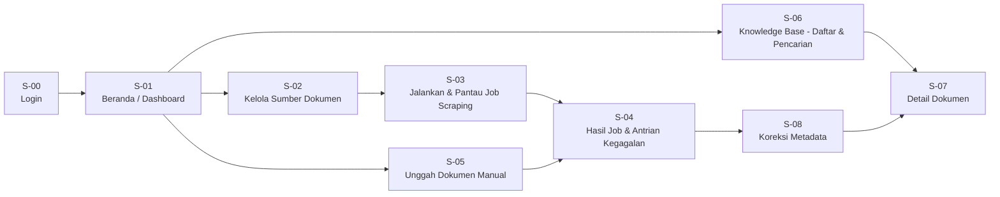

# UI SPECIFICATION — FASE 1 (MVP Scraping & Ingest)
**Proyek:** HERO | **Versi:** 1.0 | **Tanggal:** 8 September 2026
**Penyusun:** Business Analyst | **Untuk:** Muhammad Ikhwan (Frontend / UI-UX)
**Tenggat mockup Figma:** maksimal minggu pertama Fase 1 — **± 20 September 2026**

> Dokumen ini menjawab permintaan Ikhwan di rapat ("kamu ngasih aku user story-nya gitu") dan
> arahan mitra bahwa mockup dibuat **per fase**, bukan seluruh modul di muka (KEP-10).
> Cakupan di sini **hanya layar yang dibutuhkan Fase 1.** Layar Fase 2–4 disusun menyusul.

---

## 1. Batasan Desain dari Mitra

| Aspek | Ketentuan | Sumber |
| --- | --- | --- |
| Warna & tema | **Bebas.** Tidak ada palet brand yang mengikat — "tinggal diganti palet aja" | KEP-14 |
| Cakupan mockup | Hanya modul fase berjalan | KEP-10 |
| Bahasa antarmuka | Bahasa Indonesia | NFR-13 |
| Alur umpan balik | Bagikan tautan Figma → umpan balik lewat grup WhatsApp → revisi | KEP-13 |
| Prinsip yang tidak boleh dilanggar | Setiap hasil olahan sistem berlabel **"Draft / Rekomendasi"** | BRule-01 |

---

## 2. Peta Layar Fase 1

**Total: 9 layar.** Prioritas pengerjaan mockup: **S-02 → S-03 → S-05 → S-06 → S-04**, karena
kelima layar itulah yang diuji coba mitra pada 8 Oktober.

---

## 3. Spesifikasi per Layar

### S-00 — Login

| Item | Ketentuan |
| --- | --- |
| **Tujuan** | Memastikan setiap aksi terekam atas nama pengguna |
| **User Story** | US-02 |
| **Elemen** | Identitas login, kata sandi, tombol masuk, pesan galat |
| **Aturan** | Tidak ada satu pun fitur yang dapat diakses tanpa login (NFR-06) |

---

### S-01 — Beranda / Dashboard

| Item | Ketentuan |
| --- | --- |
| **Tujuan** | Pengguna langsung tahu kondisi sistem tanpa menelusuri menu |
| **User Story** | US-03 |
| **Elemen wajib** | (1) Jumlah dokumen di knowledge base — **angka ini yang diukur mitra: target ≥ 20**; (2) Ringkasan job terakhir: waktu, sumber, berhasil/duplikat/gagal; (3) Jumlah dokumen di antrian kegagalan; (4) Tombol pintas: Jalankan Scraping, Unggah Dokumen, Cari Dokumen |
| **Catatan desain** | Angka jumlah dokumen sebaiknya menonjol — inilah indikator keberhasilan Fase 1 yang akan dilihat pertama kali oleh Faris dan Andika saat uji coba |

---

### S-02 — Kelola Sumber Dokumen

| Item | Ketentuan |
| --- | --- |
| **Tujuan** | Admin mendaftarkan dan mengelola sumber dokumen |
| **User Story** | US-12, US-16, US-17 |
| **Peran** | Admin Knowledge Base |

**Elemen:**

| Elemen | Detail |
| --- | --- |
| Tabel daftar sumber | Kolom: Nama, Jenis, Alamat, Kedalaman, Status Aktif, Terakhir Dijalankan, Aksi |
| Filter jenis sumber | `Situs Web` · `Folder Lokal` · `OneDrive` |
| Tombol | Tambah Sumber, Ubah, Nonaktifkan, Hapus |
| Form Tambah/Ubah | Nama sumber; **Jenis sumber** (menentukan field berikutnya); Alamat (URL atau jalur folder); **Kedalaman crawling** (khusus situs web — nilai awal `1`); Status aktif |
| Validasi | URL wajib berformat valid dan **unik**; pesan galat tampil di bawah field |

**Catatan desain — kedalaman crawling.** Ini bukan pengaturan lanjutan yang bisa disembunyikan.
Mitra menyebut penelusuran kedalaman sebagai PR utama scraping, dan menyarankan mulai dari
kedalaman 1. Tampilkan sebagai field kelas satu dengan keterangan singkat, misalnya:
*"Kedalaman 1 hanya menelusuri halaman yang ditunjuk. Kedalaman lebih besar ikut menelusuri
tautan di dalamnya."*

---

### S-03 — Jalankan & Pantau Job Scraping

| Item | Ketentuan |
| --- | --- |
| **Tujuan** | Menjalankan penarikan dokumen dan melihat progresnya berjalan |
| **User Story** | US-13, US-09 |

**Alur layar:**

1. Pilih satu atau beberapa sumber (kotak centang pada daftar)
2. Konfirmasi cakupan job — tampilkan sumber apa saja dan kedalaman berapa
3. Tombol **Jalankan**
4. Panel status langsung: `Antrian` → `Berjalan` → `Selesai` / `Gagal`
5. Penghitung berjalan: ditemukan · diunduh · duplikat · gagal

**Catatan desain — pilihan penyimpanan.** Mitra menawarkan agar setelah scraper menemukan
kandidat (misal 100 PDF), pengguna diberi pilihan: masukkan langsung ke basis data, atau unduh
PDF-nya. Sediakan langkah antara berupa **daftar kandidat + pilihan tindakan** sebelum job
benar-benar mengunduh semuanya. Ini mencegah pengguna menarik ribuan dokumen tanpa sengaja.

---

### S-04 — Hasil Job & Antrian Kegagalan

| Item | Ketentuan |
| --- | --- |
| **Tujuan** | Tidak ada dokumen yang hilang diam-diam |
| **User Story** | US-14, US-23 |

**Dua bagian dalam satu layar:**

| Bagian | Isi |
| --- | --- |
| **Ringkasan job** | Sumber, waktu mulai–selesai, jumlah berhasil / duplikat / gagal |
| **Antrian kegagalan** | Tabel: Nama Berkas, Sumber, **Jenis Kegagalan**, Pesan, Status Tindak Lanjut, Aksi |

**Jenis kegagalan yang harus dapat dibedakan di UI:**
`Format tidak didukung` · `Duplikat` · `Ekstraksi gagal` · `OCR gagal` ·
`Metadata tidak lengkap` · `Sumber tidak dapat diakses`

**Aksi per baris:** `Proses Ulang` · `Koreksi Manual` (menuju S-08) · `Abaikan`

**Catatan desain.** Duplikat bukan kegagalan yang perlu ditindak — bedakan secara visual dari
kegagalan sungguhan. Tampilkan alasan duplikatnya: *"Hash dan ukuran berkas sama dengan
dokumen X"*, agar pengguna dapat memverifikasi keputusan sistem.

---

### S-05 — Unggah Dokumen Manual

| Item | Ketentuan |
| --- | --- |
| **Tujuan** | Memasukkan dokumen yang tidak tersedia di situs sumber |
| **User Story** | US-15, US-15a |

**Perbedaan penting yang harus terlihat di UI.** Rapat mengklarifikasi bahwa unggah manual
punya dua maksud berbeda, dan keduanya berujung di tempat berbeda:

| Pilihan | Maksud | Tujuan Penyimpanan |
| --- | --- | --- |
| **Draft Peraturan Baru** | Dokumen yang akan **dikaji** | Menjadi objek analisa/harmonisasi, **bukan** anggota corpus pembanding |
| **Peraturan Eksisting** | Melengkapi corpus | Masuk knowledge base sebagai pembanding |

Sediakan pemilihan ini **sebelum** berkas diunggah — bukan sesudah. Salah menempatkan draft
sebagai peraturan eksisting akan mengotori corpus pembanding.

**Elemen:** area seret-dan-lepas, unggah banyak berkas sekaligus, daftar berkas terpilih dengan
progres per berkas, hasil per berkas (berhasil / ditolak + alasan), keterangan
*"Hanya berkas PDF yang diterima."*

---

### S-06 — Knowledge Base: Daftar & Pencarian

| Item | Ketentuan |
| --- | --- |
| **Tujuan** | Menemukan kembali dokumen yang sudah terkumpul |
| **User Story** | US-27, US-31 |

**Elemen:**

| Elemen | Detail |
| --- | --- |
| Kolom pencarian | Kata kunci bebas |
| Filter | Kategori/folder · Jenis peraturan · Rentang tanggal terbit · **Status keberlakuan** |
| Tabel hasil | Nomor Peraturan, Judul, Tanggal Terbit, Kategori, **Status Keberlakuan**, Sumber |
| Navigasi folder | Panel samping berisi struktur kategori knowledge base |

**Catatan desain — status keberlakuan.** Peraturan yang dicabut **tetap tersimpan dan tetap
muncul** di hasil pencarian, dengan penanda visual yang jelas (BRule-08). Jangan menyembunyikannya
— riwayat regulasi justru bagian dari nilai sistem ini.

---

### S-07 — Detail Dokumen

| Item | Ketentuan |
| --- | --- |
| **Tujuan** | Memverifikasi isi dan struktur satu dokumen |
| **User Story** | US-28 |

**Tata letak dua kolom:**

| Kolom | Isi |
| --- | --- |
| Kiri | Navigasi struktur hierarkis: Bab → Bagian → Pasal → Ayat → Huruf |
| Kanan | Teks pasal terpilih |

**Panel metadata:** Judul · Nomor Peraturan · Jenis · Tanggal Terbit · Status Keberlakuan ·
Kategori · Sumber Perolehan · **Metode Ekstraksi** (`teks langsung` / `OCR`)

**Aksi:** Buka PDF Asli · Koreksi Metadata (S-08)

**Catatan desain — "Buka PDF Asli" wajib ada.** Validasi mitra dilakukan dengan *sampling*:
membuka peraturan yang dikutip lalu memeriksa apakah pasalnya benar-benar berbunyi demikian
(KEP-08). Tanpa akses cepat ke PDF asli dari layar ini, metode validasi mereka tidak dapat
dijalankan.

---

### S-08 — Koreksi Metadata

| Item | Ketentuan |
| --- | --- |
| **Tujuan** | Memperbaiki hasil ekstraksi otomatis yang keliru |
| **User Story** | US-21 |

**Tata letak berdampingan:**

| Sisi | Isi |
| --- | --- |
| Kiri | Pratinjau **halaman pertama PDF** — sumber identitas dokumen |
| Kanan | Form: Judul, Nomor Peraturan, Jenis, Tanggal Terbit, Status Keberlakuan, Kategori, Klasifikasi Akses (`publik` / `non-publik`) |

**Penanda:** field hasil ekstraksi otomatis yang berkeyakinan rendah diberi tanda agar perhatian
pengguna tertuju ke sana.

**Catatan desain.** Pratinjau halaman pertama bukan hiasan — di situlah nomor, tanggal, dan
judul berada, dan dari situ pula sistem mengambilnya (KEP-07). Menaruh sumber dan formulir
berdampingan membuat koreksi bisa dilakukan tanpa membuka berkas di aplikasi lain.

**Klasifikasi akses wajib diisi.** Field ini menentukan boleh atau tidaknya isi dokumen dikirim
ke layanan AI eksternal (NFR-08, kepatuhan NDA). Jangan jadikan opsional.

---

## 4. Komponen Lintas Layar

| Komponen | Ketentuan |
| --- | --- |
| **Label "Draft / Rekomendasi"** | Melekat pada setiap hasil olahan sistem, termasuk pada hasil ekspor. Belum banyak muncul di Fase 1, tetapi komponennya sebaiknya sudah dirancang sekarang |
| **Indikator mode pemrosesan** | Penanda `Deterministik` / `AI-Assisted`. Fase 1 selalu `Deterministik` — tampilkan tetap, agar pengguna terbiasa membacanya |
| **Status pekerjaan** | Lencana warna: `Antrian` · `Berjalan` · `Selesai` · `Gagal` |
| **Status keberlakuan** | Lencana warna: `Berlaku` · `Diubah` · `Dicabut` · `Tidak Diketahui` |
| **Pesan galat** | Selalu menyebut **apa yang salah dan apa yang bisa dilakukan pengguna**, bukan kode teknis |
| **Keadaan kosong** | Setiap tabel butuh tampilan saat belum ada data, disertai ajakan tindakan |

---

## 5. Yang TIDAK Perlu Dibuat di Fase 1

Agar tidak membuang waktu — ini semua milik fase berikutnya:

- Layar hasil summary & Key Takeaways (Fase 2)
- Layar laporan harmonisasi dan daftar temuan (Fase 3)
- Layar penyusunan & penyuntingan draft surat tanggapan (Fase 4)
- Pengaturan profil PoV dan template tanggapan (Fase 4)
- Panel audit log dan manajemen pengguna lanjutan (menyusul)
- *Toggle* AI-Assisted yang berfungsi penuh — cukup penanda modenya saja

---

## 6. Checklist Kesiapan Uji Coba Mitra — 8 Oktober 2026

Mitra akan mencoba sendiri. Alur berikut harus dapat mereka selesaikan tanpa pendampingan:

| No. | Alur | Layar | Bukti Keberhasilan |
| --- | --- | --- | --- |
| 1 | Masuk ke sistem | S-00 | Berhasil login |
| 2 | Menambahkan situs sumber | S-02 | Sumber tersimpan |
| 3 | Menjalankan scraping | S-03 | Job selesai, dokumen tertarik |
| 4 | Melihat hasil job | S-04 | Ringkasan berhasil/duplikat/gagal tampil |
| 5 | Mengunggah PDF manual | S-05 | Berkas terproses |
| 6 | Melihat knowledge base | S-06 | **≥ 20 dokumen tampil** |
| 7 | Mencari satu peraturan | S-06 | Ditemukan |
| 8 | Membuka detail & struktur pasal | S-07 | Struktur tampil, PDF asli dapat dibuka |

---

## Riwayat Revisi

| Versi | Tanggal | Perubahan | Penyusun |
| --- | --- | --- | --- |
| 1.0 | 8 Sep 2026 | Dokumen baru: 9 layar Fase 1, komponen lintas layar, checklist uji coba mitra | BA |
