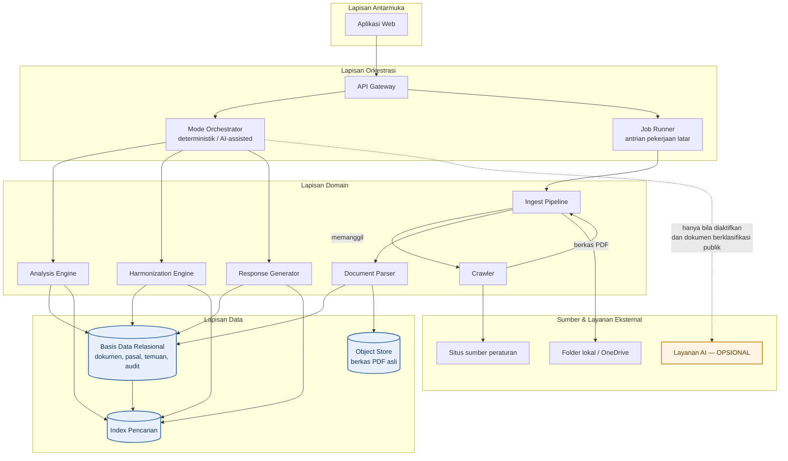
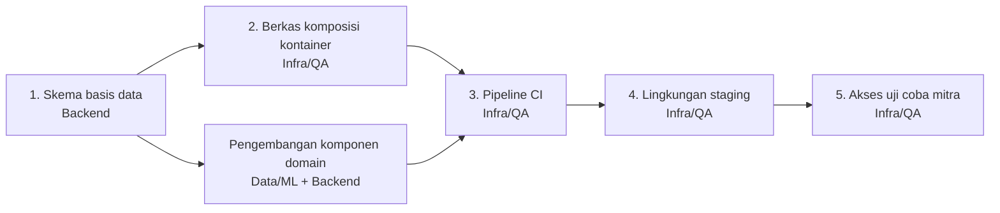

# DOKUMEN ARSITEKTUR SISTEM
**Proyek:** HERO — Harmonisasi & Analisa Regulasi Otomatis
**Versi:** 1.1 (Draft) | **Tanggal:** 9 September 2026 | **Penyusun:** Business Analyst
**Deliverable WBS:** 1.2.5 Perancangan arsitektur sistem

---

## 1. Pendahuluan

### 1.1 Tujuan Dokumen

Menetapkan rancangan arsitektur aplikasi HERO sebagai acuan tunggal bagi seluruh peran dalam
tim, mencakup pembagian komponen, keputusan teknis beserta alasannya, realisasi skema basis
data, dan rancangan lingkungan pengembangan.

Dokumen ini menutup celah antara spesifikasi kebutuhan ([SRS](03-srs-functional-spec.md)) dan
pelaksanaan pengembangan: SRS menyatakan *apa* yang harus dilakukan sistem, dokumen ini
menyatakan *bagaimana* sistem disusun dan *siapa* yang mengerjakan bagian mana.

### 1.2 Ruang Lingkup

Mencakup arsitektur aplikasi untuk seluruh fase MVP (Fase 1 s.d. Fase 5). Tidak mencakup
rancangan infrastruktur produksi di lingkungan DPEA, karena sesuai batasan Charter §A.6 tim
bekerja di luar sistem DPEA.

### 1.3 Dokumen Acuan

| Kode | Dokumen | Kaitan |
| --- | --- | --- |
| [02](02-brd-business-requirements.md) | Business Requirements Document | Tujuan bisnis dan aturan bisnis |
| [03](03-srs-functional-spec.md) | Software Requirements Specification | Kebutuhan fungsional & non-fungsional |
| [08](08-data-model-dictionary.md) | Data Model & Data Dictionary | Model data konseptual |
| [13](13-dfd-data-flow-diagram.md) | Data Flow Diagram | Dekomposisi proses |
| [14](14-mom-weekly-update-01.md) | MoM Weekly Update #1 | Keputusan mitra (KEP-01 s.d. KEP-14) |

---

## 2. Tujuan dan Batasan Arsitektur

Empat batasan berikut bersifat mengikat dan menjadi dasar sebagian besar keputusan pada §5.

| Kode | Batasan | Sumber | Konsekuensi Arsitektural |
| --- | --- | --- | --- |
| BA-01 | Sistem wajib berfungsi penuh tanpa layanan AI, tanpa internet, dan tanpa anggaran AI | KEP-02, NFR-04 | Layanan AI tidak boleh berada pada jalur eksekusi wajib komponen mana pun |
| BA-02 | Dokumen berklasifikasi non-publik tidak boleh dikirim ke layanan pihak ketiga | NFR-08, BRule-06 | Klasifikasi akses harus diperiksa pada lapisan orkestrasi sebelum pemanggilan layanan eksternal |
| BA-03 | Seluruh keluaran wajib dapat ditelusuri sampai pasal sumbernya | NFR-11, KEP-08 | Unit terkecil penyimpanan adalah pasal, bukan dokumen |
| BA-04 | Knowledge base harus dapat ditukar per sektor tanpa mengubah mesin analisanya | BO-07 | Aturan klasifikasi, profil PoV, template, dan checklist berupa konfigurasi, bukan kode |

---

## 3. Gambaran Umum Arsitektur

Arsitektur disusun berlapis. Setiap lapisan hanya boleh bergantung pada lapisan di bawahnya.



**Catatan pembacaan diagram.** Garis putus-putus menuju layanan AI adalah satu-satunya
ketergantungan opsional dalam sistem. Seluruh garis lain bersifat wajib. Bila simpul *Layanan
AI* dihapus dari diagram, sistem tetap utuh — inilah bentuk visual dari batasan BA-01.

---

## 4. Rancangan Komponen dan Pembagian Tanggung Jawab

### 4.1 Matriks Komponen terhadap Peran

| Komponen | Tanggung Jawab | Peran Pelaksana | Peran Pendukung |
| --- | --- | --- | --- |
| Aplikasi Web | Antarmuka pengguna, alur layar, penyajian hasil | **Frontend / UI-UX** | BA (spesifikasi layar) |
| API Gateway | Titik masuk tunggal, autentikasi, otorisasi peran | **Backend** | Infra/QA (pengujian keamanan) |
| Mode Orchestrator | Urutan eksekusi deterministik → AI, penanganan *fallback*, pemeriksaan klasifikasi akses | **Backend** | Data/ML |
| Job Runner | Antrian dan pemantauan pekerjaan latar | **Backend** | Infra/QA |
| **Crawler** | Penelusuran situs per kedalaman, penanganan anti-bot, pengunduhan berkas | **Data/ML** | — |
| **Ingest Pipeline** | Manajemen sumber, siklus hidup pekerjaan, validasi format, deduplikasi, penyimpanan, antrian kegagalan | **Backend** | Data/ML (kebutuhan masukan) |
| Document Parser | OCR, ekstraksi metadata, penguraian struktur bab-pasal-ayat | **Data/ML** | — |
| Analysis Engine | Peringkasan, Key Takeaways, identifikasi topik | **Data/ML** | — |
| Harmonization Engine | Pemilihan kandidat, pencocokan rujukan, klasifikasi temuan | **Data/ML** | BA (perumusan aturan) |
| Response Generator | Penyusunan narasi tanggapan berbasis profil PoV | **Data/ML** | Frontend (penyuntingan) |
| **Skema basis data & migrasi** | Perancangan tabel, relasi, indeks, dan skrip migrasi | **Backend** | Data/ML (kebutuhan kueri) |
| Object Store | Penyimpanan berkas PDF asli | **Backend** | Infra/QA (penyediaan volume) |
| **Lingkungan terkontainer** | Berkas komposisi layanan untuk pengembangan lokal | **Infra / QA** | Backend |
| CI, staging, hosting | Pipeline build & uji, lingkungan uji coba mitra | **Infra / QA** | — |
| Pengujian & keamanan dasar | Test case, pengujian fungsional, uji akses | **Infra / QA** | Semua peran |

### 4.2 Penegasan Batas Peran Infra/QA

Ruang lingkup Infra/QA sebagaimana ditetapkan [Charter §D](00-project-charter-hero.md) dan
[Stakeholder Register SH-12](01-stakeholder-register-raci.md) adalah **deployment, CI,
pengujian, dan keamanan dasar** — yakni pekerjaan yang menyangkut *lingkungan tempat aplikasi
berjalan*, bukan *isi aplikasinya*.

Tiga pekerjaan berikut kerap keliru ditempatkan pada Infra/QA. Penegasannya:

| Pekerjaan | Bukan Infra/QA, melainkan | Alasan |
| --- | --- | --- |
| Perancangan skema basis data | **Backend** | Skema adalah realisasi model data domain ([dok. 08](08-data-model-dictionary.md)). Yang menulis kueri dan migrasi adalah pemilik logika bisnis, bukan pengelola lingkungan |
| Keputusan penyimpanan PDF utuh vs blok terstruktur | **Backend + Data/ML**, disetujui Product Owner | Keputusan arsitektur yang berdampak pada kemampuan pencarian dan pembuktian hasil. Sudah diputuskan pada ADR-01 |
| Penyiapan berkas komposisi kontainer | **Infra/QA** ✅ | Ini memang pekerjaan lingkungan pengembangan |

> Aturan pemilah yang dipakai dokumen ini: **jika pekerjaan itu tetap ada meskipun aplikasi
> dijalankan langsung tanpa kontainer, maka pekerjaan itu bukan milik Infra/QA.** Skema basis
> data tetap dibutuhkan tanpa Docker; berkas komposisi kontainer tidak.

### 4.3 Kontrak Antara Crawler dan Ingest Pipeline

Pemisahan pada §4.1 hanya bermanfaat bila batas antarkeduanya tegas. Kontrak berikut mengikat
kedua peran dan disepakati pada Sprint Planning Sprint 1.

**Antarmuka:**

```
crawl(alamat_sumber, kedalaman) -> daftar[ { url_asal, nama_berkas_asli, konten } ]
```

**Yang menjadi tanggung jawab Crawler:**

| Ya | Tidak |
| --- | --- |
| Menelusuri halaman sampai kedalaman yang diminta | Menyentuh basis data |
| Menangani situs ber-anti-bot | Memutuskan apakah dokumen duplikat |
| Menemukan dan mengunduh berkas PDF | Menerapkan penamaan baku |
| Melaporkan sumber yang tidak dapat diakses | Mengelola siklus hidup pekerjaan |
| Mengembalikan konten berkas apa adanya | Menyimpan berkas ke penyimpanan permanen |

**Alasan pemisahan:**

| No. | Alasan |
| --- | --- |
| 1 | Crawler dapat dikembangkan dan diuji terhadap situs nyata **tanpa menunggu skema basis data selesai** — skema masih berstatus usulan (ADR-08) |
| 2 | Ingest Pipeline dapat dibangun memakai penelusur tiruan, sehingga kedua peran berjalan sejak hari pertama Sprint 1 |
| 3 | Ketidakpastian tertinggi pada modul ini terletak pada penelusuran — kedalaman URL dan anti-bot (RSK-20). Mengurungnya dalam satu komponen membatasi dampak kegagalannya |
| 4 | Beban Data/ML memuncak tanpa jeda pada Fase 2 s.d. 4 ([dok. 07 §7](07-wbs-sprint-plan.md)). Jalur kritis peran tersebut adalah parser struktur pasal yang menopang tiga fitur, bukan penulisan siklus hidup pekerjaan |

**Konsekuensi bila kontrak dilanggar.** Bila Crawler mulai menulis ke basis data, ia menjadi
tidak dapat diuji secara mandiri, dan setiap perubahan skema memaksa perubahan pada komponen
yang paling sering direvisi.

---

## 5. Keputusan Arsitektur

Format setiap keputusan: konteks, keputusan, alasan, konsekuensi.

### 5.1 Keputusan yang Telah Ditetapkan

#### ADR-01 — Penyimpanan Ganda: Berkas PDF Asli dan Blok Terstruktur

| Aspek | Uraian |
| --- | --- |
| **Konteks** | Mitra menawarkan dua pilihan: menyimpan PDF utuh di folder, atau mengekstrak isinya menjadi blok di basis data. Mitra menyerahkan keputusan kepada tim |
| **Keputusan** | **Keduanya dijalankan berdampingan**, bukan memilih salah satu |
| **Alasan** | Blok terstruktur diperlukan untuk pengindeksan dan pencarian per pasal. Berkas PDF asli diperlukan sebagai alat bukti: validasi mitra dilakukan dengan membuka peraturan yang dikutip lalu memeriksa bunyi pasalnya (KEP-08). Menyimpan blok saja mematikan kemampuan verifikasi; menyimpan PDF saja mematikan kemampuan pencarian |
| **Konsekuensi** | Kebutuhan penyimpanan meningkat. Setiap dokumen memiliki dua representasi yang harus dijaga konsistensinya. Layar detail dokumen wajib menyediakan tautan ke PDF asli (FR-KB-04a) |
| **Status** | Ditetapkan — terdokumentasi pada [dok. 08 catatan perancangan #12](08-data-model-dictionary.md) |

#### ADR-02 — Mode Deterministik sebagai Jalur Wajib, AI sebagai Lapisan Opsional

| Aspek | Uraian |
| --- | --- |
| **Konteks** | Sistem harus tetap dapat dipakai saat offline, tanpa internet, dan tanpa anggaran layanan AI |
| **Keputusan** | Mesin deterministik berbasis aturan selalu dieksekusi lebih dahulu. Lapisan AI hanya menaturalkan narasi di atas hasil tersebut dan tidak pernah menggantikannya |
| **Alasan** | Batasan BA-01. Selain itu, hasil berbasis aturan dapat ditelusuri asal-usulnya, sedangkan keluaran model tidak |
| **Konsekuensi** | Hasil deterministik dan hasil AI disimpan pada kolom terpisah agar dapat dibandingkan (FR-SYS-03). Kegagalan layanan AI ditangani sebagai *fallback*, bukan sebagai kegagalan proses |
| **Status** | Ditetapkan — KEP-02 |

#### ADR-03 — Pemisahan Corpus Pembanding dari Draft Kajian

| Aspek | Uraian |
| --- | --- |
| **Konteks** | Tiga jalur pengumpulan dokumen semula disatukan ke satu pipeline dengan tujuan yang sama |
| **Keputusan** | Setiap dokumen menyandang atribut `peran_dokumen` bernilai `corpus_eksisting` atau `draft_kajian`. Draft kajian dikecualikan dari daftar kandidat pembanding harmonisasi |
| **Alasan** | Unggah manual berfungsi memasukkan draft peraturan yang sedang dikaji, bukan mengisi corpus. Tanpa pemisahan ini, draft berpotensi dibandingkan dengan dirinya sendiri |
| **Konsekuensi** | Pilihan jenis dokumen harus ditampilkan sebelum unggahan dilakukan (FR-SCR-04a). Kesalahan penempatan sulit terdeteksi setelah data bercampur |
| **Status** | Ditetapkan — MoM §5.1 |

#### ADR-04 — Struktur Pasal Direpresentasikan secara Rekursif

| Aspek | Uraian |
| --- | --- |
| **Konteks** | Kedalaman struktur peraturan bervariasi: bab, bagian, paragraf, pasal, ayat, huruf |
| **Keputusan** | Satu tabel `STRUKTUR_PASAL` dengan relasi induk-anak ke dirinya sendiri |
| **Alasan** | Menghindari perubahan skema setiap kali ditemukan pola kedalaman baru |
| **Konsekuensi** | Kueri penelusuran memerlukan rekursi. Setiap keluaran analisa menunjuk ke satu baris tabel ini, memenuhi BA-03 |
| **Status** | Ditetapkan — [dok. 08 catatan perancangan #1](08-data-model-dictionary.md) |

#### ADR-05 — Deduplikasi Berdasarkan Hash Isi dan Ukuran Berkas

| Aspek | Uraian |
| --- | --- |
| **Konteks** | Portal regulasi dan JDIH masing-masing memuat ribuan dokumen yang berpotensi tumpang tindih dengan penamaan berbeda |
| **Keputusan** | Dokumen dinyatakan duplikat bila **hash isi dan ukuran berkas sama-sama identik** |
| **Alasan** | Nama berkas tidak dapat diandalkan sebagai pembeda. Metode ini ditetapkan langsung oleh mitra |
| **Konsekuensi** | Kedua atribut wajib disimpan dan diindeks. Antarmuka menampilkan dokumen pembanding pada setiap temuan duplikat |
| **Status** | Ditetapkan — KEP-06 |

#### ADR-06 — Bahasa dan Kerangka Kerja Ditentukan per Komponen

| Aspek | Uraian |
| --- | --- |
| **Konteks** | Mitra membebaskan pilihan bahasa dan kerangka kerja; mitra sendiri ber-stack .NET dan menyatakan dapat mengonversi bila masuk produksi |
| **Keputusan** | Komponen *scraper* dan *pipeline* pemrosesan dokumen memakai Python. Komponen lain ditetapkan oleh peran pelaksananya |
| **Alasan** | Ekosistem Python untuk penelusuran situs, OCR, dan pemrosesan bahasa alami paling matang. Usulan disampaikan tim dan diterima mitra |
| **Konsekuensi** | Sistem berpotensi memakai lebih dari satu bahasa. Batas antarkomponen harus berupa antarmuka yang jelas, bukan pemanggilan langsung |
| **Status** | Ditetapkan — KEP-04, menutup TD-01 |

#### ADR-07 — Aturan Domain Disimpan sebagai Konfigurasi

| Aspek | Uraian |
| --- | --- |
| **Konteks** | Mitra berencana menerapkan pola yang sama pada sektor lain dengan mengganti knowledge base-nya |
| **Keputusan** | Aturan klasifikasi kategori, profil PoV, template tanggapan, dan checklist pasal wajib disimpan sebagai data yang dapat diubah, bukan sebagai logika di dalam kode |
| **Alasan** | Batasan BA-04. Aturan yang tertanam di kode akan mengharuskan penulisan ulang untuk setiap sektor |
| **Konsekuensi** | Diperlukan antarmuka pengelolaan konfigurasi. Perubahan aturan harus tercatat pada audit log |
| **Status** | Ditetapkan — NFR-15, BO-07 |

### 5.2 Keputusan yang Diusulkan — Menunggu Persetujuan

Keputusan berikut **belum berkekuatan mengikat**. Diajukan tim sebagai rekomendasi teknis untuk
dibahas pada rapat mingguan, sesuai peran tim sebagai konsultan sejak 12 Oktober 2026 (KEP-12).

#### ADR-08 — Basis Data Relasional *(usulan)*

| Aspek | Uraian |
| --- | --- |
| **Usulan** | Basis data relasional sebagai penyimpanan utama |
| **Alasan** | Model data pada [dok. 08](08-data-model-dictionary.md) bersifat sangat relasional: 20 entitas dengan relasi induk-anak, rekursi struktur pasal, dan kebutuhan integritas rujukan antar temuan dan pasal. Ketertelusuran (BA-03) menuntut kunci asing yang ditegakkan basis data, bukan oleh aplikasi |
| **Alternatif ditolak** | Penyimpanan dokumen (*document store*): mempermudah penyimpanan blok teks, namun melemahkan penegakan relasi antar pasal yang menjadi inti ketertelusuran |
| **Perlu diputuskan** | Produk basis data spesifik — oleh Backend, dilaporkan ke Product Owner |

#### ADR-09 — Lingkungan Pengembangan Terkontainer *(usulan)*

| Aspek | Uraian |
| --- | --- |
| **Usulan** | Berkas komposisi kontainer untuk menjalankan basis data dan layanan pendukung secara lokal |
| **Alasan** | Tim terdiri atas lima orang dengan mesin berbeda. Tanpa lingkungan seragam, waktu terbuang pada penyiapan manual dan selisih versi. Lingkungan ini juga menjadi dasar pipeline CI (tanggung jawab Infra/QA) |
| **Prasyarat urutan** | Skema basis data (ADR-08) harus final lebih dahulu, karena berkas komposisi memuat inisialisasi skema. Menyusun komposisi sebelum skema final berarti mengerjakannya dua kali |
| **Pelaksana** | Infra/QA, dengan masukan skema dari Backend |

#### ADR-10 — Model AI Dijalankan Secara Lokal *(usulan)*

| Aspek | Uraian |
| --- | --- |
| **Usulan** | Lapisan AI-Assisted memakai model yang dijalankan di lingkungan tim, bukan layanan pihak ketiga |
| **Alasan** | Menghilangkan risiko kepatuhan pada batasan BA-02 secara menyeluruh: tidak ada isi dokumen yang meninggalkan lingkungan tim, sehingga pertanyaan mengenai klasifikasi akses tidak lagi menjadi penghalang. Mitra telah mempersilakan penggunaan model lokal |
| **Konsekuensi** | Kebutuhan sumber daya komputasi lokal meningkat. Kualitas naturalisasi berpotensi di bawah model berbayar — dapat diterima karena AI hanya lapisan penyempurna (ADR-02) |
| **Status** | Menutup sebagian TD-03; keputusan akhir bersama mentor |

#### ADR-11 — Keputusan Teknis yang Masih Terbuka

| Kode | Keputusan | Memblokir | Tenggat |
| --- | --- | --- | --- |
| TD-02 | Pendekatan *retrieval* / pencarian semantik | FR-HRM-05 | 30 Sep 2026 |
| TD-04 | Mesin OCR | FR-SCR-09a (Fase 1) | 27 Sep 2026 |
| TD-06 | Mekanisme akses OneDrive | FR-SCR-06 | 27 Sep 2026 |
| TD-07 | Ambang kemiripan pasal | FR-HRM-06 s.d. 08a | 25 Okt 2026 |
| TD-08 | Bentuk baku surat tanggapan | FR-POV-02, FR-POV-08 | 8 Nov 2026 |

---

## 6. Realisasi Skema Basis Data

Model data konseptual terdapat pada [dok. 08](08-data-model-dictionary.md). Bagian ini
menetapkan pengelompokan tabel dan indeks yang wajib ada; rancangan fisik ditetapkan Backend.

### 6.1 Pengelompokan Tabel

| Kelompok | Tabel | Penjelasan |
| --- | --- | --- |
| **Sumber & Ingest** | `SUMBER_DOKUMEN`, `JOB_INGEST`, `LOG_KEGAGALAN` | Jejak pengumpulan dokumen |
| **Dokumen** | `DOKUMEN`, `VERSI_DOKUMEN`, `KATEGORI` | Identitas dan penempatan dokumen |
| **Struktur** | `STRUKTUR_PASAL`, `RUJUKAN_HUKUM` | Unit terkecil ketertelusuran |
| **Analisa** | `EKSEKUSI_ANALISA`, `HASIL_ANALISA`, `KEY_TAKEAWAY` | Hasil peringkasan |
| **Harmonisasi** | `EKSEKUSI_HARMONISASI`, `TEMUAN_HARMONISASI`, `UMPAN_BALIK_TEMUAN` | Hasil pembandingan |
| **Tanggapan** | `PROFIL_POV`, `TEMPLATE_TANGGAPAN`, `CHECKLIST_PASAL`, `DRAFT_TANGGAPAN`, `BUTIR_TANGGAPAN` | Penyusunan tanggapan |
| **Sistem** | `PENGGUNA`, `PERAN`, `AUDIT_LOG` | Akses dan jejak audit |

### 6.2 Indeks yang Wajib Ada

| Tabel | Kolom | Kebutuhan yang dilayani |
| --- | --- | --- |
| `DOKUMEN` | `hash_isi` + `ukuran_berkas` | Deduplikasi ADR-05 — dijalankan pada setiap ingest |
| `DOKUMEN` | `nomor_peraturan` | Pencarian dan pencocokan rujukan |
| `DOKUMEN` | `status_keberlakuan` | Penyaringan hasil pencarian, pengecekan rujukan dicabut |
| `DOKUMEN` | `peran_dokumen` | Pengecualian draft kajian dari kandidat pembanding (ADR-03) |
| `STRUKTUR_PASAL` | `id_dokumen` + `id_induk` | Penelusuran hierarki pasal |
| `TEMUAN_HARMONISASI` | `id_harmonisasi` | Pengambilan temuan per eksekusi |
| `AUDIT_LOG` | `id_pengguna`, `waktu` | Penelusuran audit |

### 6.3 Aturan Integritas yang Ditegakkan Basis Data

| Aturan | Penegakan |
| --- | --- |
| Setiap `KEY_TAKEAWAY` menunjuk satu `STRUKTUR_PASAL` | Kunci asing bersifat wajib — memenuhi BA-03 |
| Setiap `BUTIR_TANGGAPAN` menunjuk satu `STRUKTUR_PASAL` | Kunci asing bersifat wajib |
| `TEMUAN_HARMONISASI` berjenis `menggantikan` wajib mengisi `id_pasal_digugurkan` | Batasan pemeriksaan |
| `DOKUMEN` berstatus `dicabut` tidak boleh dihapus | Tidak ada operasi penghapusan pada tabel dokumen |
| `klasifikasi_akses` wajib terisi sebelum dokumen dapat dianalisa | Batasan bukan-null — prasyarat BA-02 |

---

## 7. Lingkungan Pengembangan dan Deployment

### 7.1 Lingkungan

| Lingkungan | Kegunaan | Penanggung Jawab | Tenggat |
| --- | --- | --- | --- |
| **Lokal** | Pengembangan harian setiap anggota | Infra/QA menyiapkan, semua peran memakai | 27 Sep 2026 |
| **Staging** | Integrasi dan pengujian fungsional | Infra/QA | 28 Sep 2026 |
| **Uji coba mitra** | Dicoba langsung Faris & Andika | Infra/QA | **28 Sep 2026** |

> **Catatan.** Mitra menyatakan akan mencoba aplikasinya sendiri pada 8 Oktober 2026. Aplikasi
> yang hanya berjalan di mesin anggota tim tidak dapat diuji mitra, sehingga milestone Fase 1
> gagal diverifikasi meskipun seluruh fiturnya berfungsi.

### 7.2 Komponen Lingkungan Lokal

Berkas komposisi kontainer memuat layanan berikut:

| Layanan | Kegunaan | Wajib pada Fase |
| --- | --- | --- |
| Basis data relasional | Penyimpanan utama | 1 |
| Volume penyimpanan berkas | Berkas PDF asli (ADR-01) | 1 |
| Layanan aplikasi | API dan job runner | 1 |
| Mesin OCR | Ekstraksi identitas halaman pertama | 1 |
| Mesin pencarian / index | Pencarian dan retrieval | 2 |
| Runner model AI lokal | Lapisan AI-Assisted (ADR-10) | 2 |

### 7.3 Urutan Penyiapan

Urutan berikut mengikat karena setiap langkah menjadi masukan langkah berikutnya.



Menyusun berkas komposisi sebelum skema basis data final berarti mengerjakannya dua kali,
karena berkas tersebut memuat inisialisasi skema.

---

## 8. Pemetaan Kebutuhan ke Komponen

| Komponen | Kebutuhan yang direalisasikan |
| --- | --- |
| Crawler | FR-SCR-02, FR-SCR-02a, FR-SCR-02b |
| Ingest Pipeline | FR-SCR-01, FR-SCR-03 s.d. FR-SCR-08, FR-SCR-12 |
| Document Parser | FR-SCR-09, FR-SCR-09a, FR-SCR-09b, FR-SCR-11, FR-ANL-01 |
| Basis Data & Object Store | FR-KB-01 s.d. FR-KB-09, FR-KB-04a |
| Analysis Engine | FR-ANL-02 s.d. FR-ANL-09 |
| Harmonization Engine | FR-HRM-01 s.d. FR-HRM-13 |
| Response Generator | FR-POV-01 s.d. FR-POV-08 |
| Mode Orchestrator | FR-SYS-01 s.d. FR-SYS-05 |
| API Gateway | FR-SYS-08, NFR-06, NFR-07 |
| Job Runner | FR-SYS-09, NFR-05 |
| Audit & Riwayat | FR-SYS-07, FR-SYS-10, NFR-10 |
| Aplikasi Web | FR-SYS-06, NFR-12, NFR-13 |
| Lingkungan & CI | NFR-16, NFR-17 |

---

## 9. Risiko Arsitektur

| Kode | Risiko | Dampak | Mitigasi Arsitektural |
| --- | --- | --- | --- |
| RA-01 | Penguraian struktur pasal meleset dari asumsi penomoran baku | Tiga komponen domain (Analysis, Harmonization, Response) kehilangan masukan | Parser dipisahkan sebagai komponen tersendiri agar dapat diganti pendekatannya tanpa menyentuh komponen lain. Diuji lebih awal melalui spike |
| RA-02 | Penyimpanan ganda menjadi tidak konsisten | Validasi mitra gagal karena PDF tidak sesuai blok | Penulisan keduanya dilakukan dalam satu transaksi ingest; ketidaksesuaian dicatat pada log kegagalan |
| RA-03 | Ketergantungan tersembunyi pada layanan AI | Melanggar BA-01 | Layanan AI hanya boleh dipanggil dari Mode Orchestrator, tidak dari komponen domain mana pun. Diverifikasi lewat *fallback test* TC-53 |
| RA-04 | Dokumen non-publik terkirim ke layanan eksternal | Melanggar NDA | Pemeriksaan `klasifikasi_akses` ditempatkan pada Mode Orchestrator, sebelum pemanggilan keluar. Diverifikasi lewat TC-58 |
| RA-06 | Batas antara Crawler dan Ingest Pipeline kabur seiring waktu | Crawler tidak lagi dapat diuji mandiri; perubahan skema merembet ke komponen paling sering direvisi | Kontrak §4.3 ditegakkan pada *code review*; Crawler tidak boleh mengimpor modul basis data |
| RA-05 | Aturan domain tertanam di kode | Sistem tidak dapat dipakai ulang sektor lain (BA-04) | Aturan dimuat dari basis data saat eksekusi, bukan dari berkas sumber |

---

## Riwayat Revisi

| Versi | Tanggal | Perubahan | Penyusun |
| --- | --- | --- | --- |
| 1.1 | 9 Sep 2026 | Ingest Service dipecah menjadi Crawler (Data/ML) dan Ingest Pipeline (Backend); tambah §4.3 kontrak antarkomponen dan risiko RA-06 | BA |
| 1.0 | 9 Sep 2026 | Draft awal: batasan arsitektur, arsitektur berlapis, matriks komponen terhadap peran, 7 keputusan ditetapkan dan 3 diusulkan, realisasi skema basis data, rancangan lingkungan | BA |
