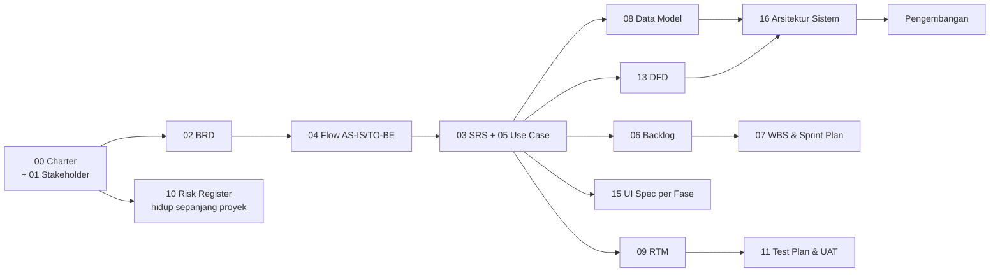

# HERO — Dokumen Proyek (PM & Business Analyst)

**Proyek:** HERO — Harmonisasi & Analisa Regulasi Otomatis
**Mitra:** Otoritas Jasa Keuangan — Departemen Pengembangan Aplikasi (DPEA)
**Mentor Industri:** Andika Wahyu Prihandoko
**Periode:** 31 Agustus 2026 – 24 Desember 2026 (± 17 minggu / 8 sprint)
**Product Owner:** Faris Budi (DPEA) — merangkap Agile Coach s.d. 11 Oktober 2026
**Tim:** Zaky (PM/BA) · Rafli (Backend) · Ikhwan (Frontend/UX) · Fathir (Data/ML) · Hamdan (Infra/QA)
**Posisi saat ini:** Sprint 0 (Fase 0 – Inception & Setup), minggu ke-2 — **tenggat Fase 0: 13 September 2026**

---

## Daftar Dokumen

| No. | Dokumen | Peran | Status | Kebutuhan Input Eksternal |
| --- | --- | --- | --- | --- |
| 00 | [Project Charter HERO](00-project-charter-hero.md) | PM | Draft v1.0 | Tanda tangan mentor & PO |
| 01 | [Stakeholder Register, RACI & Communication Plan](01-stakeholder-register-raci.md) | PM | Draft v1.1 | Penunjukan pilot user Unit Bisnis IT |
| 02 | [Business Requirements Document (BRD)](02-brd-business-requirements.md) | BA | Draft v1.1 | ✅ Baseline sudah diterima |
| 03 | [Software Requirements Specification (SRS/FRD)](03-srs-functional-spec.md) | BA | Draft v1.1 | Ambang kemiripan (TD-07); bentuk surat tanggapan (TD-08) |
| 04 | [Process Flow AS-IS & TO-BE v2](04-process-flow-asis-tobe.md) | BA | Draft v2.0 | Validasi AS-IS oleh DPEA |
| 05 | [Use Case Specification](05-use-case-spec.md) | BA | Draft v1.0 | — |
| 06 | [Product Backlog & User Stories](06-product-backlog-user-stories.md) | PM/BA | Draft v1.1 | Persetujuan pemangkasan lingkup Fase 1 |
| 07 | [WBS, Sprint Plan & Milestone](07-wbs-sprint-plan.md) | PM | Draft v1.1 | Skema hosting untuk uji coba 8 Okt |
| 08 | [Data Model & Data Dictionary](08-data-model-dictionary.md) | BA | Draft v1.1 | Review arsitek/backend |
| 09 | [Requirements Traceability Matrix (RTM)](09-rtm-traceability-matrix.md) | BA | Draft v1.1 | — |
| 10 | [Risk Register, Issue Log & Assumption Log](10-risk-register.md) | PM | Draft v1.1 | Review mingguan |
| 11 | [Test Plan & UAT Scenario](11-test-plan-uat.md) | PM/BA | Draft v1.1 | Penunjukan pilot user |
| 12 | [Glossary & Daftar Singkatan](12-glossary.md) | BA | Draft v1.0 | — |
| **13** | **[Data Flow Diagram (DFD)](13-dfd-data-flow-diagram.md)** | BA | Draft v1.0 | — |
| **14** | **[MoM Weekly Update #1](14-mom-weekly-update-01.md)** | PM | Final | Konfirmasi tanggal rapat |
| **15** | **[UI Specification Fase 1](15-ui-spec-fase-1.md)** | BA | Draft v1.0 | Mockup Figma oleh Ikhwan |
| **16** | **[Dokumen Arsitektur Sistem](16-arsitektur-sistem.md)** | BA | Draft v1.0 | Persetujuan ADR-08 s.d. ADR-10 oleh PO |
| **17** | **[MoM Weekly Update #2](17-mom-weekly-update-02.md)** | PM | Final | — |

### Template Operasional

| Template | Kegunaan | Frekuensi |
| --- | --- | --- |
| [Weekly Status Report](templates/weekly-status-report.md) | Laporan progress ke mentor & dosen | Mingguan |
| [Minutes of Meeting](templates/minutes-of-meeting.md) | Notulen rapat mitra/internal | Setiap rapat |
| [Change Request Form](templates/change-request-form.md) | Pengajuan perubahan scope | Ad-hoc |
| [Sprint Review & Retrospective](templates/sprint-review-retro.md) | Penutup sprint | Tiap 2 minggu |
| [UAT Sign-off Form](templates/uat-signoff-form.md) | Berita acara UAT | Per fitur |

### Berkas Lain di Repositori

| Berkas | Keterangan |
| --- | --- |
| [HERO_FLOW.md](../HERO_FLOW.md) | **Flow Utama v2** — diagram lengkap + ringkasan 10 perubahan dari v1 |
| [PROJECT_CHARTER_HARMONI.md](../PROJECT_CHARTER_HARMONI.md) | Charter proyek berbeda (HARMONI/OJK) — **bukan** acuan proyek HERO |

---

## Urutan Pengerjaan yang Disarankan

---

## Catatan Penting bagi PM/BA

**Diperbarui 9 September 2026.** Perubahan terakhir: [Dokumen Arsitektur Sistem](16-arsitektur-sistem.md)
disusun (deliverable WBS 1.2.5), dan kepemilikan modul scraping dipecah menjadi **algoritma
penelusuran (Data/ML)** dan **pipeline ingest (Backend)** — sebelumnya tiga dokumen menyatakan
hal yang berbeda. Kontrak antarkeduanya ada di [dok. 16 §4.3](16-arsitektur-sistem.md).

### Sudah Terjawab

| Item | Jawaban |
| --- | --- |
| ~~Baseline waktu proses manual~~ | **54 tanggapan (2025), 40 per Agustus (2026); 2–3 hari per tanggapan → target 2–3 jam** |
| ~~Tech stack~~ | Dibebaskan mitra. Tim mengusulkan Python + BeautifulSoup4, opsi Playwright/Selenium |
| ~~Product Owner~~ | Faris Budi — merangkap Agile Coach s.d. 11 Okt |
| ~~Metode validasi 70%~~ | Sampling manual DPEA: 2–3 dari 10 dokumen |
| ~~Daftar situs sumber~~ | 2 dari 3 sudah ditunjukkan (ojk.go.id/regulasi & JDIH) |

### Yang Sekarang Menjadi Blocker

| No. | Item | Memblokir | Tenggat |
| --- | --- | --- | --- |
| 1 | **Kapasitas tim ± 88 SP vs kebutuhan Fase 1 ± 117 SP.** Usulan pemangkasan lingkup ada di [dok. 06 §5B](06-product-backlog-user-stories.md) — perlu persetujuan PO | Seluruh Fase 1 | 14 Sep |
| 2 | **NDA belum ditandatangani** | Akses folder OneDrive peraturan internal | 13 Sep |
| 3 | **Skema hosting belum dipastikan.** Mitra akan mencoba sendiri pada 8 Okt; aplikasi yang hanya jalan di laptop tim tidak dapat diuji | Verifikasi milestone M1 | 28 Sep |
| 4 | **Ambang kemiripan pasal belum dijawab** — ditanyakan tim di rapat, dijawab kualitatif | Modul harmonisasi (Fase 3) | 25 Okt |
| 5 | **Contoh surat tanggapan + dokumen dasarnya belum diterima** dari mitra | Modul tanggapan PoV (Fase 4) — deliverable tersulit | 11 Okt |
| 6 | **Alamat situs sumber ketiga** | Indikator M-01 (≥ 3 situs) | 14 Sep |

### Perubahan Cara Kerja yang Perlu Disiapkan

- **Rapat menjadi mingguan**, maksimal 1 jam, dengan format laporan yang ditetapkan mitra
  ([dok. 07 §4.2](07-wbs-sprint-plan.md)).
- **Sejak 12 Oktober tim berperan sebagai konsultan**, bukan pelaksana. Mitra menyampaikan
  kebutuhan; tim yang memberi rekomendasi teknis beserta alasannya
  ([dok. 01 §2.1](01-stakeholder-register-raci.md)).
- **Mockup UI dibuat per fase**, diserahkan maksimal di minggu pertama fase tersebut. Spesifikasi
  Fase 1 untuk Ikhwan ada di [dok. 15](15-ui-spec-fase-1.md).
- **Item yang belum selesai tidak memblokir fase berikutnya** — masuk backlog, dilaporkan mingguan.
